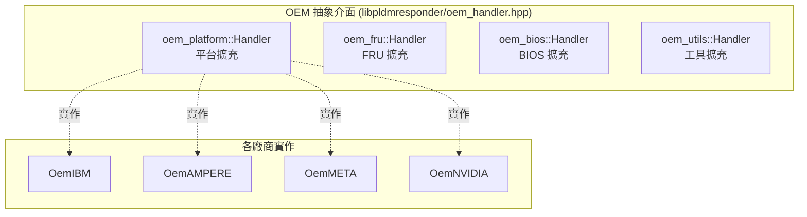

# OEM 擴充機制

PLDM 專案支援多家 OEM 廠商的擴充，透過抽象介面和編譯時條件式實現模組化設計。

---

## 概述

| OEM 廠商 | Meson 選項   | 原始碼目錄    | 說明              |
| -------- | ------------ | ------------- | ----------------- |
| IBM      | `oem-ibm`    | `oem/ibm/`    | 最完整的 OEM 實作 |
| Ampere   | `oem-ampere` | `oem/ampere/` | Ampere OEM 支援   |
| Meta     | `oem-meta`   | `oem/meta/`   | Meta OEM 支援     |
| NVIDIA   | `oem-nvidia` | `oem/nvidia/` | NVIDIA OEM 支援   |

---

## OEM 介面架構



> **逐步說明：**
>
> 這張圖展示 OEM 擴充的架構：
>
> - **上層**：4 個抽象介面（oem_platform、oem_fru、oem_bios、oem_utils），定義了廠商可以擴充的功能點。
> - **下層**：各廠商的實作（IBM、Ampere、Meta、NVIDIA），透過繼承實作這些介面。
>
> **白話總結**：OEM 擴充就像「插件系統」——核心程式碼定義了「插座」（抽象介面），各廠商提供自己的「插頭」（實作），插上就能用。

---

## 四種 OEM 介面

### 1. oem_platform::Handler（最重要）

涵蓋最廣泛的平台擴充功能：

| 方法                                 | 說明                       |
| ------------------------------------ | -------------------------- |
| `getOemStateSensorReadingsHandler()` | 讀取 OEM State Sensor      |
| `oemSetStateEffecterStatesHandler()` | 設定 OEM State Effecter    |
| `buildOEMPDR(Repo& repo)`            | 建造 OEM PDR               |
| `processSetEventReceiver()`          | 處理事件接收者設定         |
| `checkBMCState()`                    | 檢查 BMC 狀態              |
| `watchDogRunning()`                  | Watchdog 是否運行          |
| `resetWatchDogTimer()`               | 重設 Watchdog              |
| `disableWatchDogTimer()`             | 停用 Watchdog              |
| `checkAndDisableWatchDog()`          | 條件停用 Watchdog          |
| `countSetEventReceiver()`            | 計數 SetEventReceiver 次數 |
| `fetchLastBMCRecord(pldm_pdr*)`      | 取得最後一筆 BMC PDR       |
| `checkRecordHandleInRange(handle)`   | 檢查是否為遠端 PDR handle  |
| `updateOemDbusPaths(path)`           | 更新 OEM D-Bus 路徑        |
| `setSurvTimer(tid, value)`           | 設定監控計時器             |
| `handleBootTypesAtPowerOn()`         | 開機時 Boot 屬性處理       |
| `handleBootTypesAtChassisOff()`      | 關機時 Boot 屬性處理       |

### 2. oem_fru::Handler

```cpp
class Handler : public CmdHandler {
    virtual int processOEMFRUTable(const std::vector<uint8_t>& fruData) = 0;
};
```

### 3. oem_bios::Handler

```cpp
class Handler : public CmdHandler {
    virtual void processOEMBaseBiosTable(const BaseBIOSTable& biosTable) = 0;
};
```

### 4. oem_utils::Handler

```cpp
class Handler : public CmdHandler {
    virtual int setCoreCount(const EntityAssociations& associations,
                             const EntityMaps entityMaps) = 0;
};
```

---

## IBM OEM 實作（參考）

IBM OEM 是最完整的 OEM 實作，包含：

| 模組                      | 說明                      |
| ------------------------- | ------------------------- |
| `oem_ibm.hpp`             | pldmd 整合工廠類別        |
| `oem_ibm_handler.cpp/hpp` | OEM Platform Handler      |
| `host_lamp_test.cpp/hpp`  | Host Lamp 測試功能        |
| `file_io.cpp/hpp`         | PLDM File I/O（OEM 命令） |
| `pldmtool oem-ibm`        | 專屬 pldmtool 子命令      |

---

## OEM Handler 的注入方式

OEM Handler 透過 setter 方法注入到各模組中：

```cpp
// pldmd.cpp 中
platformHandler->setOemPlatformHandler(oemHandler);
fruHandler->setOemPlatformHandler(oemHandler);
fruHandler->setOemFruHandler(oemFruHandler);
baseHandler->setOemPlatformHandler(oemHandler);
hostPDRHandler->setOemPlatformHandler(oemHandler);
hostPDRHandler->setOemUtilsHandler(oemUtilsHandler);
```

---

## 相關文件

- [LibpldmResponder](LibpldmResponder.md) - OEM 介面定義
- [Pldmd](Pldmd.md) - OEM 初始化流程
- [TypeOEM](TypeOEM.md) - OEM Type 協議說明

---

_返回 [Home](Home.md)_
