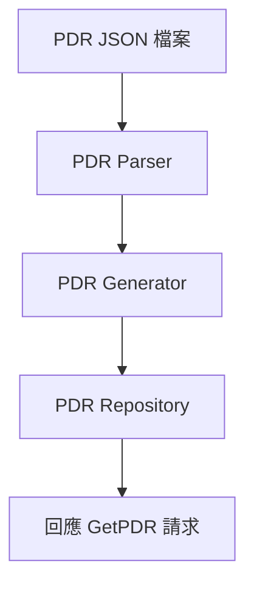

# PDR 實作

本文件說明 Platform Descriptor Records (PDR) 的實作方式。

---

## 概述

PDR 是描述平台資源的標準化記錄，包含 Sensor、Effecter、Entity 關聯等資訊。

---

## PDR JSON 配置

PDR 透過 JSON 檔案定義，檔名對應 PDR Type：

```
configurations/pdr/
├── 11.json   # State Sensor PDR (Type 11)
├── 14.json   # State Effecter PDR (Type 14)
└── 15.json   # Entity Association PDR (Type 15)
```

---

## JSON 格式範例

### State Sensor PDR (11.json)

```json
{
    "entries": [
        {
            "type": 11,
            "instance": 0,
            "container_id": 1,
            "entity_type": 45,
            "entity_instance": 0,
            "sensor_composite_count": 1,
            "possible_states": [
                { "set_id": 196, "state_ids": [1, 2, 3] }
            ],
            "dbus": {
                "path": "/xyz/openbmc_project/state/host0",
                "interface": "xyz.openbmc_project.State.Host",
                "property_name": "CurrentHostState",
                "property_type": "string"
            }
        }
    ]
}
```

---

## PDR Repository

PLDM 會解析 JSON 並建立 PDR 儲存庫：



---

## 原始碼

| 檔案 | 說明 |
|------|------|
| `libpldmresponder/pdr.cpp` | PDR 基礎 |
| `libpldmresponder/pdr_utils.cpp` | 工具函式 |
| `libpldmresponder/pdr_state_sensor.hpp` | State Sensor PDR |
| `libpldmresponder/pdr_state_effecter.hpp` | State Effecter PDR |

---

*返回 [Home](Home.md)*
