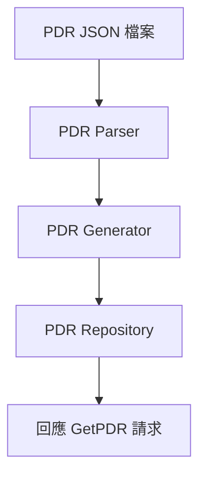
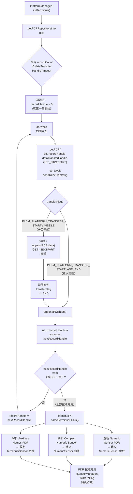

# PDR 實作

本文件說明 Platform Descriptor Records (PDR) 的實作方式。

---

## 概述

### PDR 是什麼？

PDR (Platform Descriptor Records) 是 DMTF DSP0248 定義的**標準化中繼資料記錄**，用來描述平台上的可管理資源：

| 描述什麼                      | 對應的 PDR Type                                 |
| ----------------------------- | ----------------------------------------------- |
| 這個裝置是誰、在哪裡          | Terminus Locator (1)                            |
| 溫度/電壓/功耗等數值 Sensor   | Numeric Sensor (2)、Compact Numeric Sensor (22) |
| ON/OFF/Presence 等狀態 Sensor | State Sensor (11)                               |
| 可控制的數值/狀態 Effecter    | Numeric Effecter (9)、State Effecter (14)       |
| Entity 之間的階層關係         | Entity Association (15)                         |
| FRU 記錄集對應                | FRU Record Set (20)                             |

> [!TIP]
> PDR 本身不是 Sensor 讀值，而是「**描述 Sensor 長什麼樣**」的元資料：它告訴 BMC「我這個裝置上有哪些 Sensor、每個 Sensor 的量測範圍、單位、閾值」等。BMC 讀到 PDR 後，才知道要用 `GetSensorReading` 去讀哪些 Sensor。

### PDR 存在哪裡？

PDR **不是出廠前燒錄在 EEPROM 中的固定資料**。大多數情況下，PDR 由各端點的 **firmware 在 runtime 動態生成**並保存在 RAM 中的 PDR Repository：

```
┌──────────────────────────────────────────────────────┐
│                   PDR 的兩種來源                      │
├──────────────────────┬───────────────────────────────┤
│  BMC 本地 (Responder)│  遠端 Terminus (Requester 端)  │
│                      │                               │
│  JSON 配置檔         │  裝置 firmware 動態生成         │
│  ↓ 解析 ↓            │  ↓ 存放在 RAM ↓               │
│  PDR Repository      │  PDR Repository               │
│  (pldmd 記憶體)       │  (裝置的管理微控制器記憶體)     │
│                      │                               │
│  回應他方的 GetPDR    │  回應 BMC 的 GetPDR            │
└──────────────────────┴───────────────────────────────┘
```

> [!IMPORTANT]
> **PDR 通常不存在 EEPROM 中。** 裝置的管理微控制器（如 GPU 的 BMC-lite 或 Baseboard Management firmware）在 boot 時根據自身硬體配置（多少 Sensor、型號、拓撲）動態組裝 PDR 到記憶體中。BMC 端的 PDR 則由 JSON 配置檔在 `pldmd` 啟動時解析生成。
>
> 少數簡單裝置可能將 PDR 存在 flash/EEPROM 中作為靜態資料，但這不是主流做法。

---

## PDR JSON 配置

PDR 透過 JSON 檔案定義，檔名對應 PDR Type：

```
configurations/pdr/
├── 4.json    # Numeric Sensor Init PDR (Type 4)
├── 11.json   # State Sensor PDR (Type 11)
└── com.ibm.Hardware.Chassis.Model.*/ # IBM 特定配置
    ├── 4.json
    └── 11.json
```

> **注意**：base 目錄僅包含 Type 4 和 Type 11 的 JSON。State Effecter (14) 和 Entity Association (15) 的 PDR 在 upstream 中是由程式碼動態生成或由其他配置驅動，而非單獨的 JSON 檔。

---

## JSON 格式範例

### State Sensor PDR (11.json)

```json
{
  "entries": [
    {
      "type": 11,
      "instance": 0,
      "container_id": 1,
      "entity_type": 45,
      "entity_instance": 0,
      "sensor_composite_count": 1,
      "possible_states": [{ "set_id": 196, "state_ids": [1, 2, 3] }],
      "dbus": {
        "path": "/xyz/openbmc_project/state/host0",
        "interface": "xyz.openbmc_project.State.Host",
        "property_name": "CurrentHostState",
        "property_type": "string"
      }
    }
  ]
}
```

---

## PDR Repository

### BMC 本地 PDR (Responder 端)

PLDM 會解析 JSON 並建立 PDR 儲存庫：



> **逐步說明：**
>
> 1. **PDR JSON 檔案**：開發者在 JSON 中定義 BMC 本地的 Sensor、Effecter 等硬體描述。
> 2. **PDR Parser**：解析 JSON，提取 PDR 定義。
> 3. **PDR Generator**：將解析結果轉換成 PLDM PDR 二進位格式。
> 4. **PDR Repository**：將生成的 PDR 存入記憶體中的 Repository。
> 5. **回應 GetPDR 請求**：當遠端裝置查詢時，從 Repository 取出 PDR 回覆。
>
> **白話總結**：就像編製「商品目錄」——從配置檔讀取商品定義、轉換成標準格式、存入資料庫，等客戶查詢時直接回覆。

### 遠端 Terminus PDR (Requester 端 / platform-mc)

BMC 透過 `PlatformManager::getPDRs()` 從遠端 Terminus 拉取 PDR：



> **逐步說明：**
>
> **步驟 1：先查元資料**：呼叫 `GetPDRRepositoryInfo` 取得 `recordCount`（PDR 總數）和 `largestRecordSize`（最大單筆大小），用於事先分配緩衝區。
>
> **步驟 2：迴圈拉取**：以 `recordHandle = 0` 開始，每次呼叫 `GetPDR` 取得一筆 PDR（或分段取得大型 PDR）。回應中的 `nextRecordHandle` 告知下一筆位置；若為 `0` 表示已是最後一筆。
>
> **步驟 3：分段傳輸（Multi-part Transfer）**：單筆 PDR 資料超過傳輸大小上限時，用 `transferFlag` 協調多次請求（`START` → `MIDDLE`... → `END`）。各段資料依序拼接，`END` 段附帶 CRC8 校驗碼。
>
> **步驟 4：解析 PDR**：全部 PDR 拉取完成後，`terminus->parseTerminusPDRs()` 逐一解析，依 PDR 類型建立對應物件（`NumericSensor`）或設定屬性（名稱、閾值）。
>
> **白話總結**：就像圖書館館員一本一本抄書——先知道總冊數（RepositoryInfo），再逐本借閱（GetPDR），有些大書要分章節借（分段），全抄完才整理上架（parseTerminusPDRs）。

> [!NOTE]
> multi-part transfer 使用 `dataTransferHandle` 串接各段資料，直到 `transferFlag == PLDM_PLATFORM_TRANSFER_END`

---

## 原始碼

### libpldmresponder (BMC 本地 PDR 生成)

| 檔案                                        | 說明                      |
| ------------------------------------------- | ------------------------- |
| `libpldmresponder/pdr.cpp/hpp`              | PDR 基礎與 JSON 解析      |
| `libpldmresponder/pdr_utils.cpp/hpp`        | PDR 工具函式              |
| `libpldmresponder/pdr_state_sensor.hpp`     | State Sensor PDR 生成     |
| `libpldmresponder/pdr_state_effecter.hpp`   | State Effecter PDR 生成   |
| `libpldmresponder/pdr_numeric_effecter.hpp` | Numeric Effecter PDR 生成 |

### platform-mc (遠端 PDR 拉取與解析)

| 檔案                                   | 說明                                                                     |
| -------------------------------------- | ------------------------------------------------------------------------ |
| `platform-mc/platform_manager.cpp/hpp` | `getPDRs()` / `getPDR()` / `getPDRRepositoryInfo()`                      |
| `platform-mc/terminus.cpp/hpp`         | `parseTerminusPDRs()` — 解析 Numeric/Compact Numeric/Auxiliary Names PDR |

---

_返回 [Home](Home.md)_
