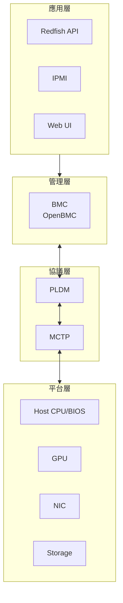
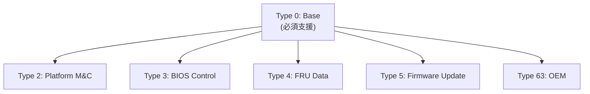
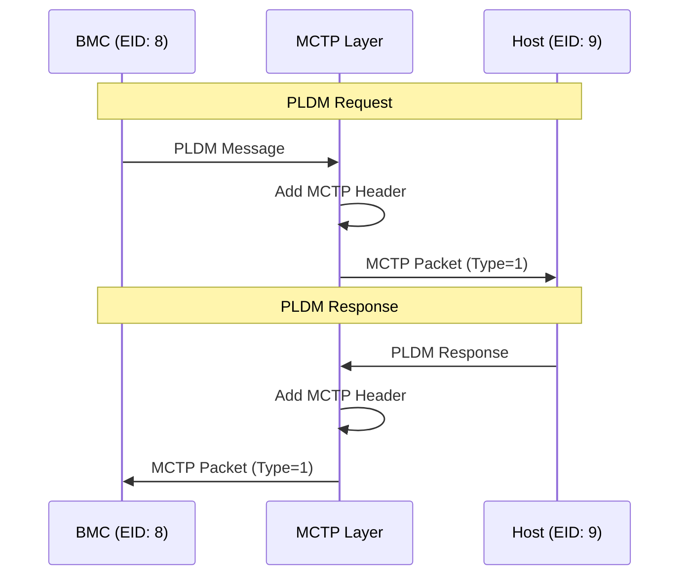
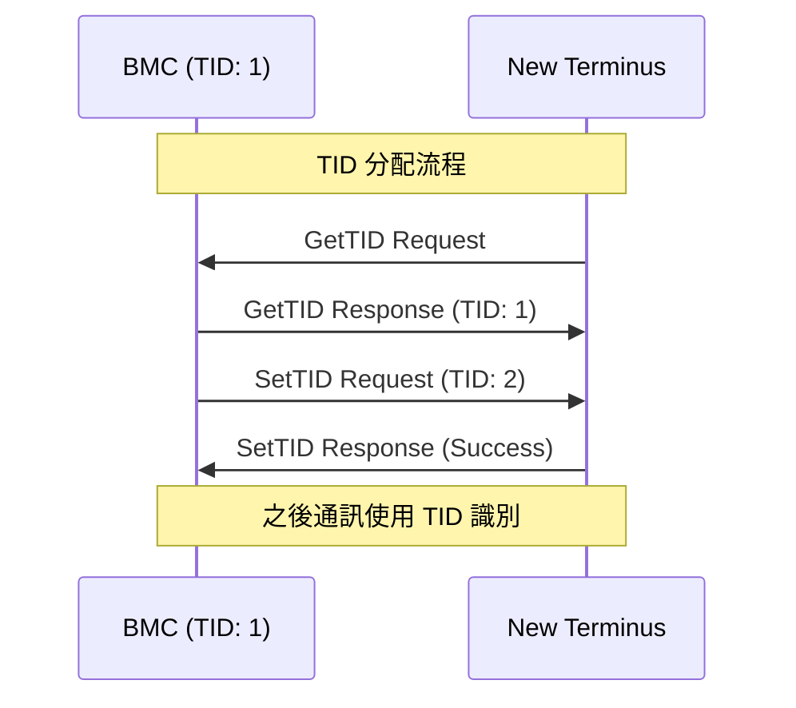
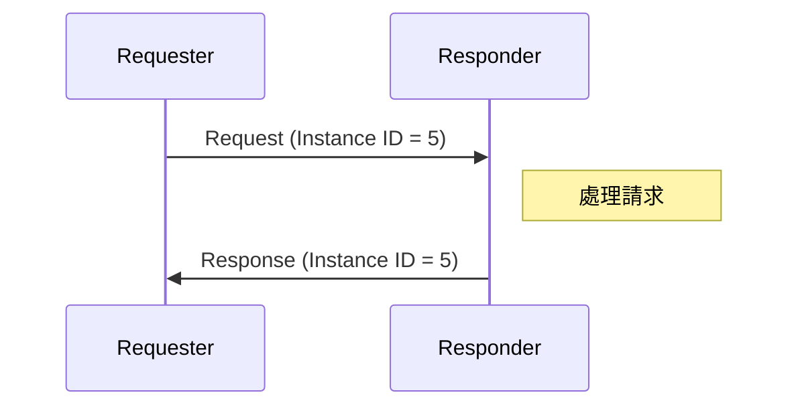
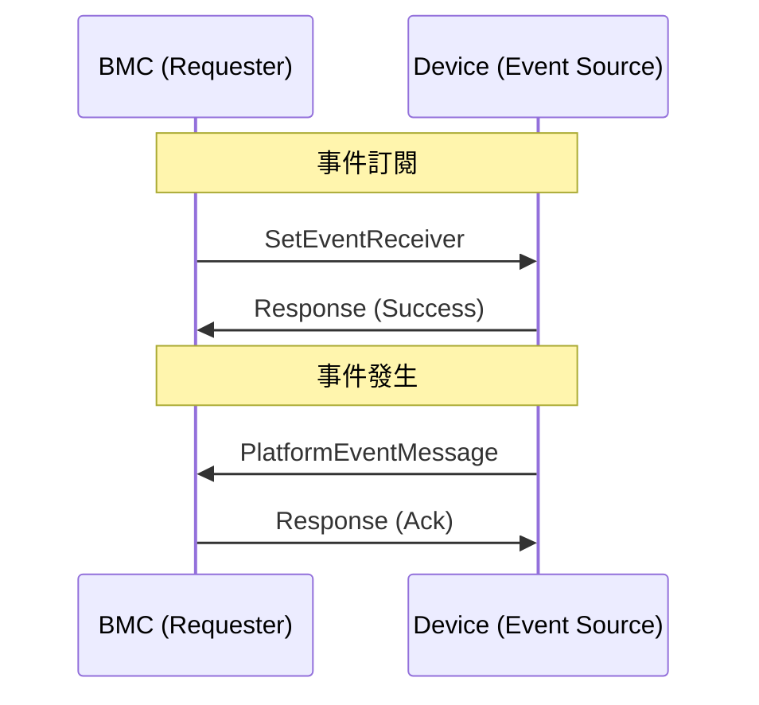

# PLDM 協議概述

PLDM (Platform Level Data Model) 是 DMTF 定義的平台管理協議，提供標準化的訊息格式與資料模型。

---

## 什麼是 PLDM？

PLDM 定義了：

1. **資料模型** - 描述平台資源的標準格式
2. **訊息格式** - 請求/回應的封包結構
3. **命令集** - 各 PLDM Type 的操作命令
4. **傳輸綁定** - 與 MCTP 的整合方式

### PLDM 在系統中的角色



---

## PLDM 訊息格式

### 訊息結構

每個 PLDM 訊息包含以下欄位：

| 欄位 | 大小 | 說明 |
|------|------|------|
| Instance ID | 5 bits | 請求/回應配對識別符 |
| Header Version | 2 bits | PLDM 標頭版本 (固定 00b) |
| PLDM Type | 6 bits | PLDM 類型代碼 |
| Command Code | 8 bits | 命令代碼 |
| Payload | 可變 | 命令特定資料 |

### 請求訊息格式

```
┌─────────────────────────────────────────────────────────┐
│  Byte 0  │  Byte 1   │  Byte 2   │  Byte 3...N        │
├──────────┼───────────┼───────────┼────────────────────┤
│ IID │ Hdr│ PLDM Type │  Command  │  Request Payload   │
│ (5) │(2) │   (6)     │   (8)     │                    │
└─────────────────────────────────────────────────────────┘

Bit 7 of Byte 0: Request bit (1 = Request, 0 = Response)
Bit 6 of Byte 0: D bit (Datagram, no response expected)
```

### 回應訊息格式

```
┌─────────────────────────────────────────────────────────────────┐
│  Byte 0  │  Byte 1   │  Byte 2   │  Byte 3    │  Byte 4...N    │
├──────────┼───────────┼───────────┼────────────┼────────────────┤
│ IID │ Hdr│ PLDM Type │  Command  │ Completion │ Response       │
│ (5) │(2) │   (6)     │   (8)     │   Code     │ Payload        │
└─────────────────────────────────────────────────────────────────┘
```

### Completion Codes

| 代碼 | 名稱 | 說明 |
|------|------|------|
| 0x00 | PLDM_SUCCESS | 成功 |
| 0x01 | PLDM_ERROR | 一般錯誤 |
| 0x02 | PLDM_ERROR_INVALID_DATA | 無效資料 |
| 0x03 | PLDM_ERROR_INVALID_LENGTH | 長度錯誤 |
| 0x04 | PLDM_ERROR_NOT_READY | 尚未就緒 |
| 0x05 | PLDM_ERROR_UNSUPPORTED_PLDM_CMD | 不支援的命令 |
| 0x20 | PLDM_ERROR_INVALID_PLDM_TYPE | 無效 PLDM Type |

---

## PLDM Types

PLDM 定義了多種 Type，每種處理不同的管理功能：

| Type Code | 名稱 | 規範 | 說明 |
|-----------|------|------|------|
| 0 | Base | DSP0240 | 基礎探索與版本查詢 |
| 1 | SMBIOS | DSP0246 | SMBIOS 表格傳輸 |
| 2 | Platform M&C | DSP0248 | 平台監控與控制 |
| 3 | BIOS Control | DSP0247 | BIOS 配置管理 |
| 4 | FRU Data | DSP0257 | FRU 資料存取 |
| 5 | Firmware Update | DSP0267 | 韌體更新 |
| 6 | Redfish Device Enablement | DSP0218 | Redfish 整合 |
| 63 | OEM | - | 廠商自訂 |

### Type 關係圖



---

## PLDM over MCTP

PLDM 使用 MCTP (Management Component Transport Protocol) 作為傳輸層：



### MCTP 封裝

```
MCTP Packet:
┌───────────────┬─────────────────────────────────────┐
│  MCTP Header  │          MCTP Payload               │
│   (4 bytes)   │      (PLDM Message)                 │
├───────────────┼─────────────────────────────────────┤
│ Dst EID       │ Instance ID │ Type │ Cmd │ Payload │
│ Src EID       │             │      │     │         │
│ Flags         │             │      │     │         │
│ Msg Type = 1  │             │      │     │         │
└───────────────┴─────────────────────────────────────┘
```

---

## Terminus 概念

在 PLDM 中，**Terminus** 是一個 PLDM 通訊端點：

| 術語 | 說明 |
|------|------|
| **Terminus** | PLDM 通訊端點，具有唯一 TID |
| **TID** | Terminus ID，8-bit 識別符 |
| **EID** | MCTP Endpoint ID，傳輸層位址 |

### TID 分配



---

## 請求/回應模式

### 同步模式



### 非同步事件



---

## Instance ID 管理

Instance ID 用於匹配請求與回應：

| 規則 | 說明 |
|------|------|
| 範圍 | 0-31 (5 bits) |
| 唯一性 | 每個 (Requester, Responder) 配對須唯一 |
| 生命週期 | 收到回應或超時後釋放 |
| 重試 | 重試時使用相同 Instance ID |

```cpp
// Instance ID 分配範例
class InstanceIdDb {
public:
    uint8_t next(mctp_eid_t eid) {
        uint8_t id = nextId[eid];
        nextId[eid] = (nextId[eid] + 1) % 32;
        return id;
    }
    
    void free(mctp_eid_t eid, uint8_t instanceId) {
        // 標記為可重用
    }
};
```

---

## 相關文件

- [TypeBase](TypeBase.md) - Base Type 命令詳解
- [TypePlatform](TypePlatform.md) - Platform M&C 說明
- [DMTFSpecifications](DMTFSpecifications.md) - DMTF 規範索引

---

*返回 [Home](Home.md)*
