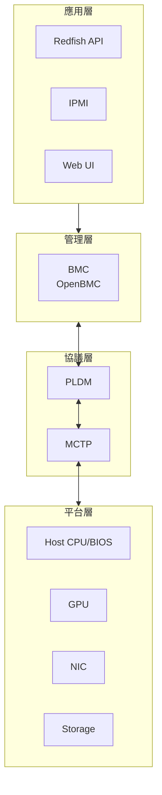
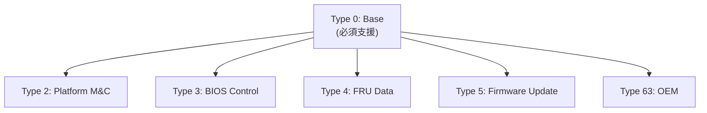
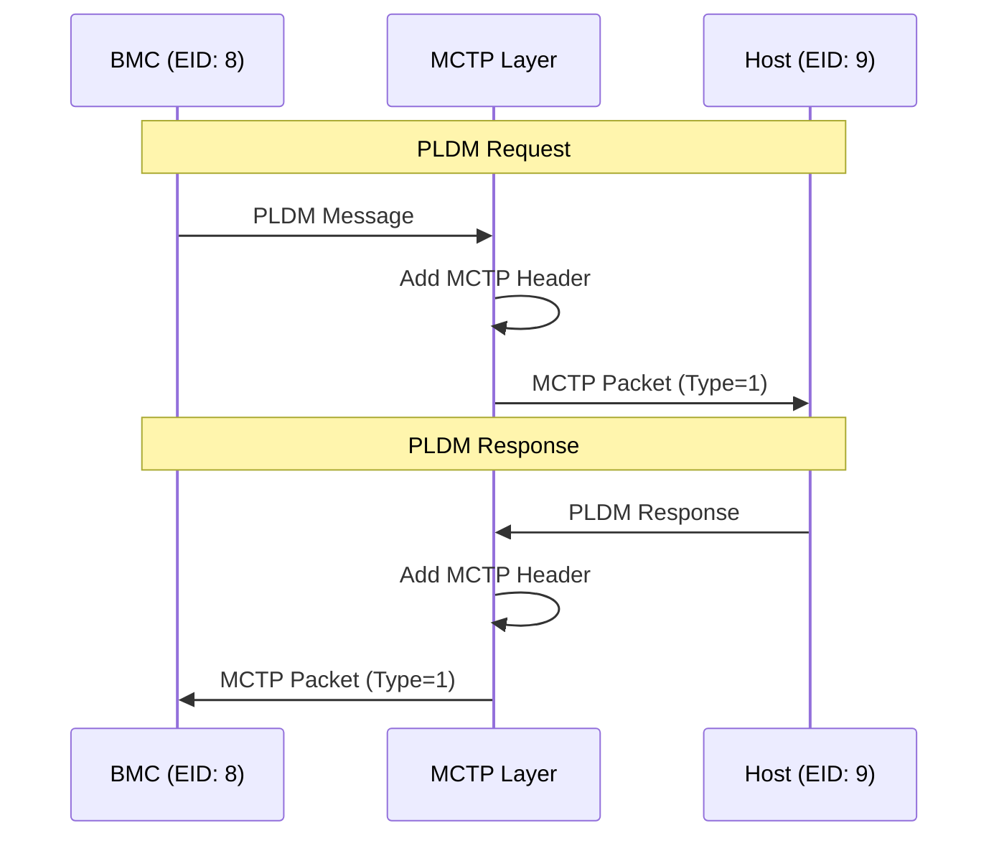
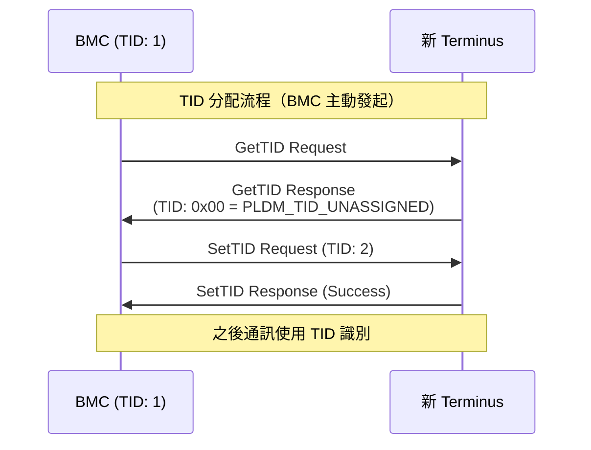
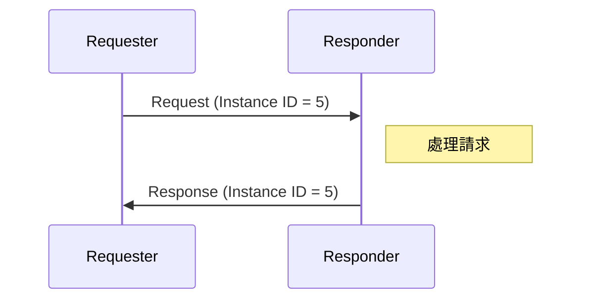
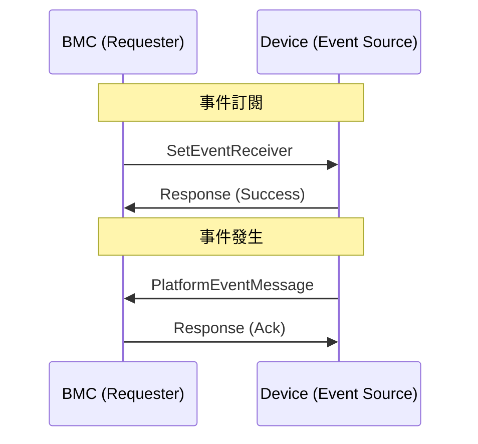

# PLDM 協議概述

PLDM (Platform Level Data Model) 是 DMTF 定義的平台管理協議，提供標準化的訊息格式與資料模型。

---

## 什麼是 PLDM？

PLDM 定義了：

1. **資料模型** - 描述平台資源的標準格式
2. **訊息格式** - 請求/回應的封包結構
3. **命令集** - 各 PLDM Type 的操作命令
4. **傳輸綁定** - 與 MCTP 的整合方式

### PLDM 在系統中的角色



> **逐步說明：**
>
> 這張圖展示 PLDM 在系統中的位置（四層架構）：
>
> - **應用層**：Redfish API、IPMI、Web UI（使用者接觸的介面）。
> - **管理層**：BMC 運行 OpenBMC 作業系統。
> - **協議層**：PLDM 負責「說什麼」，MCTP 負責「怎麼傳」。
> - **平台層**：被管理的硬體裝置（Host CPU、GPU、NIC、Storage）。
>
> **白話總結**：PLDM 是 BMC 與硬體之間的「共同語言」，透過 MCTP 「交通網」進行通訊。

---

## PLDM 訊息格式

### 訊息結構

每個 PLDM 訊息包含以下欄位：

| 欄位           | 大小   | 說明                             |
| -------------- | ------ | -------------------------------- |
| Request (Rq)   | 1 bit  | 1=請求, 0=回應                   |
| Datagram (D)   | 1 bit  | 1=Datagram (不須對應的 Response) |
| Reserved (Rs)  | 1 bit  | 保留位元 (固定為 0)              |
| Instance ID    | 5 bits | 請求/回應配對識別符              |
| Header Version | 2 bits | PLDM 標頭版本 (固定 00b)         |
| PLDM Type      | 6 bits | PLDM 類型代碼                    |
| Command Code   | 8 bits | 命令代碼                         |
| Payload        | 可變   | 命令特定資料                     |

### 請求訊息格式

```text
┌─────────────────┬───────────────┬───────────┬────────────────────┐
│      Byte 0     │     Byte 1    │  Byte 2   │  Byte 3...N        │
├┬─┬─┬────────────┼────┬──────────┼───────────┼────────────────────┤
│R│D│R│ Instance │Hdr │ PLDM Type│  Command  │  Request Payload   │
│q│ │s│ ID (5)   │(2) │   (6)    │   (8)     │                    │
│1│1│1│          │    │          │           │                    │
└┴─┴─┴────────────┴────┴──────────┴───────────┴────────────────────┘

* Rq (Bit 7 of Byte 0): Request bit (1 = Request, 0 = Response)
* D  (Bit 6 of Byte 0): Datagram bit (1 = Datagram, 不須回應; 0 = Request/Response 模式，Request 發出後必須等待對應的 Response)
* Rs (Bit 5 of Byte 0): Reserved (固定為 0)
```

### 回應訊息格式

```text
┌─────────────────┬───────────────┬───────────┬────────────┬────────────────┐
│      Byte 0     │     Byte 1    │  Byte 2   │  Byte 3    │  Byte 4...N    │
├┬─┬─┬────────────┼────┬──────────┼───────────┼────────────┼────────────────┤
│R│D│R│ Instance │Hdr │ PLDM Type│  Command  │ Completion │ Response       │
│q│ │s│ ID (5)   │(2) │   (6)    │   (8)     │   Code     │ Payload        │
│1│1│1│          │    │          │           │   (8)      │                │
└┴─┴─┴────────────┴────┴──────────┴───────────┴────────────┴────────────────┘
```

### Completion Codes

| 代碼 | 名稱                            | 說明           |
| ---- | ------------------------------- | -------------- |
| 0x00 | PLDM_SUCCESS                    | 成功           |
| 0x01 | PLDM_ERROR                      | 一般錯誤       |
| 0x02 | PLDM_ERROR_INVALID_DATA         | 無效資料       |
| 0x03 | PLDM_ERROR_INVALID_LENGTH       | 長度錯誤       |
| 0x04 | PLDM_ERROR_NOT_READY            | 尚未就緒       |
| 0x05 | PLDM_ERROR_UNSUPPORTED_PLDM_CMD | 不支援的命令   |
| 0x20 | PLDM_ERROR_INVALID_PLDM_TYPE    | 無效 PLDM Type |

---

## PLDM Types

PLDM 定義了多種 Type，每種處理不同的管理功能：

| Type Code | 名稱                      | 規範    | 說明               |
| --------- | ------------------------- | ------- | ------------------ |
| 0         | Base                      | DSP0240 | 基礎探索與版本查詢 |
| 1         | SMBIOS                    | DSP0246 | SMBIOS 表格傳輸    |
| 2         | Platform M&C              | DSP0248 | 平台監控與控制     |
| 3         | BIOS Control              | DSP0247 | BIOS 配置管理      |
| 4         | FRU Data                  | DSP0257 | FRU 資料存取       |
| 5         | Firmware Update           | DSP0267 | 韌體更新           |
| 6         | Redfish Device Enablement | DSP0218 | Redfish 整合       |
| 63        | OEM                       | -       | 廠商自訂           |

### Type 關係圖



> **逐步說明：**
>
> PLDM Type 的關係：Base (Type 0) 是必要的基礎，其他 Type 都依賴它。每個 Type 處理不同功能：Platform（監控）、BIOS（配置）、FRU（硬體資訊）、FW Update（韌體更新）、OEM（廠商自訂）。

---

## PLDM over MCTP

PLDM 使用 MCTP (Management Component Transport Protocol) 作為傳輸層：



> **逐步說明：**
>
> 1. BMC 建立 PLDM 訊息。
> 2. MCTP 層加上 MCTP 標頭（目的地 EID、來源 EID、Message Type=1 表示 PLDM）。
> 3. 經過實體傳輸（I2C/PCIe）傳送到 Host。
> 4. Host 建立 PLDM 回應，同樣經 MCTP 封裝後回傳。
>
> **白話總結**：PLDM 訊息就像「信件內容」，MCTP 是「信封」，Message Type=1 是「郵票」（表示裡面是 PLDM）。

### MCTP 封裝

```
MCTP Packet:
┌───────────────┬─────────────────────────────────────┐
│  MCTP Header  │          MCTP Payload               │
│   (4 bytes)   │      (PLDM Message)                 │
├───────────────┼─────────────────────────────────────┤
│ Dst EID       │ Instance ID │ Type │ Cmd │ Payload │
│ Src EID       │             │      │     │         │
│ Flags         │             │      │     │         │
│ Msg Type = 1  │             │      │     │         │
└───────────────┴─────────────────────────────────────┘
```

---

## Terminus 概念

在 PLDM 中，**Terminus** 是一個 PLDM 通訊端點（裝置層級的邏輯實體）：

| 術語         | 說明                                                         |
| ------------ | ------------------------------------------------------------ |
| **Terminus** | PLDM 通訊端點，具有唯一 TID。代表一個**裝置**而非單一 Sensor |
| **TID**      | Terminus ID，8-bit 識別符（0x00 為未分配、0xFF 保留）        |
| **EID**      | MCTP Endpoint ID，傳輸層位址                                 |

### Terminus 是什麼？實體例子

一個 Terminus 是一個能夠收送 PLDM 訊息的裝置端點。每個 Terminus 可擁有多個 Sensor 和 Effecter：

```
┌─────────────────────────────────────────┐
│  GPU（= 1 個 Terminus, TID = 5）         │
│                                         │
│  ┌───────────┐ ┌───────────┐ ┌────────┐ │
│  │Core 溫度  │ │Memory 溫度│ │VRM 溫度│ │
│  │Sensor #1  │ │Sensor #2  │ │Sensor #3││
│  └───────────┘ └───────────┘ └────────┘ │
│                                         │
│  GPU 內部的管理微控制器負責回應 PLDM 訊息│
└──────────────┬──────────────────────────┘
               │ MCTP (PCIe VDM / SMBus)
┌──────────────▼──────────────────────────┐
│  BMC（= 另一個 Terminus, TID = 1）       │
│  pldmd → GetSensorReading(TID=5, ID=1) │
└─────────────────────────────────────────┘
```

> [!IMPORTANT]
> **GPU 整體是一個 Terminus，Sensor 不是 Terminus。**
> 3 個溫度 Sensor 都屬於同一個 GPU Terminus，BMC 透過 `GetSensorReading(TID, SensorID)` 指定要讀哪一個 Sensor。
> Terminus 的粒度通常與「裝置上有無獨立管理微控制器/firmware」對齊。

常見的 Terminus：

| Terminus 範例      | TID | 說明                  |
| ------------------ | --- | --------------------- |
| BMC 自身           | 1   | Management Controller |
| Host BIOS/UEFI     | 2   | Host Terminus         |
| GPU                | 3   | GPU 管理微控制器      |
| NIC (SmartNIC/DPU) | 4   | 網路裝置管理控制器    |

### TID 分配



> **逐步說明：**
>
> TID 分配流程：
>
> 1. **BMC 主動詢問**：當 mctpd 發現新 MCTP 端點時，通知 BMC。BMC 作為 Requester 主動向新裝置發送 `GetTID`，查詢其目前持有的 TID。
> 2. **裝置回報 TID**：裝置回傳目前的 TID。若為 `0x00`（`PLDM_TID_UNASSIGNED`）表示從未被分配過；若有非零值則表示裝置自上次斷線保留了舊 TID。
> 3. **BMC 分配並指派**：若需要新 TID，BMC 從 TID Pool 找一個空閒值，用 `SetTID` 指派給新裝置。
>
> **白話總結**：BMC 是主動的那一方——見到新面孔（新裝置），主動上前問「你有工號嗎？」沒有就分配一個；有的話確認一下是否衝突。

---

## 請求/回應模式

### 同步模式



> **逐步說明**：Requester 發送請求（附帶 Instance ID=5），Responder 處理後用相同 Instance ID 回應。Instance ID 用於匹配請求和回應，就像店員給的取餐號碼。

### 非同步事件



> **逐步說明：**
>
> 1. **訂閱**：BMC 透過 `SetEventReceiver` 告訴裝置：「有事情的話告訴我」。
> 2. **事件發生**：裝置主動發送 `PlatformEventMessage` 給 BMC。
> 3. **確認**：BMC 回應確認收到。
>
> **白話總結**：同步模式是「我問你答」，非同步事件是「你有事主動告訴我」。

---

## Instance ID 管理

Instance ID 用於匹配請求與回應：

| 規則     | 說明                                   |
| -------- | -------------------------------------- |
| 範圍     | 0-31 (5 bits)                          |
| 唯一性   | 每個 (Requester, Responder) 配對須唯一 |
| 生命週期 | 收到回應或超時後釋放                   |
| 重試     | 重試時使用相同 Instance ID             |

> ⚠️ **概念性說明**：以下為簡化的概念範例。實際的 `InstanceIdDb` class 位於 `common/instance_id.hpp`，底層使用 libpldm 的 `pldm_instance_id_alloc()` / `pldm_instance_id_free()` 管理 Instance ID。

```cpp
// 概念性簡化 — 實際實作見 common/instance_id.hpp
class InstanceIdDb {
public:
    std::expected<uint8_t, InstanceIdError> next(uint8_t tid) {
        // 透過 pldm_instance_id_alloc() 分配
        return id; // 0-31 範圍內的可用 ID
    }

    void free(uint8_t tid, uint8_t instanceId) {
        // 透過 pldm_instance_id_free() 釋放
    }
};
```

---

## 相關文件

- [TypeBase](TypeBase.md) - Base Type 命令詳解
- [TypePlatform](TypePlatform.md) - Platform M&C 說明
- [DMTFSpecifications](DMTFSpecifications.md) - DMTF 規範索引

---

_返回 [Home](Home.md)_
