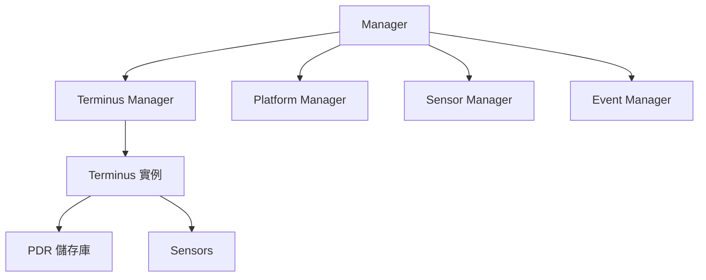
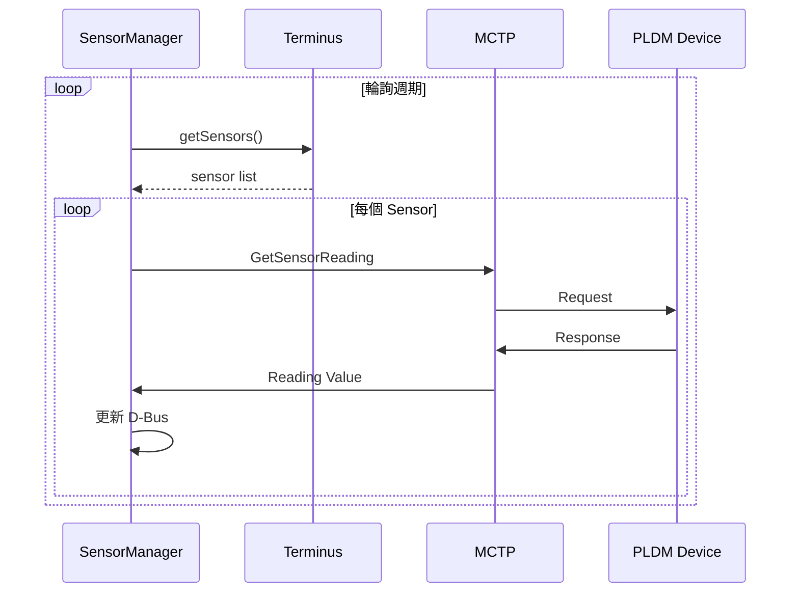

# Platform MC 模組

Platform MC 模組實作 BMC 作為 Management Controller 的 PLDM Platform 功能。

---

## 概述

| 項目 | 說明 |
|------|------|
| **位置** | `platform-mc/` |
| **功能** | Terminus 管理、Sensor 讀取、事件處理 |

---

## 架構



---

## 核心類別

### Terminus

代表一個 PLDM 端點：

```cpp
class Terminus {
    mctp_eid_t eid;
    uint8_t tid;
    std::vector<uint8_t> supportedPldmTypes;
    std::vector<std::shared_ptr<NumericSensor>> numericSensors;
};
```

### TerminusManager

管理所有 Terminus 的生命週期：

```cpp
class TerminusManager {
    std::map<tid_t, std::shared_ptr<Terminus>> termini;
    
    void discoverTerminus(mctp_eid_t eid);
    std::shared_ptr<Terminus> getTerminus(tid_t tid);
};
```

### SensorManager

輪詢 Sensor 並更新 D-Bus：

```cpp
class SensorManager {
    void startPolling();
    void handleSensorReading(Sensor& sensor, Response& response);
};
```

---

## Sensor 讀取流程



---

## 原始碼

| 檔案 | 說明 |
|------|------|
| `manager.cpp/hpp` | 模組主管理器 |
| `terminus.cpp/hpp` | Terminus 實作 |
| `terminus_manager.cpp/hpp` | Terminus 管理 |
| `sensor_manager.cpp/hpp` | Sensor 管理 |
| `numeric_sensor.cpp/hpp` | 數值型 Sensor |
| `event_manager.cpp/hpp` | 事件處理 |

---

*返回 [Home](Home.md)*
