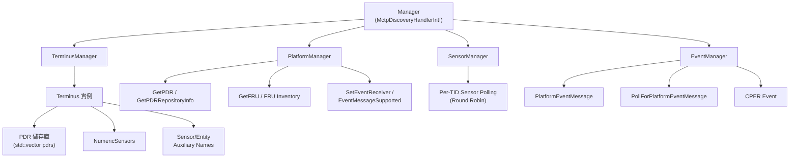
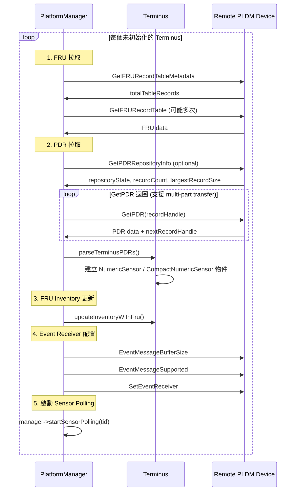
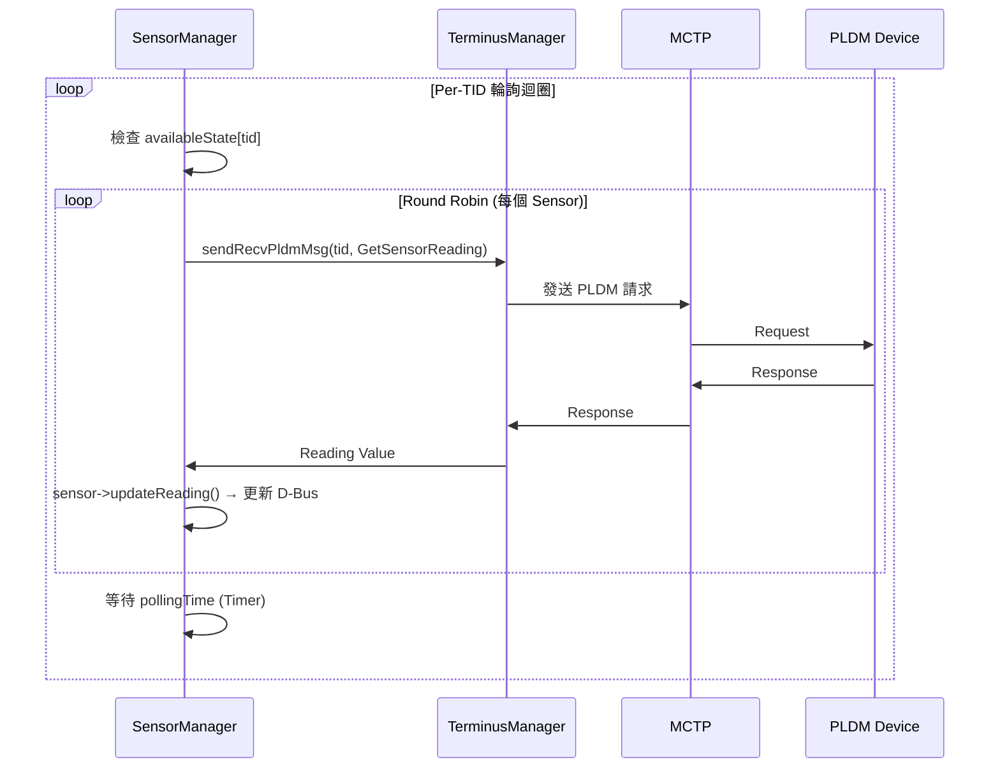

# Platform MC 模組

Platform MC 模組實作 BMC 作為 Management Controller 的 PLDM Platform 功能。

---

## 概述

| 項目     | 說明                                                                    |
| -------- | ----------------------------------------------------------------------- |
| **位置** | `platform-mc/`                                                          |
| **功能** | Terminus 管理、PDR 拉取、Sensor 讀取、事件處理、FRU 拉取、Effecter 控制 |

---

## 架構



---

## 核心類別

### Manager

`platform-mc/Manager` 是頂層管理器，實作 `MctpDiscoveryHandlerIntf`，負責整合所有子系統：

```cpp
class Manager : public pldm::MctpDiscoveryHandlerIntf {
  private:
    TerminiMapper termini{};           // 所有 Terminus 實例
    TerminusManager terminusManager;   // Terminus 探索與 TID 管理
    PlatformManager platformManager;   // PDR/FRU/Event 初始化
    SensorManager sensorManager;       // Sensor 輪詢
    EventManager eventManager;         // 事件處理
    PollHandlers pollHandlers;         // OEM 輪詢 handlers
};
```

主要回調：

- `handleMctpEndpoints()` → 觸發 `terminusManager.discoverMctpTerminus()`
- `handleRemovedMctpEndpoints()` → 移除 Terminus
- `updateMctpEndpointAvailability()` → 更新可用狀態，啟停 Sensor Polling
- `startSensorPolling(tid)` / `stopSensorPolling(tid)`
- `handleSensorEvent()` / `handleCperEvent()` / `handlePldmMessagePollEvent()`

---

### Terminus

代表一個 PLDM 端點，儲存從遠端拉回的所有資料：

```cpp
class Terminus {
  public:
    Terminus(pldm_tid_t tid, uint64_t supportedPLDMTypes,
             sdeventplus::Event& event);

    bool doesSupportType(uint8_t type);
    bool doesSupportCommand(uint8_t type, uint8_t command);
    bool setSupportedCommands(const std::vector<uint8_t>& cmds);
    void parseTerminusPDRs();  // 解析 PDR 並建立 Sensor 物件

    // === 主要成員變數 ===
    std::vector<std::vector<uint8_t>> pdrs{};      // 從遠端拉回的原始 PDR
    bool initialized = false;                       // 是否已初始化
    uint16_t maxBufferSize;                          // 最大訊息緩衝區
    bitfield8_t synchronyConfigurationSupported;     // 事件同步模式
    std::vector<std::shared_ptr<NumericSensor>> numericSensors{};
    bool pollEvent;                                  // 是否有待輪詢事件
    uint16_t pollEventId;
    uint32_t pollDataTransferHandle;

  private:
    pldm_tid_t tid;                                  // Terminus ID
    std::bitset<64> supportedTypes;                  // 支援的 PLDM Types
    std::vector<uint8_t> supportedCmds;              // 支援的命令 bitmask
    std::map<uint8_t, ver32_t> supportedTypeVersions;
    std::vector<std::shared_ptr<SensorAuxiliaryNames>> sensorAuxiliaryNamesTbl{};
    std::vector<std::shared_ptr<EntityAuxiliaryNames>> entityAuxiliaryNamesTbl{};
    EntityName terminusName{};
    std::string inventoryPath;

    // PDR 解析相關
    std::vector<std::shared_ptr<pldm_numeric_sensor_value_pdr>> numericSensorPdrs{};
    std::vector<std::shared_ptr<pldm_compact_numeric_sensor_pdr>> compactNumericSensorPdrs{};
};
```

> [!NOTE]
> Terminus **不儲存 EID**。EID ↔ TID 的對應由 `TerminusManager` 的 `mctpInfoTable` 維護。

---

### TerminusManager

管理所有 Terminus 的生命週期，使用 C++20 coroutine (`exec::task<int>`)：

```cpp
using TerminiMapper = std::map<pldm_tid_t, std::shared_ptr<Terminus>>;

class TerminusManager {
  public:
    // 觸發 Terminus 探索 (接收 MCTP endpoint 清單)
    void discoverMctpTerminus(const MctpInfos& mctpInfos);
    void removeMctpTerminus(const MctpInfos& mctpInfos);

    // 發送 PLDM 請求 (coroutine)
    exec::task<int> sendRecvPldmMsg(pldm_tid_t tid, Request& request,
                                     const pldm_msg** responseMsg,
                                     size_t* responseLen);

    // TID ↔ MCTP 映射
    std::optional<MctpInfo> toMctpInfo(const pldm_tid_t& tid);
    std::optional<pldm_tid_t> toTid(const MctpInfo& mctpInfo) const;
    std::optional<pldm_tid_t> mapTid(const MctpInfo& mctpInfo);

  private:
    // Terminus 初始化流程 (coroutine)
    exec::task<int> initMctpTerminus(const MctpInfo& mctpInfo);
    exec::task<int> getTidOverMctp(mctp_eid_t eid, pldm_tid_t* tid);
    exec::task<int> setTidOverMctp(mctp_eid_t eid, pldm_tid_t tid);
    exec::task<int> getPLDMTypes(pldm_tid_t tid, uint64_t& supportedTypes);
    exec::task<int> getPLDMVersion(pldm_tid_t tid, uint8_t type, ver32_t* version);
    exec::task<int> getPLDMCommands(pldm_tid_t tid, uint8_t type,
                                     ver32_t version, bitfield8_t* supportedCmds);

    TerminiMapper& termini;
    std::vector<bool> tidPool;                   // TID 分配池 (0 和 0xFF 保留)
    std::map<pldm_tid_t, MctpInfo> mctpInfoTable;
    std::map<MctpInfo, Availability> mctpInfoAvailTable;
};
```

---

### PlatformManager

負責 PDR 拉取、FRU 拉取、Event Receiver 配置：

```cpp
class PlatformManager {
  public:
    // 初始化所有支援 Type 2 的 Terminus
    exec::task<int> initTerminus();
    exec::task<int> configEventReceiver(pldm_tid_t tid);

  private:
    exec::task<int> getPDRs(std::shared_ptr<Terminus> terminus);
    exec::task<int> getPDR(const pldm_tid_t tid, ...);  // 單筆 GetPDR
    exec::task<int> getPDRRepositoryInfo(const pldm_tid_t tid, ...);
    exec::task<int> setEventReceiver(pldm_tid_t tid, ...);
    exec::task<int> eventMessageBufferSize(pldm_tid_t tid, ...);
    exec::task<int> eventMessageSupported(pldm_tid_t tid, ...);
    exec::task<int> getFRURecordTableMetadata(pldm_tid_t tid, uint16_t* total);
    exec::task<int> getFRURecordTables(pldm_tid_t tid, ...);
};
```

**`initTerminus()` 完整流程：**



---

### SensorManager

per-TID Sensor 輪詢，使用 round-robin 策略：

```cpp
class SensorManager {
  public:
    void startPolling(pldm_tid_t tid);
    void stopPolling(pldm_tid_t tid);
    void disableTerminusSensors(pldm_tid_t tid);  // 將所有 sensor 值設為 NaN
    void updateAvailableState(pldm_tid_t tid, Availability state);

  protected:
    exec::task<int> doSensorPollingTask(pldm_tid_t tid);
    exec::task<int> getSensorReading(std::shared_ptr<NumericSensor> sensor);

  private:
    uint32_t pollingTime;                          // 輪詢間隔 (ms)
    std::map<pldm_tid_t, std::unique_ptr<sdbusplus::Timer>> sensorPollTimers;
    std::map<pldm_tid_t, Availability> availableState;
    std::map<pldm_tid_t, SensorID> roundRobinSensorItMap;  // round-robin 迭代器
};
```

---

### EventManager

PLDM 事件處理，支援非同步事件與輪詢事件：

```cpp
class EventManager {
  public:
    int handlePlatformEvent(pldm_tid_t tid, uint16_t eventId,
                            uint8_t eventClass, const uint8_t* eventData,
                            size_t eventDataSize);
    exec::task<int> pollForPlatformEventTask(pldm_tid_t tid,
                                              uint32_t pollDataTransferHandle);
    void registerPolledEventHandler(uint8_t eventClass, HandlerFuncs handlers);
    void updateAvailableState(pldm_tid_t tid, Availability state);

  protected:
    int processNumericSensorEvent(pldm_tid_t tid, uint16_t sensorId, ...);
    int processCperEvent(pldm_tid_t tid, uint16_t eventId, ...);
};
```

---

## Sensor 讀取流程



---

## 原始碼

| 檔案                                 | 說明                                  |
| ------------------------------------ | ------------------------------------- |
| `manager.cpp/hpp`                    | 頂層 Manager (整合所有子系統)         |
| `terminus.cpp/hpp`                   | Terminus 實作 (PDR 解析、Sensor 建立) |
| `terminus_manager.cpp/hpp`           | Terminus 探索與 TID 管理              |
| `platform_manager.cpp/hpp`           | PDR/FRU 拉取、Event Receiver 配置     |
| `sensor_manager.cpp/hpp`             | Sensor 輪詢                           |
| `numeric_sensor.cpp/hpp`             | 數值型 Sensor (D-Bus 物件建立)        |
| `event_manager.cpp/hpp`              | 事件處理                              |
| `dbus_impl_fru.cpp/hpp`              | FRU D-Bus 介面實作                    |
| `dbus_to_terminus_effecters.cpp/hpp` | D-Bus 到 Terminus Effecter 映射       |

---

_返回 [Home](Home.md)_
