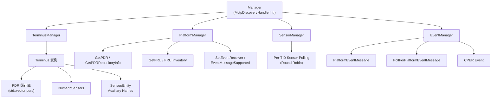
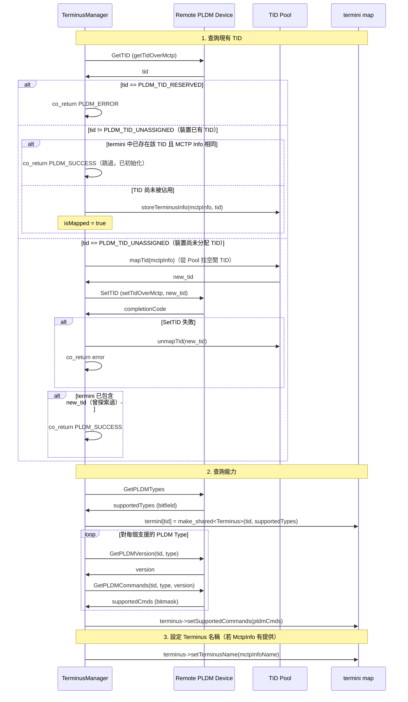
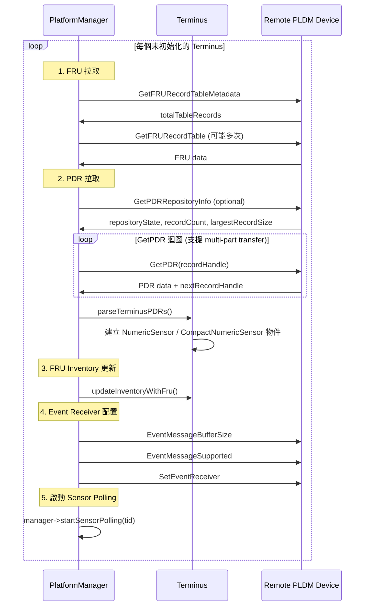
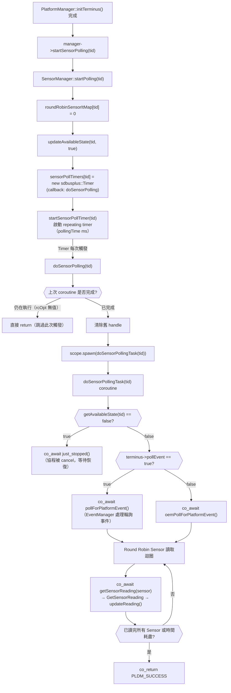
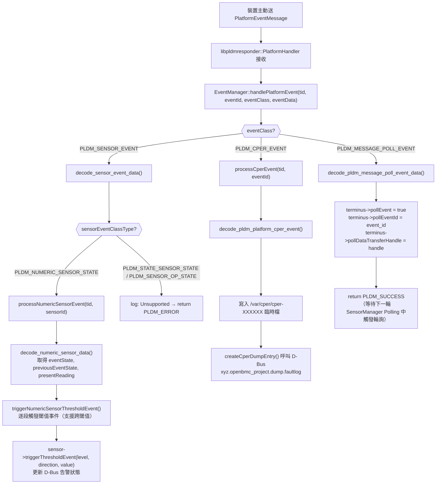
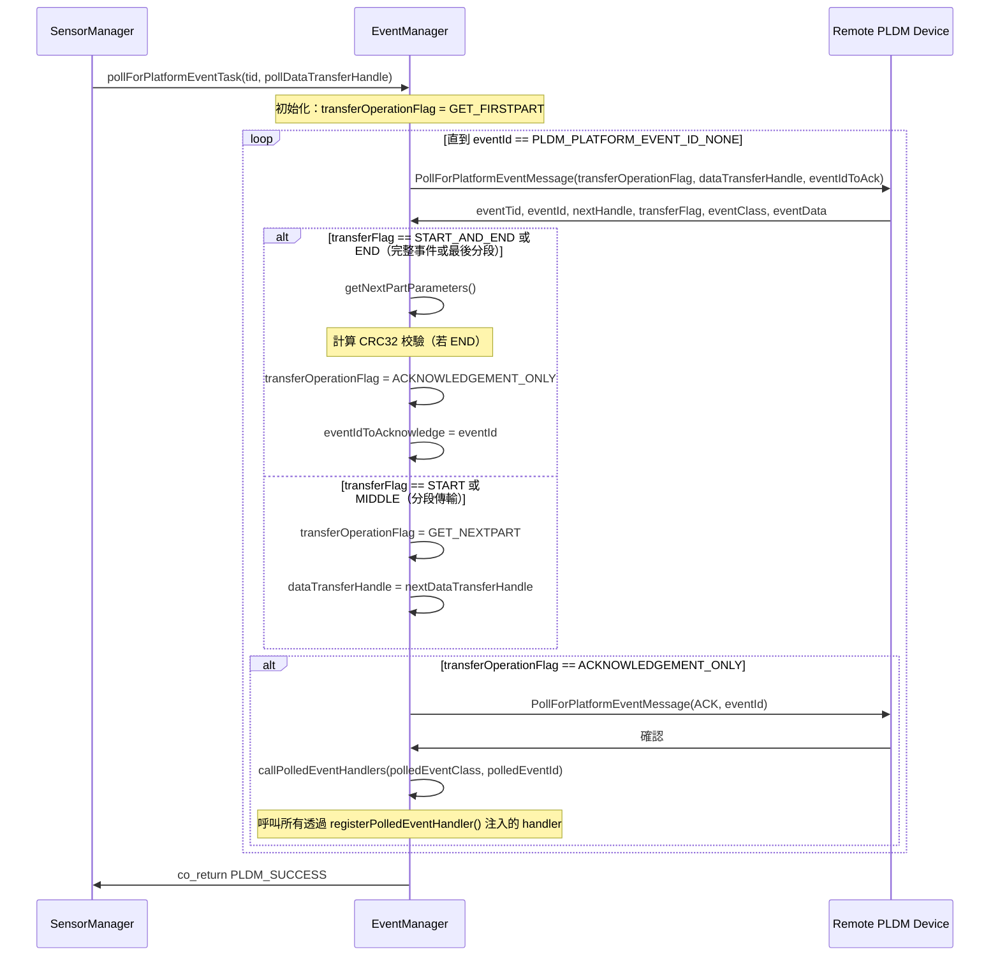
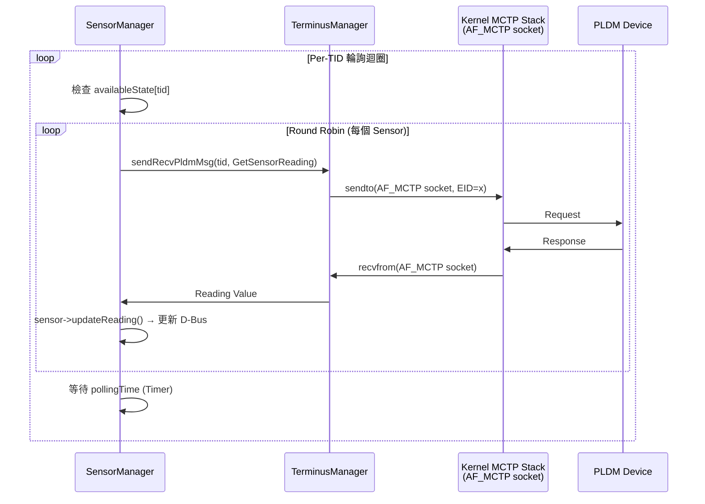

# Platform MC 模組

Platform MC 模組實作 BMC 作為 Management Controller 的 PLDM Platform 功能。

---

## 概述

| 項目     | 說明                                                                    |
| -------- | ----------------------------------------------------------------------- |
| **位置** | `platform-mc/`                                                          |
| **功能** | Terminus 管理、PDR 拉取、Sensor 讀取、事件處理、FRU 拉取、Effecter 控制 |

---

## 架構



> **逐步說明：**
>
> 這張圖展示 platform-mc 模組的組成：
>
> - **Manager**（頂層）：實作 `MctpDiscoveryHandlerIntf`，整合四個子系統。
> - **TerminusManager**：探索和管理所有 PLDM Terminus（TID 分配、能力查詢）。
> - **PlatformManager**：拉取 PDR/FRU、配置 Event Receiver。
> - **SensorManager**：對每個 Terminus 進行 Sensor 輪詢（Round Robin）。
> - **EventManager**：處理平台事件、輪詢事件、CPER 事件。
> - **Terminus**：儲存從遠端拉回的 PDR、Sensor 物件、輔助名稱。
>
> **白話總結**：platform-mc 是 BMC 「主動管理」遠端裝置的模組——發現裝置、了解它的能力、定期讀取它的 Sensor、處理它的事件。

---

## 核心類別

### Manager

`platform-mc/Manager` 是頂層管理器，實作 `MctpDiscoveryHandlerIntf`，負責整合所有子系統：

```cpp
class Manager : public pldm::MctpDiscoveryHandlerIntf {
  private:
    TerminiMapper termini{};           // 所有 Terminus 實例
    TerminusManager terminusManager;   // Terminus 探索與 TID 管理
    PlatformManager platformManager;   // PDR/FRU/Event 初始化
    SensorManager sensorManager;       // Sensor 輪詢
    EventManager eventManager;         // 事件處理
    PollHandlers pollHandlers;         // OEM 輪詢 handlers
};
```

主要回調：

- `handleMctpEndpoints()` → 觸發 `terminusManager.discoverMctpTerminus()`
- `handleRemovedMctpEndpoints()` → 移除 Terminus
- `updateMctpEndpointAvailability()` → 更新可用狀態，啟停 Sensor Polling
- `startSensorPolling(tid)` / `stopSensorPolling(tid)`
- `handleSensorEvent()` / `handleCperEvent()` / `handlePldmMessagePollEvent()`

---

### Terminus

代表一個 PLDM 端點，儲存從遠端拉回的所有資料：

```cpp
class Terminus {
  public:
    Terminus(pldm_tid_t tid, uint64_t supportedPLDMTypes,
             sdeventplus::Event& event);

    bool doesSupportType(uint8_t type);
    bool doesSupportCommand(uint8_t type, uint8_t command);
    bool setSupportedCommands(const std::vector<uint8_t>& cmds);
    void parseTerminusPDRs();  // 解析 PDR 並建立 Sensor 物件

    // === 主要成員變數 ===
    std::vector<std::vector<uint8_t>> pdrs{};      // 從遠端拉回的原始 PDR
    bool initialized = false;                       // 是否已初始化
    uint16_t maxBufferSize;                          // 最大訊息緩衝區
    bitfield8_t synchronyConfigurationSupported;     // 事件同步模式
    std::vector<std::shared_ptr<NumericSensor>> numericSensors{};
    bool pollEvent;                                  // 是否有待輪詢事件
    uint16_t pollEventId;
    uint32_t pollDataTransferHandle;

  private:
    pldm_tid_t tid;                                  // Terminus ID
    std::bitset<64> supportedTypes;                  // 支援的 PLDM Types
    std::vector<uint8_t> supportedCmds;              // 支援的命令 bitmask
    std::map<uint8_t, ver32_t> supportedTypeVersions;
    std::vector<std::shared_ptr<SensorAuxiliaryNames>> sensorAuxiliaryNamesTbl{};
    std::vector<std::shared_ptr<EntityAuxiliaryNames>> entityAuxiliaryNamesTbl{};
    EntityName terminusName{};
    std::string inventoryPath;

    // PDR 解析相關
    std::vector<std::shared_ptr<pldm_numeric_sensor_value_pdr>> numericSensorPdrs{};
    std::vector<std::shared_ptr<pldm_compact_numeric_sensor_pdr>> compactNumericSensorPdrs{};
};
```

> [!NOTE]
> Terminus **不儲存 EID**。EID ↔ TID 的對應由 `TerminusManager` 的 `mctpInfoTable` 維護。

---

### TerminusManager

管理所有 Terminus 的生命週期，使用 C++20 coroutine (`exec::task<int>`)：

```cpp
using TerminiMapper = std::map<pldm_tid_t, std::shared_ptr<Terminus>>;

class TerminusManager {
  public:
    // 觸發 Terminus 探索 (接收 MCTP endpoint 清單)
    void discoverMctpTerminus(const MctpInfos& mctpInfos);
    void removeMctpTerminus(const MctpInfos& mctpInfos);

    // 發送 PLDM 請求 (coroutine)
    exec::task<int> sendRecvPldmMsg(pldm_tid_t tid, Request& request,
                                     const pldm_msg** responseMsg,
                                     size_t* responseLen);

    // TID ↔ MCTP 映射
    std::optional<MctpInfo> toMctpInfo(const pldm_tid_t& tid);
    std::optional<pldm_tid_t> toTid(const MctpInfo& mctpInfo) const;
    std::optional<pldm_tid_t> mapTid(const MctpInfo& mctpInfo);

  private:
    // Terminus 初始化流程 (coroutine)
    exec::task<int> initMctpTerminus(const MctpInfo& mctpInfo);
    exec::task<int> getTidOverMctp(mctp_eid_t eid, pldm_tid_t* tid);
    exec::task<int> setTidOverMctp(mctp_eid_t eid, pldm_tid_t tid);
    exec::task<int> getPLDMTypes(pldm_tid_t tid, uint64_t& supportedTypes);
    exec::task<int> getPLDMVersion(pldm_tid_t tid, uint8_t type, ver32_t* version);
    exec::task<int> getPLDMCommands(pldm_tid_t tid, uint8_t type,
                                     ver32_t version, bitfield8_t* supportedCmds);

    TerminiMapper& termini;
    std::vector<bool> tidPool;                   // TID 分配池 (0 和 0xFF 保留)
    std::map<pldm_tid_t, MctpInfo> mctpInfoTable;
    std::map<MctpInfo, Availability> mctpInfoAvailTable;
};
```

> **📖 這段程式碼用到的兩個概念**
>
> #### `exec::task<int>` 是什麼？
>
> 就是 **coroutine 回傳型別**。只要一個函式宣告回傳 `exec::task<int>`，它就是一個 coroutine——可以在函式內用 `co_await` 暫停等待，呼叫者也可以用 `co_await` 等它完成。
>
> `<int>` 是完成後回傳的值的型別。這裡是 `int`，代表**錯誤碼**（`PLDM_SUCCESS = 0`，其他值代表各種錯誤）。
>
> 對照來看就很直覺：
>
> | 一般函式             | Coroutine                     |
> | -------------------- | ----------------------------- |
> | `int foo()`          | `exec::task<int> foo()`       |
> | `return 0;`          | `co_return 0;`                |
> | `int result = foo()` | `int result = co_await foo()` |
>
> 所以看到 `exec::task<int> sendRecvPldmMsg(...)` 就知道：「這是一個非同步發送 PLDM 訊息的函式，會等回應，完成後給你一個 int 錯誤碼」。
>
> #### `std::optional<T>` 是什麼？
>
> `std::optional<T>` 代表「**這個值可能存在，也可能不存在**」。比回傳 `nullptr` 或 `-1` 表示找不到更明確、更安全。
>
> 白話說：就像一個盒子，裡面**可能有東西，也可能是空的**。
>
> ```cpp
> // 例：toMctpInfo(tid) — 根據 TID 查對應的 MctpInfo
> std::optional<MctpInfo> result = terminusManager.toMctpInfo(tid);
>
> if (result.has_value()) {
>     MctpInfo info = result.value();  // 有值，取出來用
> } else {
>     // 找不到這個 TID 對應的 MCTP 資訊
> }
>
> // 也可以用更簡潔的寫法：
> if (result) { ... }
> ```
>
> 這裡的三個函式用途：
>
> | 函式               | 白話意思                                                                    |
> | ------------------ | --------------------------------------------------------------------------- |
> | `toMctpInfo(tid)`  | 給我一個 TID，查它對應的 MCTP 資訊（EID、UUID 等）。查不到就回傳空 optional |
> | `toTid(mctpInfo)`  | 給我一個 MCTP 端點，查它被分配到的 TID。查不到就回傳空 optional             |
> | `mapTid(mctpInfo)` | 給 MCTP 端點**分配**一個新 TID，失敗（TID 池滿）就回傳空 optional           |

**`initMctpTerminus()` 完整流程：**



> **逐步說明：**
>
> 這張圖展示 `initMctpTerminus()` 初始化一個新 MCTP Terminus 的完整流程，分三個階段：
>
> **階段 1：TID 協商（三條分支）**
>
> 首先送出 `GetTID` 詢問裝置現在持有的 TID：
>
> - **分支 A：裝置已有 TID 且在管理清單中**（MCTP Info 相同）→ 代表是重複探索，直接回傳成功，不重複初始化。
> - **分支 B：裝置已有 TID 且尚未在管理清單中**（新上線但保留了舊 TID）→ 直接用裝置告知的 TID 呼叫 `storeTerminusInfo()` 記錄映射。
> - **分支 C：裝置 TID 為 0（未指派）** → 呼叫 `mapTid()` 從 `tidPool` 找一個空閒 TID，用 `SetTID` 指派給裝置。若裝置不支援 `SetTID`（回傳 `PLDM_ERROR_UNSUPPORTED_PLDM_CMD`），就 unmapTid 並回傳錯誤。
>
> **階段 2：能力查詢**
>
> TID 確認後，建立 `Terminus` 物件，然後對每個支援的 PLDM Type 依序執行：
> `GetPLDMVersion` → 取得版本號 → `GetPLDMCommands` → 取得命令支援 bitmask。
> 最終將完整的命令 bitmask 存入 `Terminus` 物件，供後續 `doesSupportCommand()` 判斷使用。
>
> **階段 3：名稱設定**
>
> 若 `MctpInfo` 中帶有目標名稱（`MctpInfoName`，由 mctpd 提供），則設定為 Terminus 的預設名稱（後續 FRU 拉取可能會覆寫）。
>
> **白話總結**：就像員工入職登記——先確認是否已有工號（TID），沒有就分配新工號並通知本人；然後查清楚他會什麼（支援的 Type/Command）；最後給他貼上名牌。

---

### PlatformManager

負責 PDR 拉取、FRU 拉取、Event Receiver 配置：

```cpp
class PlatformManager {
  public:
    // 初始化所有支援 Type 2 的 Terminus
    exec::task<int> initTerminus();
    exec::task<int> configEventReceiver(pldm_tid_t tid);

  private:
    exec::task<int> getPDRs(std::shared_ptr<Terminus> terminus);
    exec::task<int> getPDR(const pldm_tid_t tid, ...);  // 單筆 GetPDR
    exec::task<int> getPDRRepositoryInfo(const pldm_tid_t tid, ...);
    exec::task<int> setEventReceiver(pldm_tid_t tid, ...);
    exec::task<int> eventMessageBufferSize(pldm_tid_t tid, ...);
    exec::task<int> eventMessageSupported(pldm_tid_t tid, ...);
    exec::task<int> getFRURecordTableMetadata(pldm_tid_t tid, uint16_t* total);
    exec::task<int> getFRURecordTables(pldm_tid_t tid, ...);
};
```

**`initTerminus()` 完整流程：**



> **逐步說明：**
>
> 這張圖展示 PlatformManager 初始化一個 Terminus 的完整流程：
>
> 1. **FRU 拉取**：先取得裝置的 FRU 資料（型號、序號等），可能需要多次讀取。
> 2. **PDR 拉取**：先查詢 PDR Repository 資訊，然後在迴圈中逐筆拉取 PDR（支援 multi-part transfer）。拉取完成後解析 PDR，建立 NumericSensor 物件。
> 3. **FRU Inventory 更新**：將 FRU 資料寫入 D-Bus Inventory。
> 4. **Event Receiver 配置**：查詢裝置支援的事件模式，設定 BMC 為事件接收者。
> 5. **啟動 Sensor Polling**：開始定期輪詢裝置的 Sensor。
>
> **白話總結**：就像新員工報到——先收集個人資料（FRU）、瀏覽能力履歷（PDR）、建立檔案（Inventory）、設定通知（EventReceiver）、開始工作（Polling）。

---

### SensorManager

per-TID Sensor 輪詢，使用 round-robin 策略：

```cpp
class SensorManager {
  public:
    void startPolling(pldm_tid_t tid);
    void stopPolling(pldm_tid_t tid);
    void disableTerminusSensors(pldm_tid_t tid);  // 將所有 sensor 值設為 NaN
    void updateAvailableState(pldm_tid_t tid, Availability state);

  protected:
    exec::task<int> doSensorPollingTask(pldm_tid_t tid);
    exec::task<int> getSensorReading(std::shared_ptr<NumericSensor> sensor);

  private:
    uint32_t pollingTime;                          // 輪詢間隔 (ms)
    std::map<pldm_tid_t, std::unique_ptr<sdbusplus::Timer>> sensorPollTimers;
    std::map<pldm_tid_t, Availability> availableState;
    std::map<pldm_tid_t, SensorID> roundRobinSensorItMap;  // round-robin 迭代器
};
```

**`startPolling()` → Timer 機制 → Coroutine 啟動流程：**



> **逐步說明：**
>
> **Timer 啟動機制**：`startPolling()` 建立一個 `sdbusplus::Timer`，以 `pollingTime`（毫秒，來自 `SENSOR_POLLING_TIME` 編譯常數）為週期重複觸發，每次觸發時呼叫 `doSensorPolling(tid)`。
>
> **Coroutine 防重入**：`doSensorPolling()` 是一個普通同步函式（Timer callback），它的工作是**啟動或跳過** coroutine。如果上一次 coroutine 任務尚未完成（`rcOpt` 沒有值），直接 return 跳過；否則清除舊 handle 並用 `scope.spawn()` 啟動新的 `doSensorPollingTask()` coroutine。這確保同一個 TID 不會有兩個 coroutine 同時執行。
>
> **可用性保護**：`doSensorPollingTask()` 在每次迭代開始及讀取每個 Sensor 前都會呼叫 `getAvailableState(tid)` 檢查 Terminus 是否可用。若不可用（例如 MCTP 通訊中斷），呼叫 `co_await stdexec::just_stopped()` 讓 coroutine 暫停等待 cancel 訊號，而非繼續嘗試發送請求。
>
> **事件優先**：每輪 Sensor 讀取前，若 `terminus->pollEvent == true`（表示裝置用 `PlatformEventMessage` 通知有待處理的事件），會優先執行 `pollForPlatformEvent()` 拉取事件，再進行 Sensor 讀取。
>
> **Round Robin 讀取**：`roundRobinSensorItMap[tid]` 記錄目前的 Sensor 索引。每次讀取從上次停留的位置繼續，確保在一個 polling 週期（`pollingTime`）內**盡量讀更多 Sensor**。若時間耗盡（`t1 - t0 >= pollingTimeInUsec`），剩餘的 Sensor 留到下一個週期。**每個 Sensor 有獨立的 `updateTime`**——只有當 `elapsed >= sensor->updateTime` 時才實際發送 `GetSensorReading` 請求，讓不同頻率的 Sensor 在同一個 round-robin 中共存。
>
> **白話總結**：就像公車定時出發——每隔一段時間（Timer）出發一次（doSensorPolling），若上班公車還沒回來就這班不出發（防重入）；出發後依序載客（round-robin 讀 Sensor），但如果路況太差（不可用）就靠邊停等修路（just_stopped）。

---

### EventManager

PLDM 事件處理，支援非同步事件與輪詢事件：

```cpp
class EventManager {
  public:
    int handlePlatformEvent(pldm_tid_t tid, uint16_t eventId,
                            uint8_t eventClass, const uint8_t* eventData,
                            size_t eventDataSize);
    exec::task<int> pollForPlatformEventTask(pldm_tid_t tid,
                                              uint32_t pollDataTransferHandle);
    void registerPolledEventHandler(uint8_t eventClass, HandlerFuncs handlers);
    void updateAvailableState(pldm_tid_t tid, Availability state);

  protected:
    int processNumericSensorEvent(pldm_tid_t tid, uint16_t sensorId, ...);
    int processCperEvent(pldm_tid_t tid, uint16_t eventId, ...);

  private:
    // eventClass → handler 函式列表（OEM 或系統可透過 registerPolledEventHandler 注入）
    std::map<uint8_t, HandlerFuncs> eventHandlers;
};
```

EventManager 有**兩條完全獨立的事件路徑**：

**路徑 A：主動推送（PlatformEventMessage）**

裝置主動向 BMC 送事件，由 `libpldmresponder` 的 Platform Handler 接收後轉發給 EventManager：



**路徑 B：主動輪詢（PollForPlatformEventMessage）**

由 `SensorManager::doSensorPollingTask()` 發現 `terminus->pollEvent == true` 後主動觸發，以 coroutine 形式執行：



> **逐步說明：**
>
> **路徑 A（主動推送）** 是**裝置主動通知 BMC** 的路徑。BMC 在 `PlatformManager::initTerminus()` 中已透過 `SetEventReceiver` 告知裝置「有事請通知我」。裝置觸發事件時，送出 `PlatformEventMessage`，由 `libpldmresponder` 接收後轉給 `EventManager::handlePlatformEvent()` 處理。
>
> - **PLDM_SENSOR_EVENT**（Sensor 閾值事件）：解析後呼叫 `processNumericSensorEvent()`。其中的 `triggerNumericSensorThresholdEvent()` 會處理**跨閾值**的情形（例如從 `LOWER_FATAL` 直接跳到 `UPPER_FATAL`），沿途依序觸發中間所有閾值的 assert/deassert 事件，確保 D-Bus 告警狀態正確。
> - **PLDM_CPER_EVENT**（CPU/硬體錯誤日誌事件）：將事件二進位資料寫到 `/var/cper/` 下的臨時檔，再透過 D-Bus 呼叫 `xyz.openbmc_project.dump.faultlog.Create()` 建立 Dump 條目。
> - **PLDM_MESSAGE_POLL_EVENT**（輪詢通知）：裝置表示「我有事件但不主動推送，請 BMC 來輪詢」。`handlePlatformEvent()` 只記錄 `pollEvent = true` 並記錄 handle，實際拉取由 SensorManager 的下一輪 polling 觸發路徑 B。
>
> **路徑 B（主動輪詢）** 是**BMC 主動去裝置拉事件**的路徑。使用 `PollForPlatformEventMessage` 命令迭代拉取，支援**分段傳輸（multi-part transfer）**：
>
> 1. 第一次送 `GET_FIRSTPART`，後續分段送 `GET_NEXTPART`
> 2. 若 `transferFlag == END`，需驗證 CRC32 校驗碼
> 3. 完整事件拼接完成後，送一次 `ACKNOWLEDGEMENT_ONLY` 確認 ACK
> 4. ACK 之後才呼叫透過 `registerPolledEventHandler()` 注入的 handler 函式
>
> **`registerPolledEventHandler()` 擴充點**：OEM 或子系統（如 `oem_event_manager`）可透過此函式向 EventManager 注入自訂的事件處理函式。當 `callPolledEventHandlers()` 被呼叫時，會遍歷並執行所有該 `eventClass` 對應的 handler 函式。
>
> **白話總結**：路徑 A 就像「裝置主動打電話來通知 BMC」；路徑 B 就像「BMC 定期去查裝置的信箱（有時是很大一封信需要分批拿）」，拿完信才蓋章確認（ACK），然後轉給各部門（handler）處理。

---

## Sensor 讀取流程



> **逐步說明：**
>
> 這張圖展示 SensorManager 的 Sensor 讀取流程：
>
> 1. **Per-TID 輪詢迴圈**：每個 Terminus 有獨立的輪詢計時器。
> 2. **檢查可用性**：先確認 Terminus 是否仍然可用。
> 3. **Round Robin 讀取**：對該 Terminus 的每個 Sensor 輪流發送 `GetSensorReading`。TerminusManager 透過 AF_MCTP socket **直接**將 PLDM 請求發送到 Kernel MCTP Stack，Kernel 負責實體傳輸（不需要 mctpd 中繼）。
> 4. **更新 D-Bus**：收到讀數後，透過 `sensor->updateReading()` 更新 D-Bus 上的 Sensor 值。
> 5. **等待間隔**：讀完一輪後等待 `pollingTime` 毫秒再讀下一輪。
>
> **白話總結**：就像巡邊檢查——定期走訪每個裝置，讀取每個 Sensor 的值，更新到中央監控系統（D-Bus）。

---

## 原始碼

| 檔案                                 | 說明                                  |
| ------------------------------------ | ------------------------------------- |
| `manager.cpp/hpp`                    | 頂層 Manager (整合所有子系統)         |
| `terminus.cpp/hpp`                   | Terminus 實作 (PDR 解析、Sensor 建立) |
| `terminus_manager.cpp/hpp`           | Terminus 探索與 TID 管理              |
| `platform_manager.cpp/hpp`           | PDR/FRU 拉取、Event Receiver 配置     |
| `sensor_manager.cpp/hpp`             | Sensor 輪詢                           |
| `numeric_sensor.cpp/hpp`             | 數值型 Sensor (D-Bus 物件建立)        |
| `event_manager.cpp/hpp`              | 事件處理                              |
| `dbus_impl_fru.cpp/hpp`              | FRU D-Bus 介面實作                    |
| `dbus_to_terminus_effecters.cpp/hpp` | D-Bus 到 Terminus Effecter 映射       |

---

_返回 [Home](Home.md)_
