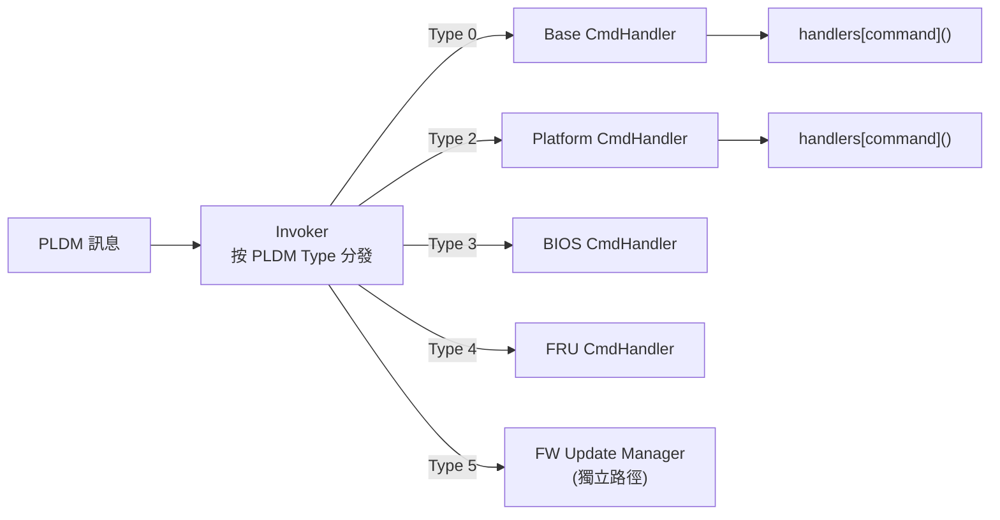
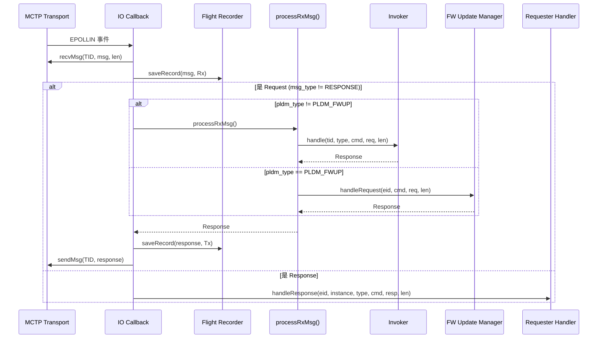

# pldmd 守護程式

pldmd 是 OpenBMC PLDM 的核心守護程式，負責處理所有 PLDM 通訊。它同時扮演 **Responder**（回應遠端請求）和 **Requester**（主動發送請求）的角色。

---

## 概述

| 項目               | 說明                           |
| ------------------ | ------------------------------ |
| **執行檔**         | `/usr/bin/pldmd`               |
| **服務**           | `pldmd.service`                |
| **原始碼**         | `pldmd/pldmd.cpp`（約 460 行） |
| **D-Bus 服務名**   | `xyz.openbmc_project.PLDM`     |
| **D-Bus 物件路徑** | `/xyz/openbmc_project/pldm`    |
| **語言**           | C++20                          |

---

## 啟動流程（main 函式深度追蹤）

pldmd 的 `main()` 函式位於 `pldmd/pldmd.cpp`，啟動步驟如下：

```mermaid
flowchart TD
    Start["main() 啟動"] --> ParseArgs["1. 解析命令列參數<br/>--verbose"]
    ParseArgs --> ReadHost["2. readHostEID()<br/>取得 Host MCTP EID"]
    ReadHost --> InitTransport["3. PldmTransport 初始化<br/>建立 MCTP 傳輸通道"]
    InitTransport --> EventLoop["4. Event::get_default()<br/>取得 sd-event 事件迴圈"]
    EventLoop --> DBus["5. 建立 D-Bus 連線<br/>ObjectManager × 3"]
    DBus --> InstanceId["6. InstanceIdDb 初始化<br/>Instance ID 資料庫"]
    InstanceId --> Invoker["7. Invoker + ReqHandler<br/>建立訊息分發器和請求處理器"]
    Invoker --> PDRRepo["8. pldm_pdr_init()<br/>初始化 PDR Repository"]
    PDRRepo --> PlatformMC["9. platform_mc::Manager<br/>Platform MC 管理器"]
    PlatformMC --> Handlers["10. 建立 Responder Handlers"]

    subgraph Handlers["10. 建立各 Type Handler"]
        H1["fruHandler<br/>(FRU Type 4)"]
        H2["platformHandler<br/>(Platform Type 2)"]
        H3["biosHandler<br/>(BIOS Type 3)"]
        H4["baseHandler<br/>(Base Type 0)"]
    end

    Handlers --> OEM["11. OEM 初始化<br/>NVIDIA / IBM / Ampere / Meta"]
    OEM --> Register["12. invoker.registerHandler()<br/>註冊所有 Type Handler"]
    Register --> DBusImpl["13. D-Bus 介面實作<br/>PDR + Event"]
    DBusImpl --> FWUpdate["14. fw_update::Manager<br/>韌體更新管理器"]
    FWUpdate --> MCTP["15. MctpDiscovery<br/>MCTP 端點探索"]
    MCTP --> IOCallback["16. IO 回調註冊<br/>監聽 MCTP Transport fd"]
    IOCallback --> HostPDR["17. setHostFirmwareCondition()<br/>應用 Host PDR"]
    HostPDR --> Signal["18. SIGUSR1 信號處理<br/>Flight Recorder Dump"]
    Signal --> Run["19. event.loop()<br/>進入主事件迴圈"]
```



> **逐步說明：**
>
> 這張圖展示 pldmd 守護程式從啟動到進入主迴圈的 19 個步驟：
>
> 1. **步驟 1-3（基礎設定）**：解析命令列參數、讀取 Host 的 MCTP EID（通訊地址）、初始化傳輸層（建立和 MCTP 的連線）。
> 2. **步驟 4-6（基礎設施）**：取得事件迴圈（用於非同步處理）、建立 D-Bus 連線（和 OpenBMC 其他服務通訊）、初始化 Instance ID 資料庫（用於匹配請求/回應）。
> 3. **步驟 7-9（核心元件）**：建立 Invoker（訊息分發器）和 Requester Handler（請求管理器）、初始化 PDR 倉庫（平台描述記錄）、建立 Platform MC 管理器。
> 4. **步驟 10-12（處理器註冊）**：建立各 PLDM Type 的 Handler（FRU/Platform/BIOS/Base）、OEM 初始化、將所有 Handler 註冊到 Invoker 中。
> 5. **步驟 13-19（最後就緒）**：建立 D-Bus 介面、韌體更新管理器、MCTP 端點探索、註冊 IO 回調（監聽傳入的 PLDM 訊息）、處理 Host PDR、註冊信號處理，最後進入主事件迴圈（無限等待並處理事件）。
>
> **白話總結**：就像開一家餐廳——先租店面（傳輸層）、接水電（D-Bus）、排置廠房設備（Handler）、註冊外送平台（MCTP）、最後開門營業（event.loop）。

---

## 核心元件詳解

### 1. Transport 層（`common/transport.hpp`）

`PldmTransport` 類別封裝了 libpldm 的傳輸層，支援兩種實作：

| 傳輸方式     | 說明                                 | 編譯選項                              |
| ------------ | ------------------------------------ | ------------------------------------- |
| `af-mctp`    | 直接使用 Linux Kernel AF_MCTP socket | `transport-implementation=af-mctp`    |
| `mctp-demux` | 透過 mctp-demux daemon 中轉          | `transport-implementation=mctp-demux` |

> ⚠️ **簡化說明**：以下為 `PldmTransport` 類別的主要公開 API 概覽，省略了部分 private 成員和條件編譯細節。完整定義請見 `common/transport.hpp`。

```cpp
// PldmTransport 提供的核心 API（簡化）
class PldmTransport {
public:
    PldmTransport(bool listening = true);
    int getEventSource() const;            // 取得可 poll 的 fd
    pldm_requester_rc_t sendMsg(...);      // 非同步發送
    pldm_requester_rc_t recvMsg(...);      // 非同步接收
    pldm_requester_rc_t sendRecvMsg(...);  // 同步請求-回應
private:
    pollfd pfd;
    TransportImpl impl;                    // union: mctp_demux 或 af_mctp
    struct pldm_transport* transport;      // 抽象傳輸物件
};
```

> **面試重點**：`af-mctp` 是較新的方式，直接使用 kernel socket；`mctp-demux` 是舊方式，需要額外的 demux daemon。現代 OpenBMC 傾向使用 `af-mctp`。

### 2. 訊息分發器：Invoker 與 CmdHandler

pldmd 使用兩層分發架構：



> **逐步說明：**
>
> 這張圖展示 pldmd 的「兩層分發」架構：
>
> 1. **第一層：Invoker**：當一筆 PLDM 訊息進來時，Invoker 先看它的 PLDM Type（像收發室看郵件的「部門」欄位），然後轉發給對應的 CmdHandler。
> 2. **第二層：CmdHandler**：每個 CmdHandler 再看具體的 Command Code（像看郵件的「收件人」），呼叫對應的處理函式。
> 3. **特殊路徑：Type 5**：FW Update 不經過 Invoker，而是直接走獨立的 `FW Update Manager`。這是因為 FW Update 的處理邏輯和其他 Type 很不一樣。
>
> **白話總結**：就像一個公司的收發室：先看「哪個部門」（PLDM Type）→ 再看「哪個人」（Command）→ 最後交給負責的員工處理。

**第一層：`Invoker`**（`pldmd/invoker.hpp`）

```cpp
class Invoker {
public:
    // 註冊 Type Handler
    void registerHandler(Type pldmType, std::unique_ptr<CmdHandler> handler);

    // 按 Type 分發
    Response handle(pldm_tid_t tid, Type pldmType, Command pldmCommand,
                    const pldm_msg* request, size_t reqMsgLen);
private:
    std::map<Type, std::unique_ptr<CmdHandler>> handlers;
};
```

**第二層：`CmdHandler`**（`pldmd/handler.hpp`）

```cpp
class CmdHandler {
public:
    // 按 Command 分發
    Response handle(pldm_tid_t tid, Command pldmCommand,
                    const pldm_msg* request, size_t reqMsgLen) {
        return handlers.at(pldmCommand)(tid, request, reqMsgLen);
    }

    // 產生只包含 Completion Code 的回應
    static Response ccOnlyResponse(const pldm_msg* request, uint8_t cc);

protected:
    // 子類別在此註冊命令處理函式
    std::map<Command, HandlerFunc> handlers;
};
```

> **設計模式**：這是一個 **Command Pattern** + **Strategy Pattern** 的組合。每個 PLDM Type 實作自己的 `CmdHandler` 衍生類別，在建構時將支援的命令碼對應到 handler 函式。

**Handler 註冊順序**（`pldmd.cpp` L354-357）：

```cpp
invoker.registerHandler(PLDM_BIOS, std::move(biosHandler));      // Type 3
invoker.registerHandler(PLDM_PLATFORM, std::move(platformHandler)); // Type 2
invoker.registerHandler(PLDM_FRU, std::move(fruHandler));          // Type 4
invoker.registerHandler(PLDM_BASE, std::move(baseHandler));        // Type 0
```

> **注意**：Type 5（FW Update）走獨立路徑，不透過 Invoker——在 `processRxMsg()` 中直接判斷 `hdrFields.pldm_type == PLDM_FWUP` 時呼叫 `fwManager->handleRequest()`。

### 3. 訊息處理流程（processRxMsg）



> **逐步說明：**
>
> 這張圖展示 pldmd 收到一筆 MCTP 訊息後的完整處理流程：
>
> 1. **收到 MCTP 訊息**：當 MCTP Transport 的 file descriptor 變得可讀時（EPOLLIN 事件），IO 回調被觸發，從 Transport 讀取訊息。
> 2. **記錄到 Flight Recorder**：如果啟用了 Flight Recorder，將訊息記錄下來（像飛機的黑盒子），供後續除錯使用。
> 3. **判斷是 Request 還是 Response**：
>    - **如果是 Request**（別人問我、我要回答）：
>      - Type 不是 FW Update → 走 Invoker 分發給對應的 CmdHandler
>      - Type 是 FW Update → 直接交給 FW Update Manager
>      - 處理完後發送 Response 回去
>    - **如果是 Response**（我問別人、別人回答我）：交給 Requester Handler，透過 Instance ID 匹配到對應的請求，呼叫 callback。
>
> **白話總結**：pldmd 就像一個「接線生」——收到來電後，先判斷是「別人打來的」還是「我打出去的回複」，然後轉到對的部門。

**關鍵設計決策**：

1. **Request vs Response 判斷**：透過 `pldm_header_info.msg_type` 區分
2. **未知命令處理**：當 `handlers.at()` 拋出 `std::out_of_range` 時，回傳 `PLDM_ERROR_UNSUPPORTED_PLDM_CMD`
3. **Response 路由**：Response 訊息直接交給 `requester::Handler::handleResponse()` 進行 Instance ID 匹配

### 4. Instance ID 管理（`common/instance_id.hpp`）

Instance ID 是 PLDM 協議中用於匹配 Request-Response 的 5-bit 識別碼（範圍 0-31，依 DSP0240 v1.1.0），在 C++ API 中以 `uint8_t` 儲存。

> ⚠️ **簡化說明**：以下為 `InstanceIdDb` 類別的主要公開 API 概覽，省略了部分實作細節。完整定義請見 `common/instance_id.hpp`。

```cpp
class InstanceIdDb {
public:
    InstanceIdDb();                            // 使用預設路徑
    InstanceIdDb(const std::string& path);     // 指定資料庫路徑

    std::expected<uint8_t, InstanceIdError> next(uint8_t tid);  // 分配 ID
    void free(uint8_t tid, uint8_t instanceId);                 // 釋放 ID
private:
    pldm_instance_db* pldmInstanceIdDb;        // libpldm 底層實作
};
```

| 操作            | 說明                                                                                        |
| --------------- | ------------------------------------------------------------------------------------------- |
| `next(tid)`     | 為指定 TID 分配一個 Instance ID，失敗時返回 `InstanceIdError`（如 `-EAGAIN` 表示無可用 ID） |
| `free(tid, id)` | 釋放已使用的 Instance ID，若 ID 未曾分配則拋出 `std::runtime_error`                         |

> **DSP0240 v1.1.0 規範**：Instance ID 在 6 秒後過期並可重用（Table 6, Timing Specification）。`meson.options` 中 `instance-id-expiration-interval` 預設 5 秒。

### 5. Flight Recorder（`common/flight_recorder.hpp`）

Flight Recorder 是一個環形緩衝區，記錄最近 N 條 PLDM 訊息，用於事後除錯：

```cpp
class FlightRecorder {
    // Singleton 模式
    static FlightRecorder& GetInstance();

    // 記錄一條訊息（timestamp + Rx/Tx + raw bytes）
    void saveRecord(const FlightRecorderData& buffer, ReqOrResponse isRequest);

    // 傾印到 /tmp/pldm_flight_recorder
    void playRecorder();

private:
    FlightRecorderCassette tapeRecorder;  // vector<tuple<timestamp, isReq, data>>
    int index;                            // 環形索引
};
```

| 配置                         | 說明                                |
| ---------------------------- | ----------------------------------- |
| `flightrecorder-max-entries` | Meson 選項，預設 0（停用），最大 30 |
| 觸發方式                     | 發送 `SIGUSR1` 信號給 pldmd         |
| 輸出路徑                     | `/tmp/pldm_flight_recorder`         |

```bash
# 啟用 Flight Recorder 編譯
meson setup build -Dflightrecorder-max-entries=30

# 傾印記錄
kill -SIGUSR1 $(pidof pldmd)
cat /tmp/pldm_flight_recorder
```

---

## OEM 擴充機制

pldmd 透過編譯時條件式（`#ifdef`）支援多家 OEM 擴充。以下為 upstream source code 中實際存在的 OEM：

| OEM    | 編譯旗標     | Meson 選項   | 來源目錄      | 說明                                                                         |
| ------ | ------------ | ------------ | ------------- | ---------------------------------------------------------------------------- |
| Ampere | `OEM_AMPERE` | `oem-ampere` | `oem/ampere/` | Ampere 平台支援，在 `pldmd.cpp` 中以 `#ifdef OEM_AMPERE` 守護                |
| IBM    | `OEM_IBM`    | `oem-ibm`    | `oem/ibm/`    | 完整 OEM 處理（Host/File I/O 等），在 `pldmd.cpp` 中以 `#ifdef OEM_IBM` 守護 |
| Meta   | `OEM_META`   | `oem-meta`   | `oem/meta/`   | Meta 平台支援，在 `pldmd.cpp` 中以 `#ifdef OEM_META` 守護                    |
| NVIDIA | `OEM_NVIDIA` | `oem-nvidia` | `oem/nvidia/` | NVIDIA 平台支援，在 `pldmd.cpp` 中以 `#ifdef OEM_NVIDIA` 守護                |

### OEM 初始化模式（`pldmd.cpp` L328-352）

```cpp
#ifdef OEM_AMPERE
    pldm::oem_ampere::OemAMPERE oemAMPERE(
        &dbusHandler, pldmTransport.getEventSource(), pdrRepo.get(),
        instanceIdDb, event, invoker, hostPDRHandler.get(),
        platformHandler.get(), fruHandler.get(), baseHandler.get(),
        biosHandler.get(), platformManager.get(), &reqHandler);
#endif

#ifdef OEM_META
    pldm::oem_meta::OemMETA oemMETA(&dbusHandler, invoker,
                                    platformHandler.get());
#endif

#ifdef OEM_NVIDIA
    pldm::oem_nvidia::OemNVIDIA oemNVIDIA(platformHandler.get(),
                                          platformManager.get());
#endif

#ifdef OEM_IBM
    pldm::oem_ibm::OemIBM oemIBM(
        &dbusHandler, pldmTransport.getEventSource(), hostEID, pdrRepo.get(),
        instanceIdDb, event, invoker, hostPDRHandler.get(),
        platformHandler.get(), fruHandler.get(), baseHandler.get(),
        biosHandler.get(), &reqHandler);
#endif
```

> **設計說明**：OEM 物件在建構時即完成所有初始化（包括註冊額外的 handler、PDR、event handler 等），利用 RAII 模式確保 OEM 擴充的生命週期與 daemon 一致。

---

## D-Bus 介面

pldmd 在 D-Bus 上暴露以下介面：

### Object Manager（4 個路徑）

```cpp
// pldmd.cpp L208-217
sdbusplus::server::manager_t objManager(bus, "/xyz/openbmc_project/software");
sdbusplus::server::manager_t sensorObjManager(bus, "/xyz/openbmc_project/sensors");
sdbusplus::server::manager_t metricObjManager(bus, "/xyz/openbmc_project/metric");
sdbusplus::server::manager_t inventoryManager(bus, "/xyz/openbmc_project/inventory");
```

### PDR 查詢介面

| 項目 | 值                                                |
| ---- | ------------------------------------------------- |
| 介面 | `xyz.openbmc_project.PLDM.PDR`                    |
| 路徑 | `/xyz/openbmc_project/pldm`                       |
| 方法 | `FindStateEffecterPDR(tid, entityID, stateSetId)` |
| 方法 | `FindStateSensorPDR(tid, entityID, stateSetId)`   |

### Event 介面

| 項目 | 值                               |
| ---- | -------------------------------- |
| 介面 | `xyz.openbmc_project.PLDM.Event` |
| 路徑 | `/xyz/openbmc_project/pldm`      |

### Host Firmware 條件介面

| 項目 | 值                          |
| ---- | --------------------------- |
| 類別 | `dbus_api::Host`            |
| 路徑 | `/xyz/openbmc_project/pldm` |

---

## 命令列選項

```bash
$ pldmd --help
Usage: pldmd [OPTIONS]
Options:
  -v, --verbose    啟用詳細輸出（印出每條 Rx/Tx 訊息）
```

### 啟用 Verbose 模式

```bash
# 方法 1：透過環境變數
echo 'PLDMD_ARGS="--verbose"' > /etc/default/pldmd
systemctl restart pldmd

# 方法 2：直接執行
pldmd --verbose

# 停用
rm /etc/default/pldmd
systemctl restart pldmd
```

---

## Meson 建置選項

以下為 upstream `meson.options` 中實際存在的配置選項（已驗證）：

| 選項                              | 類型    | 預設     | 範圍                     | 說明                              |
| --------------------------------- | ------- | -------- | ------------------------ | --------------------------------- |
| `transport-implementation`        | combo   | —        | `af-mctp` / `mctp-demux` | MCTP 傳輸實作                     |
| `terminus-id`                     | int     | 1        | 0-255                    | 本機 Terminus ID (TID)            |
| `terminus-handle`                 | int     | 1        | 0-65535                  | 本機 Terminus Handle              |
| `dbus-timeout-value`              | int     | 5        | 3-10                     | D-Bus 呼叫超時（秒）              |
| `heartbeat-timeout-seconds`       | int     | 120      | —                        | Host 心跳超時                     |
| `number-of-request-retries`       | int     | 2        | 2-30                     | 請求重試次數                      |
| `instance-id-expiration-interval` | int     | 5        | 5-6                      | Instance ID 過期間隔（秒）        |
| `response-time-out`               | int     | 2000     | 300-4800                 | 回應超時（毫秒）                  |
| `flightrecorder-max-entries`      | int     | 0        | 0-30                     | Flight Recorder 容量，0=停用      |
| `maximum-transfer-size`           | int     | 4096     | 16-4294967295            | FW Update 最大傳輸大小（bytes）   |
| `update-timeout-seconds`          | int     | 60       | 60-90                    | FW Update 元件更新超時            |
| `softoff-timeout-seconds`         | int     | 7200     | —                        | Soft Power Off 等待 Host 關機超時 |
| `default-sensor-update-interval`  | int     | 999      | 1-4294967295             | 預設 sensor 輪詢間隔（ms）        |
| `sensor-polling-time`             | int     | 249      | 1-10000                  | Terminus sensor 輪詢 timer（ms）  |
| `system-specific-bios-json`       | feature | disabled | —                        | 系統特定 BIOS JSON 支援           |
| `oem-ibm`                         | feature | enabled  | —                        | IBM OEM 支援                      |
| `oem-ampere`                      | feature | enabled  | —                        | Ampere OEM 支援                   |
| `oem-meta`                        | feature | enabled  | —                        | Meta OEM 支援                     |
| `oem-nvidia`                      | feature | enabled  | —                        | NVIDIA OEM 支援                   |

---

## 原始碼結構

| 檔案                          | 大小  | 說明                           |
| ----------------------------- | ----- | ------------------------------ |
| `pldmd/pldmd.cpp`             | 17KB  | 主程式，完整啟動流程和事件迴圈 |
| `pldmd/handler.hpp`           | 1.7KB | `CmdHandler` 基底類別定義      |
| `pldmd/invoker.hpp`           | 1.2KB | `Invoker` 訊息分發器           |
| `pldmd/dbus_impl_pdr.cpp/hpp` | 3KB   | PDR D-Bus 介面實作             |
| `pldmd/oem_ibm.hpp`           | 7.9KB | IBM OEM 工廠類別               |
| `pldmd/service_files/`        | —     | Systemd 服務檔案               |

### 共用模組（`common/`）

| 檔案                  | 大小  | 說明                            |
| --------------------- | ----- | ------------------------------- |
| `transport.cpp/hpp`   | 8.7KB | `PldmTransport` MCTP 傳輸封裝   |
| `instance_id.hpp`     | 4.5KB | `InstanceIdDb` Instance ID 管理 |
| `flight_recorder.hpp` | 3.8KB | `FlightRecorder` 訊息記錄器     |
| `types.hpp`           | 8.8KB | 共用型別定義                    |
| `utils.cpp/hpp`       | 55KB  | D-Bus 工具、Host EID 讀取等     |
| `bios_utils.hpp`      | 3.6KB | BIOS 屬性工具函式               |

---

## 相關文件

- [Architecture](Architecture.md) - 系統架構
- [Configuration](Configuration.md) - 建置與設定
- [Requester](Requester.md) - Requester 模組
- [LibpldmResponder](LibpldmResponder.md) - Responder Handler 函式庫

---

_返回 [Home](Home.md)_
