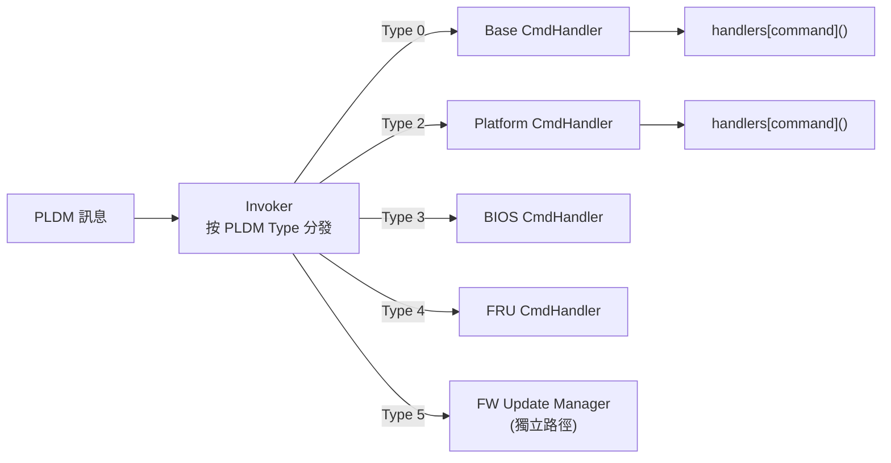
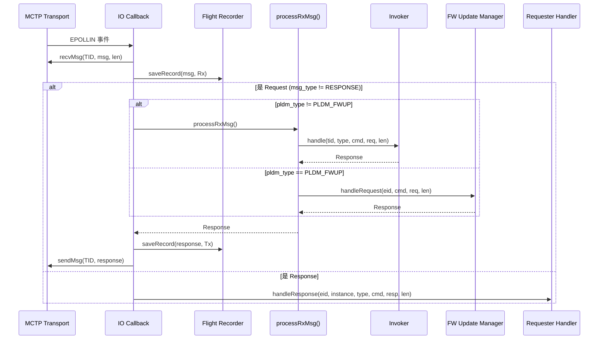

# pldmd 守護程式

pldmd 是 OpenBMC PLDM 的核心守護程式，負責處理所有 PLDM 通訊。它同時扮演 **Responder**（回應遠端請求）和 **Requester**（主動發送請求）的角色。

---

## 概述

| 項目 | 說明 |
|------|------|
| **執行檔** | `/usr/bin/pldmd` |
| **服務** | `pldmd.service` |
| **原始碼** | `pldmd/pldmd.cpp`（約 482 行） |
| **D-Bus 服務名** | `xyz.openbmc_project.PLDM` |
| **D-Bus 物件路徑** | `/xyz/openbmc_project/pldm` |
| **語言** | C++20 |

---

## 啟動流程（main 函式深度追蹤）

pldmd 的 `main()` 函式位於 `pldmd/pldmd.cpp`，啟動步驟如下：

```mermaid
flowchart TD
    Start["main() 啟動"] --> ParseArgs["1. 解析命令列參數<br/>--verbose"]
    ParseArgs --> ReadHost["2. readHostEID()<br/>取得 Host MCTP EID"]
    ReadHost --> InitTransport["3. PldmTransport 初始化<br/>建立 MCTP 傳輸通道"]
    InitTransport --> EventLoop["4. Event::get_default()<br/>取得 sd-event 事件迴圈"]
    EventLoop --> DBus["5. 建立 D-Bus 連線<br/>ObjectManager × 4"]
    DBus --> InstanceId["6. InstanceIdDb 初始化<br/>Instance ID 資料庫"]
    InstanceId --> Invoker["7. Invoker + ReqHandler<br/>建立訊息分發器和請求處理器"]
    Invoker --> PDRRepo["8. pldm_pdr_init()<br/>初始化 PDR Repository"]
    PDRRepo --> PlatformMC["9. platform_mc::Manager<br/>Platform MC 管理器"]
    PlatformMC --> Handlers["10. 建立 Responder Handlers"]

    subgraph Handlers["10. 建立各 Type Handler"]
        H1["fruHandler<br/>(FRU Type 4)"]
        H2["platformHandler<br/>(Platform Type 2)"]
        H3["biosHandler<br/>(BIOS Type 3)"]
        H4["baseHandler<br/>(Base Type 0)"]
    end

    Handlers --> OEM["11. OEM 初始化<br/>NVIDIA / IBM / Ampere / Meta"]
    OEM --> Register["12. invoker.registerHandler()<br/>註冊所有 Type Handler"]
    Register --> DBusImpl["13. D-Bus 介面實作<br/>PDR + Event"]
    DBusImpl --> FWUpdate["14. fw_update::Manager<br/>韌體更新管理器"]
    FWUpdate --> MCTP["15. MctpDiscovery<br/>MCTP 端點探索"]
    MCTP --> IOCallback["16. IO 回調註冊<br/>監聽 MCTP Transport fd"]
    IOCallback --> HostPDR["17. setHostFirmwareCondition()<br/>應用 Host PDR"]
    HostPDR --> Signal["18. SIGUSR1 信號處理<br/>Flight Recorder Dump"]
    Signal --> Run["19. event.loop()<br/>進入主事件迴圈"]
```



---

## 核心元件詳解

### 1. Transport 層（`common/transport.hpp`）

`PldmTransport` 類別封裝了 libpldm 的傳輸層，支援兩種實作：

| 傳輸方式 | 說明 | 編譯選項 |
|----------|------|----------|
| `af-mctp` | 直接使用 Linux Kernel AF_MCTP socket | `transport-implementation=af-mctp` |
| `mctp-demux` | 透過 mctp-demux daemon 中轉 | `transport-implementation=mctp-demux` |

```cpp
// PldmTransport 提供的核心 API
class PldmTransport {
public:
    PldmTransport(bool listening = true);
    int getEventSource() const;            // 取得可 poll 的 fd
    pldm_requester_rc_t sendMsg(...);      // 非同步發送
    pldm_requester_rc_t recvMsg(...);      // 非同步接收
    pldm_requester_rc_t sendRecvMsg(...);  // 同步請求-回應
private:
    pollfd pfd;
    TransportImpl impl;                    // union: mctp_demux 或 af_mctp
    struct pldm_transport* transport;      // 抽象傳輸物件
};
```

> **面試重點**：`af-mctp` 是較新的方式，直接使用 kernel socket；`mctp-demux` 是舊方式，需要額外的 demux daemon。現代 OpenBMC 傾向使用 `af-mctp`。

### 2. 訊息分發器：Invoker 與 CmdHandler

pldmd 使用兩層分發架構：



**第一層：`Invoker`**（`pldmd/invoker.hpp`）

```cpp
class Invoker {
public:
    // 註冊 Type Handler
    void registerHandler(Type pldmType, std::unique_ptr<CmdHandler> handler);

    // 按 Type 分發
    Response handle(pldm_tid_t tid, Type pldmType, Command pldmCommand,
                    const pldm_msg* request, size_t reqMsgLen);
private:
    std::map<Type, std::unique_ptr<CmdHandler>> handlers;
};
```

**第二層：`CmdHandler`**（`pldmd/handler.hpp`）

```cpp
class CmdHandler {
public:
    // 按 Command 分發
    Response handle(pldm_tid_t tid, Command pldmCommand,
                    const pldm_msg* request, size_t reqMsgLen) {
        return handlers.at(pldmCommand)(tid, request, reqMsgLen);
    }

    // 產生只包含 Completion Code 的回應
    static Response ccOnlyResponse(const pldm_msg* request, uint8_t cc);

protected:
    // 子類別在此註冊命令處理函式
    std::map<Command, HandlerFunc> handlers;
};
```

> **設計模式**：這是一個 **Command Pattern** + **Strategy Pattern** 的組合。每個 PLDM Type 實作自己的 `CmdHandler` 衍生類別，在建構時將支援的命令碼對應到 handler 函式。

**Handler 註冊順序**（`pldmd.cpp` L354-357）：

```cpp
invoker.registerHandler(PLDM_BIOS, std::move(biosHandler));      // Type 3
invoker.registerHandler(PLDM_PLATFORM, std::move(platformHandler)); // Type 2
invoker.registerHandler(PLDM_FRU, std::move(fruHandler));          // Type 4
invoker.registerHandler(PLDM_BASE, std::move(baseHandler));        // Type 0
```

> **注意**：Type 5（FW Update）走獨立路徑，不透過 Invoker——在 `processRxMsg()` 中直接判斷 `hdrFields.pldm_type == PLDM_FWUP` 時呼叫 `fwManager->handleRequest()`。

### 3. 訊息處理流程（processRxMsg）



**關鍵設計決策**：

1. **Request vs Response 判斷**：透過 `pldm_header_info.msg_type` 區分
2. **未知命令處理**：當 `handlers.at()` 拋出 `std::out_of_range` 時，回傳 `PLDM_ERROR_UNSUPPORTED_PLDM_CMD`
3. **Response 路由**：Response 訊息直接交給 `requester::Handler::handleResponse()` 進行 Instance ID 匹配

### 4. Instance ID 管理（`common/instance_id.hpp`）

Instance ID 是 PLDM 協議中用於匹配 Request-Response 的 8-bit 識別碼（依 DSP0240 v1.0.0）。

```cpp
class InstanceIdDb {
public:
    InstanceIdDb();                            // 使用預設路徑
    InstanceIdDb(const std::string& path);     // 指定資料庫路徑

    std::expected<uint8_t, InstanceIdError> next(uint8_t tid);  // 分配 ID
    void free(uint8_t tid, uint8_t instanceId);                 // 釋放 ID
private:
    pldm_instance_db* pldmInstanceIdDb;        // libpldm 底層實作
};
```

| 操作 | 說明 |
|------|------|
| `next(tid)` | 為指定 TID 分配一個 Instance ID，失敗時返回 `InstanceIdError`（如 `-EAGAIN` 表示無可用 ID） |
| `free(tid, id)` | 釋放已使用的 Instance ID，若 ID 未曾分配則拋出 `std::runtime_error` |

> **DSP0240 規範**：Instance ID 在 6 秒後過期並可重用（Table 6, Timing Specification）。`meson.options` 中 `instance-id-expiration-interval` 預設 5 秒。

### 5. Flight Recorder（`common/flight_recorder.hpp`）

Flight Recorder 是一個環形緩衝區，記錄最近 N 條 PLDM 訊息，用於事後除錯：

```cpp
class FlightRecorder {
    // Singleton 模式
    static FlightRecorder& GetInstance();

    // 記錄一條訊息（timestamp + Rx/Tx + raw bytes）
    void saveRecord(const FlightRecorderData& buffer, ReqOrResponse isRequest);

    // 傾印到 /tmp/pldm_flight_recorder
    void playRecorder();

private:
    FlightRecorderCassette tapeRecorder;  // vector<tuple<timestamp, isReq, data>>
    int index;                            // 環形索引
};
```

| 配置 | 說明 |
|------|------|
| `flightrecorder-max-entries` | Meson 選項，預設 0（停用），最大 30 |
| 觸發方式 | 發送 `SIGUSR1` 信號給 pldmd |
| 輸出路徑 | `/tmp/pldm_flight_recorder` |

```bash
# 啟用 Flight Recorder 編譯
meson setup build -Dflightrecorder-max-entries=30

# 傾印記錄
kill -SIGUSR1 $(pidof pldmd)
cat /tmp/pldm_flight_recorder
```

---

## OEM 擴充機制

pldmd 透過編譯時條件式支援多家 OEM 擴充：

| OEM | 編譯旗標 | 類別 | 說明 |
|-----|----------|------|------|
| **NVIDIA** | `OEM_NVIDIA` | `OemNVIDIA` | Legacy CPER 事件（0xFA）向後相容 |
| IBM | `OEM_IBM` | `OemIBM` | 完整 OEM 處理（Host/File I/O 等） |
| Ampere | `OEM_AMPERE` | `OemAMPERE` | Ampere 平台支援 |
| Meta | `OEM_META` | `OemMETA` | Meta 平台支援 |

### NVIDIA OEM 實作（`oem/nvidia/oem_nvidia.hpp`）

```cpp
class OemNVIDIA {
public:
    explicit OemNVIDIA(responder::platform::Handler* platformHandler,
                       platform_mc::Manager* platformManager) {
        createOemEventHandler(platformHandler, platformManager);
    }
private:
    void createOemEventHandler(...) {
        // 註冊 0xFA (legacy CPER event class) 處理器
        // 相容 DSP0248 V1.3.0 之前使用的自訂事件類別
        platformHandler->registerEventHandlers(
            PLDM_OEM_NVIDIA_LEGACY_CPER_EVENT_CLASS, {...});
        platformManager->registerPolledEventHandler(
            PLDM_OEM_NVIDIA_LEGACY_CPER_EVENT_CLASS, {...});
    }
};
```

> **背景說明**：CPER（Common Platform Error Record）事件在 DSP0248 v1.3.0 之後標準化為 event class `0x07`（`PLDM_CPER_EVENT`）。NVIDIA 在此之前使用自訂 event class `0xFA`。`OemNVIDIA` 讓 pldmd 同時支援新舊兩種 event class。

---

## D-Bus 介面

pldmd 在 D-Bus 上暴露以下介面：

### Object Manager（4 個路徑）

```cpp
// pldmd.cpp L208-217
sdbusplus::server::manager_t objManager(bus, "/xyz/openbmc_project/software");
sdbusplus::server::manager_t sensorObjManager(bus, "/xyz/openbmc_project/sensors");
sdbusplus::server::manager_t metricObjManager(bus, "/xyz/openbmc_project/metric");
sdbusplus::server::manager_t inventoryManager(bus, "/xyz/openbmc_project/inventory");
```

### PDR 查詢介面

| 項目 | 值 |
|------|-----|
| 介面 | `xyz.openbmc_project.PLDM.PDR` |
| 路徑 | `/xyz/openbmc_project/pldm` |
| 方法 | `FindStateEffecterPDR(tid, entityID, stateSetId)` |
| 方法 | `FindStateSensorPDR(tid, entityID, stateSetId)` |

### Event 介面

| 項目 | 值 |
|------|-----|
| 介面 | `xyz.openbmc_project.PLDM.Event` |
| 路徑 | `/xyz/openbmc_project/pldm` |

### Host Firmware 條件介面

| 項目 | 值 |
|------|-----|
| 類別 | `dbus_api::Host` |
| 路徑 | `/xyz/openbmc_project/pldm` |

---

## 命令列選項

```bash
$ pldmd --help
Usage: pldmd [OPTIONS]
Options:
  -v, --verbose    啟用詳細輸出（印出每條 Rx/Tx 訊息）
```

### 啟用 Verbose 模式

```bash
# 方法 1：透過環境變數
echo 'PLDMD_ARGS="--verbose"' > /etc/default/pldmd
systemctl restart pldmd

# 方法 2：直接執行
pldmd --verbose

# 停用
rm /etc/default/pldmd
systemctl restart pldmd
```

---

## Meson 建置選項

以下為與 pldmd 直接相關的 `meson.options` 配置：

| 選項 | 類型 | 預設 | 範圍 | 說明 |
|------|------|------|------|------|
| `transport-implementation` | combo | — | `af-mctp` / `mctp-demux` | MCTP 傳輸實作 |
| `terminus-id` | int | 1 | 0-255 | 本機 Terminus ID (TID) |
| `terminus-handle` | int | 1 | 0-65535 | 本機 Terminus Handle |
| `dbus-timeout-value` | int | 5 | 3-10 | D-Bus 呼叫超時（秒） |
| `heartbeat-timeout-seconds` | int | 120 | — | Host 心跳超時 |
| `number-of-request-retries` | int | 2 | 2-30 | 請求重試次數 |
| `instance-id-expiration-interval` | int | 5 | 5-6 | Instance ID 過期間隔（秒） |
| `response-time-out` | int | 2000 | 300-4800 | 回應超時（毫秒） |
| `flightrecorder-max-entries` | int | 0 | 0-30 | Flight Recorder 容量，0=停用 |
| `oem-nvidia` | feature | enabled | — | NVIDIA OEM 支援 |
| `oem-ibm` | feature | enabled | — | IBM OEM 支援 |
| `oem-ampere` | feature | enabled | — | Ampere OEM 支援 |
| `oem-meta` | feature | enabled | — | Meta OEM 支援 |

---

## 原始碼結構

| 檔案 | 大小 | 說明 |
|------|------|------|
| `pldmd/pldmd.cpp` | 17KB | 主程式，完整啟動流程和事件迴圈 |
| `pldmd/handler.hpp` | 1.7KB | `CmdHandler` 基底類別定義 |
| `pldmd/invoker.hpp` | 1.2KB | `Invoker` 訊息分發器 |
| `pldmd/dbus_impl_pdr.cpp/hpp` | 3KB | PDR D-Bus 介面實作 |
| `pldmd/oem_ibm.hpp` | 7.9KB | IBM OEM 工廠類別 |
| `pldmd/service_files/` | — | Systemd 服務檔案 |

### 共用模組（`common/`）

| 檔案 | 大小 | 說明 |
|------|------|------|
| `transport.cpp/hpp` | 8.7KB | `PldmTransport` MCTP 傳輸封裝 |
| `instance_id.hpp` | 4.5KB | `InstanceIdDb` Instance ID 管理 |
| `flight_recorder.hpp` | 3.8KB | `FlightRecorder` 訊息記錄器 |
| `types.hpp` | 8.8KB | 共用型別定義 |
| `utils.cpp/hpp` | 55KB | D-Bus 工具、Host EID 讀取等 |
| `bios_utils.hpp` | 3.6KB | BIOS 屬性工具函式 |

---

## 相關文件

- [Architecture](Architecture.md) - 系統架構
- [Configuration](Configuration.md) - 建置與設定
- [Requester](Requester.md) - Requester 模組
- [LibpldmResponder](LibpldmResponder.md) - Responder Handler 函式庫

---

*返回 [Home](Home.md)*
