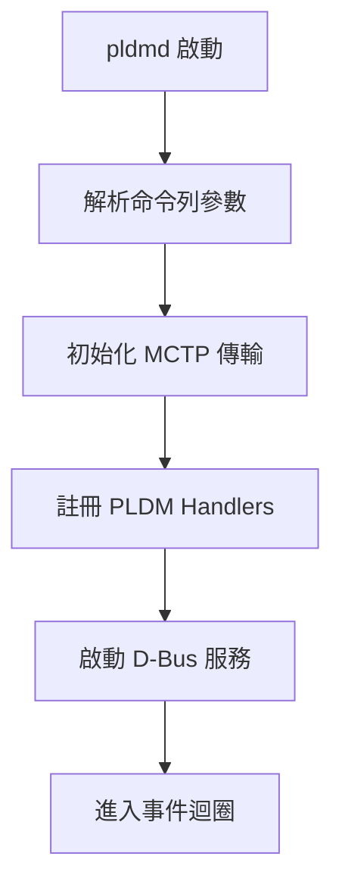
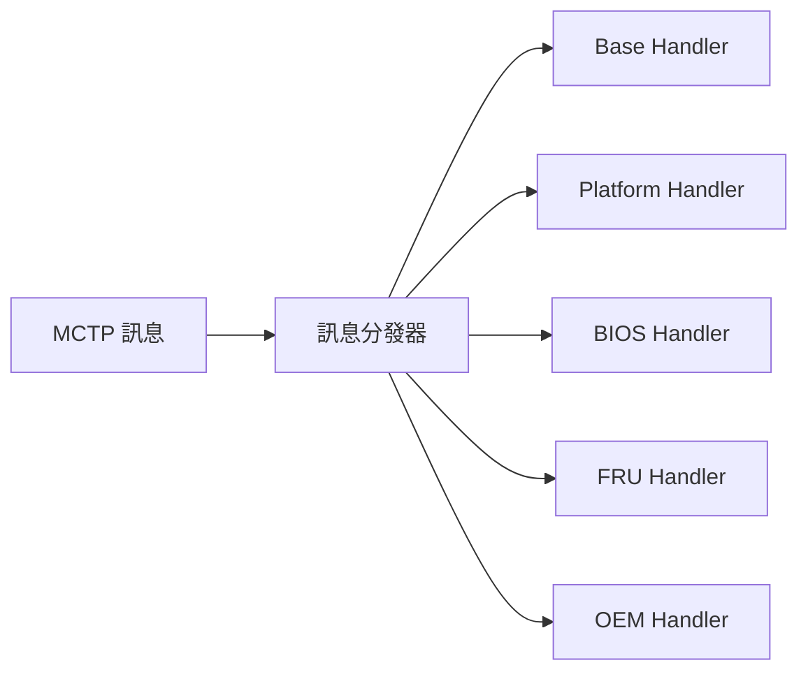

# pldmd 守護程式

pldmd 是 OpenBMC PLDM 的核心守護程式，負責處理所有 PLDM 通訊。

---

## 概述

| 項目 | 說明 |
|------|------|
| **執行檔** | `/usr/bin/pldmd` |
| **服務** | `pldmd.service` |
| **語言** | C++ |

---

## 主要職責

- 接收與發送 PLDM 訊息 (透過 MCTP)
- 路由訊息到對應的 Handler
- 管理 Instance ID
- 提供 D-Bus 服務介面

---

## 啟動流程



---

## 命令列選項

```bash
$ pldmd --help
Usage: pldmd [OPTIONS]

Options:
  -v, --verbose            啟用詳細輸出
  -m, --mctp_eid EID       設定本機 MCTP EID
  --help                   顯示說明
```

### 啟用詳細模式

```bash
# 設定環境變數
echo 'PLDMD_ARGS="--verbose"' > /etc/default/pldmd
systemctl restart pldmd

# 停用
rm /etc/default/pldmd
systemctl restart pldmd
```

---

## D-Bus 介面

### 服務資訊

| 項目 | 值 |
|------|-----|
| 服務名稱 | `xyz.openbmc_project.PLDM` |
| 物件路徑 | `/xyz/openbmc_project/pldm` |

---

## 訊息路由



---

## 原始碼

| 檔案 | 說明 |
|------|------|
| `pldmd/pldmd.cpp` | 主程式 |
| `pldmd/dbus_impl_pdr.cpp` | PDR D-Bus 介面 |
| `pldmd/dbus_impl_requester.cpp` | Requester D-Bus 介面 |

---

## 相關文件

- [Architecture](Architecture.md) - 系統架構
- [Configuration](Configuration.md) - 設定指南

---

*返回 [Home](Home.md)*
