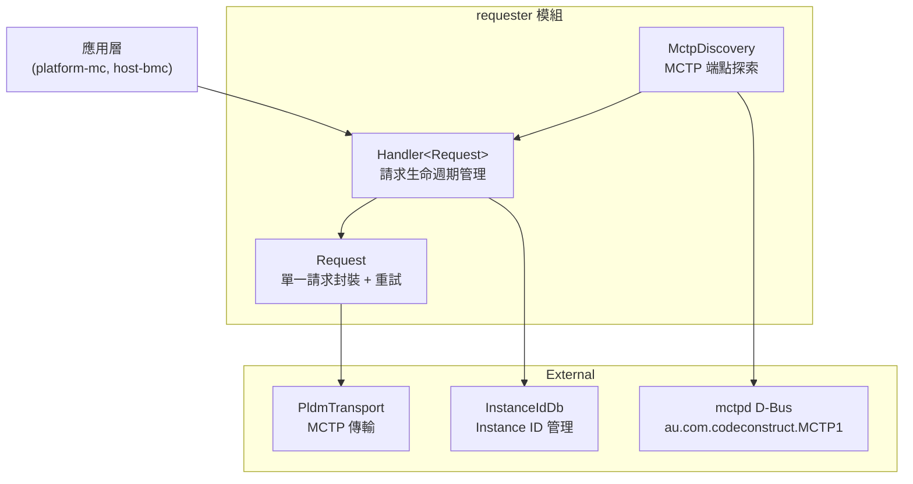
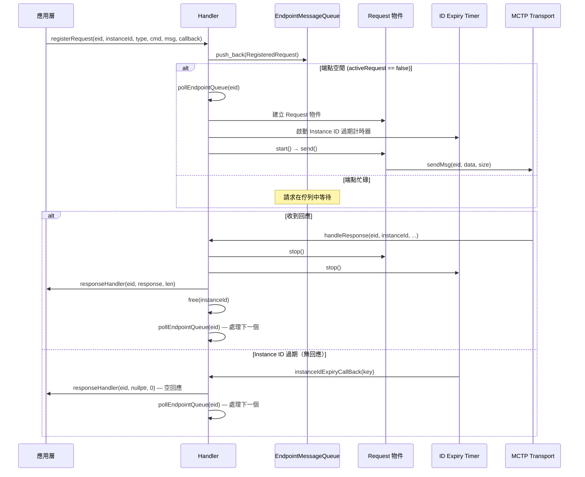
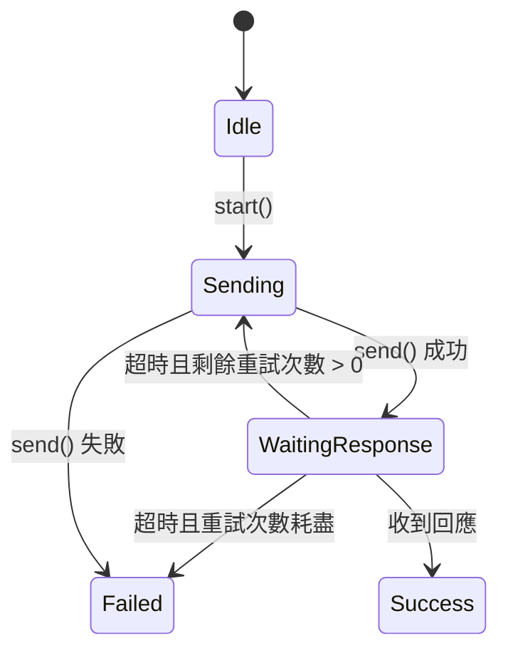
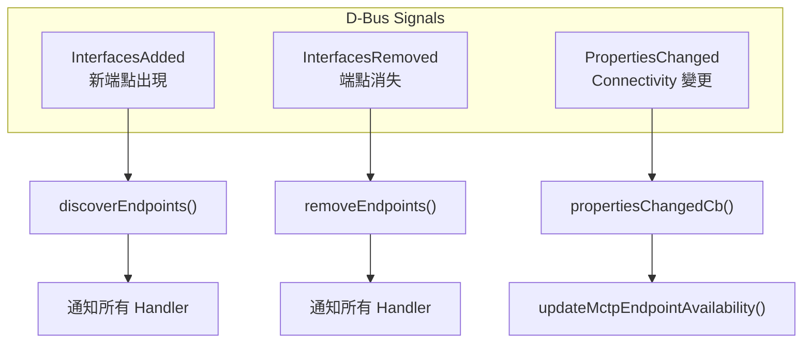

# Requester 模組

Requester 模組實作 BMC 作為 **PLDM Requester** 的功能——主動向遠端 PLDM Terminus 發送請求並處理回應。

---

## 概述

| 項目         | 說明                                                                                 |
| ------------ | ------------------------------------------------------------------------------------ |
| **位置**     | `requester/`                                                                         |
| **功能**     | 請求生命週期管理、重試邏輯、MCTP 端點探索                                            |
| **核心檔案** | `handler.hpp`（23KB）、`request.hpp`（6.5KB）、`mctp_endpoint_discovery.cpp`（18KB） |

---

## 架構



> **逐步說明：**
>
> 這張圖展示 Requester 模組的架構組成：
>
> - **應用層**（上方）：platform-mc、host-bmc 等模組透過 Handler 發送請求。
> - **requester 模組**（中間）：
>   - **Handler**：請求生命週期管理器，管理佇列、重試、超時。
>   - **Request**：單一請求的封裝，包含自動重試邏輯。
>   - **MctpDiscovery**：透過 D-Bus 監聽 MCTP 端點的新增/移除。
> - **外部依賴**（下方）：PldmTransport（MCTP 傳輸）、InstanceIdDb（ID 管理）、mctpd D-Bus。
>
> **白話總結**：應用層想發請求時，透過 Handler 排隊、發送、重試，最後透過 MCTP 傳送出去。

---

## 核心元件

### 1. RequestKey — 請求唯一識別

每個 PLDM 請求由 4 個欄位組合唯一識別：

```cpp
struct RequestKey {
    mctp_eid_t eid;     // MCTP 端點 ID
    uint8_t instanceId; // PLDM Instance ID
    uint8_t type;       // PLDM Type (0=Base, 2=Platform...)
    uint8_t command;    // PLDM Command code
};
```

Hash 函式將四個欄位打包為 32-bit 值：

```cpp
struct RequestKeyHasher {
    std::size_t operator()(const RequestKey& key) const {
        return (key.eid << 24 | key.instanceId << 16 |
                key.type << 8 | key.command);
    }
};
```

### 2. Handler — 請求生命週期管理器

`Handler<RequestInterface>` 是整個 Requester 的核心類別模板，管理請求的完整生命週期：



> **逐步說明：**
>
> 這張圖展示一個 PLDM 請求從註冊到完成的完整生命週期：
>
> 1. **註冊請求**：應用層呼叫 `registerRequest()`，請求被推入端點專屬的佇列。
> 2. **檢查端點狀態**：
>    - 如果端點空閒（沒有其他請求在等回應），立即處理：建立 Request 物件、啟動過期計時器、發送訊息。
>    - 如果端點忙碌，請求在佇列中等待。
> 3. **等待回應**：
>    - **收到回應**：停止計時器、呼叫原始 callback、釋放 Instance ID、處理佇列中的下一個請求。
>    - **超時無回應**：呼叫 callback 但傳入空回應（通知失敗），然後處理下一個請求。
>
> **關鍵設計**：每個端點一次只允許一個活躍請求，避免 Instance ID 衝突和压垂低資源端點。

#### 建構參數

```cpp
Handler(PldmTransport* pldmTransport,
        sdeventplus::Event& event,
        pldm::InstanceIdDb& instanceIdDb,
        bool verbose,
        std::chrono::seconds instanceIdExpiryInterval = 5s,  // INSTANCE_ID_EXPIRATION_INTERVAL
        uint8_t numRetries = 2,                               // NUMBER_OF_REQUEST_RETRIES
        std::chrono::milliseconds responseTimeOut = 2000ms);  // RESPONSE_TIME_OUT
```

| 參數                       | Meson 選項                        | 預設值  | 說明                                          |
| -------------------------- | --------------------------------- | ------- | --------------------------------------------- |
| `instanceIdExpiryInterval` | `instance-id-expiration-interval` | 5 秒    | Instance ID 過期時間（DSP0240 規定最大 6 秒） |
| `numRetries`               | `number-of-request-retries`       | 2 次    | 請求重試次數                                  |
| `responseTimeOut`          | `response-time-out`               | 2000 ms | 單次等待回應超時                              |

#### 端點訊息佇列（per-EID Queue）

Handler 為每個 MCTP 端點維護一個獨立的訊息佇列：

```cpp
struct EndpointMessageQueue {
    mctp_eid_t eid;
    std::deque<std::shared_ptr<RegisteredRequest>> requestQueue;
    bool activeRequest;  // 是否有正在等待回應的請求
};
```

**關鍵設計**：每個端點一次只允許一個活躍請求（`activeRequest` 標誌）。這避免了同一端點的 Instance ID 衝突，並確保低資源端點不會被大量請求淹沒。

#### 主要 API

| 方法                                                        | 說明                                   |
| ----------------------------------------------------------- | -------------------------------------- |
| `registerRequest(eid, instanceId, type, cmd, msg, handler)` | 註冊請求並排入佇列                     |
| `unregisterRequest(eid, instanceId, type, cmd)`             | 取消已註冊的請求                       |
| `handleResponse(eid, instanceId, type, cmd, resp, len)`     | 處理收到的回應                         |
| `sendRecvMsg(eid, request)`                                 | Coroutine API（C++20 sender/receiver） |

### 3. Request — 單一請求封裝

繼承 `RequestRetryTimer`，實作自動重試邏輯：



> **逐步說明（狀態機）：**
>
> 單一 Request 物件的狀態轉換：
>
> 1. **Idle → Sending**：呼叫 `start()` 開始發送。
> 2. **Sending → WaitingResponse**：發送成功後等待回應。
> 3. **WaitingResponse → Sending**：如果超時且還有重試次數，重新發送（預設 2 次重試）。
> 4. **WaitingResponse → Failed**：重試次數耗盡，宣告失敗。
> 5. **WaitingResponse → Success**：收到回應，成功。
>
> **白話總結**：就像打電話，無人接聽就重撥，重撥兩次還是沒人接就放棄。

```cpp
// 抽象基底類別：重試計時器
class RequestRetryTimer {
protected:
    virtual int send() const = 0;  // 子類別實作實際發送

    void callback() {              // 超時回調
        if (numRetries--)
            send();                // 重試
        else
            stop();                // 放棄
    }

    uint8_t numRetries;
    std::chrono::milliseconds timeout;
    sdbusplus::Timer timer;
};

// 具體實作：透過 MCTP Transport 發送
class Request final : public RequestRetryTimer {
    int send() const override {
        // 1. verbose 模式印出
        // 2. Flight Recorder 記錄
        // 3. 驗證是 Request 訊息
        // 4. pldmTransport->sendMsg(eid, data, size)
        return pldmTransport->sendMsg(
            static_cast<pldm_tid_t>(eid),
            requestMsg.data(), requestMsg.size());
    }
};
```

### 4. Coroutine API（C++20 Sender/Receiver）

Handler 提供了基於 C++20 stdexec 的 coroutine API：

```cpp
// 回傳型別
using SendRecvCoResp = std::tuple<int, const pldm_msg*, size_t>;
// [PLDM_SUCCESS, resp, len]       — 成功
// [PLDM_ERROR, nullptr, 0]        — registerRequest 失敗
// [PLDM_ERROR_NOT_READY, nullptr, 0] — 超時無回應

// 使用方式（在 coroutine 中）
auto [rc, resp, len] = co_await handler.sendRecvMsg(eid, std::move(request));
```

內部由 `SendRecvMsgSender` 和 `SendRecvMsgOperation` 實作，支援取消（stop token）。

---

## MCTP 端點探索（`mctp_endpoint_discovery.cpp/hpp`）

`MctpDiscovery` 負責發現和追蹤 PLDM-capable 的 MCTP 端點。

### 與 mctpd 的整合

透過 D-Bus 監聽 CodeConstruct mctpd：

| D-Bus 常數     | 值                                        |
| -------------- | ----------------------------------------- |
| 服務名稱       | `au.com.codeconstruct.MCTP1`              |
| 路徑前綴       | `/au/com/codeconstruct/mctp1`             |
| 端點介面       | `au.com.codeconstruct.MCTP.Endpoint1`     |
| 篩選 PLDM 支援 | MCTP Message Type = `1`（`mctpTypePLDM`） |

### D-Bus 信號監聽



> **逐步說明：**
>
> 這張圖展示 MctpDiscovery 如何監聽 D-Bus 信號：
>
> - **InterfacesAdded**：新 MCTP 端點出現時，呼叫 `discoverEndpoints()` 通知所有註冊的 Handler（如 FW Manager、Platform Manager）。
> - **InterfacesRemoved**：端點消失時，呼叫 `removeEndpoints()` 通知 Handler 清理。
> - **PropertiesChanged**：端點屬性變更（如 Connectivity 狀態）時，更新可用性。
>
> **白話總結**：MctpDiscovery 像「哨兵」，監控誰來了、誰走了、誰的狀態變了，並即時通知相關模組。

### Handler 介面

`MctpDiscoveryHandlerIntf` 定義了接收 MCTP 端點事件的抽象介面：

```cpp
class MctpDiscoveryHandlerIntf {
public:
    virtual void handleMctpEndpoints(const MctpInfos& mctpInfos) = 0;
    virtual void handleRemovedMctpEndpoints(const MctpInfos& mctpInfos) = 0;
    virtual void updateMctpEndpointAvailability(
        const MctpInfo& mctpInfo, Availability availability) = 0;
    virtual std::optional<mctp_eid_t> getActiveEidByName(
        const std::string& terminusName) = 0;
    virtual void handleConfigurations(const Configurations&) {}
};
```

**註冊的 Handler**（`pldmd.cpp` L368-371）：

```cpp
std::unique_ptr<MctpDiscovery> mctpDiscoveryHandler =
    std::make_unique<MctpDiscovery>(
        bus, std::initializer_list<MctpDiscoveryHandlerIntf*>{
                 fwManager.get(), platformManager.get()});
```

即 `fw_update::Manager` 和 `platform_mc::Manager` 會收到 MCTP 端點的新增/移除/可用性變更通知。

### 端點資訊

```cpp
// common/types.hpp 中定義
using MctpInfo = std::tuple<mctp_eid_t, emctpd::UUID, std::string, MctpMedium>;
```

| 欄位          | 說明                                           |
| ------------- | ---------------------------------------------- |
| `mctp_eid_t`  | MCTP 端點 ID                                   |
| UUID          | 端點 UUID（`xyz.openbmc_project.Common.UUID`） |
| `std::string` | 端點名稱                                       |
| `MctpMedium`  | MCTP 傳輸媒體（I2C/I3C 等）                    |

### 配置自動關聯

`MctpDiscovery` 也會搜尋 Entity Manager 的配置物件，支援以下介面：

```cpp
const std::vector<std::string> interfaceFilter = {
    "xyz.openbmc_project.Configuration.MCTPI2CTarget",
    "xyz.openbmc_project.Configuration.MCTPI3CTarget"
};
```

---

## 原始碼結構

| 檔案                                    | 大小  | 說明                                       |
| --------------------------------------- | ----- | ------------------------------------------ |
| `requester/handler.hpp`                 | 23KB  | `Handler` 模板類別，含完整請求生命週期管理 |
| `requester/request.hpp`                 | 6.5KB | `RequestRetryTimer` + `Request` 重試邏輯   |
| `requester/mctp_endpoint_discovery.cpp` | 18KB  | MCTP 端點探索實作                          |
| `requester/mctp_endpoint_discovery.hpp` | 8.6KB | MCTP 端點探索標頭                          |
| `requester/README.md`                   | 1.9KB | 模組說明文件                               |

---

## 相關文件

- [Pldmd](Pldmd.md) - pldmd 守護程式
- [Architecture](Architecture.md) - 系統架構
- [PlatformMC](PlatformMC.md) - Platform MC（使用 Requester 與 Terminus 通訊）

---

_返回 [Home](Home.md)_
