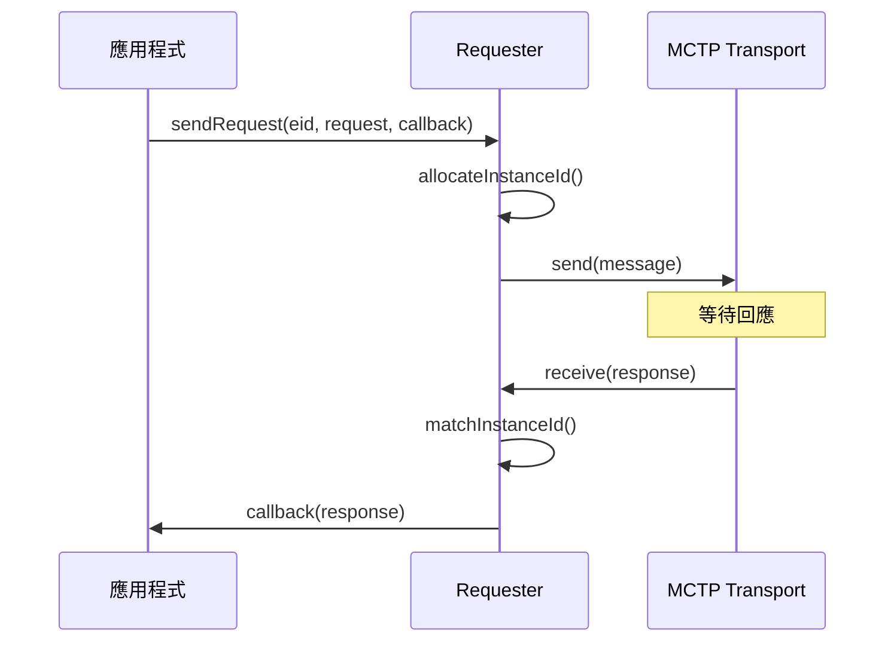

# Requester 模組

Requester 模組實作 BMC 作為 PLDM Requester 的功能。

---

## 概述

| 項目 | 說明 |
|------|------|
| **位置** | `requester/` |
| **功能** | 請求管理、MCTP 端點探索 |

---

## 核心元件

### Handler

管理請求佇列與回應回調：

```cpp
template <class RequestInterface>
class Handler {
    // 發送請求並註冊回調
    void sendRequest(mctp_eid_t eid, Request req, Callback callback);
    
    // 處理回應
    void handleResponse(mctp_eid_t eid, Response resp);
};
```

### Request

封裝單一 PLDM 請求：

```cpp
template <class RequestInterface>
class Request {
    uint8_t instanceId;
    std::vector<uint8_t> requestMsg;
    
    // 重試邏輯
    void retry();
};
```

### MCTP Endpoint Discovery

探索 PLDM-capable 端點：

```cpp
class MctpEndpointDiscovery {
    void discoverEndpoints();
    void handleNewEndpoint(mctp_eid_t eid);
};
```

---

## 請求流程



---

## 原始碼

| 檔案 | 說明 |
|------|------|
| `handler.hpp` | 請求處理器 |
| `request.hpp` | 請求封裝 |
| `mctp_endpoint_discovery.cpp/hpp` | MCTP 端點探索 |

---

*返回 [Home](Home.md)*
