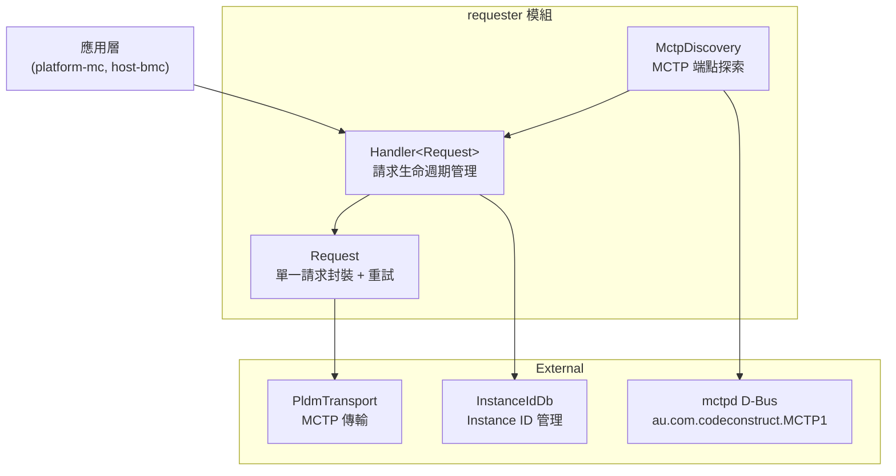
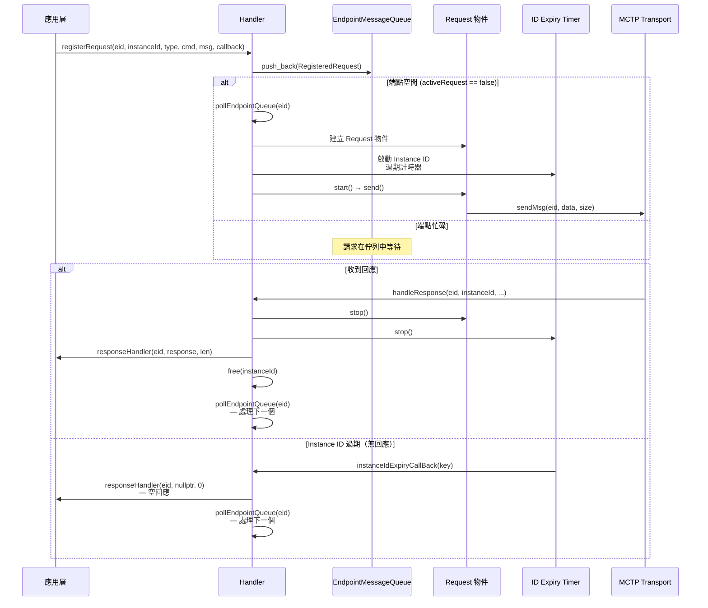
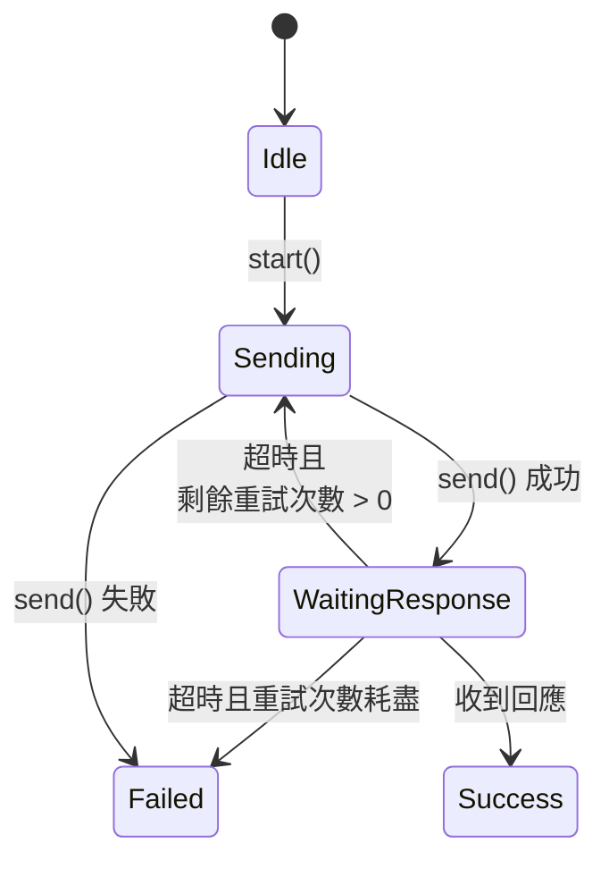
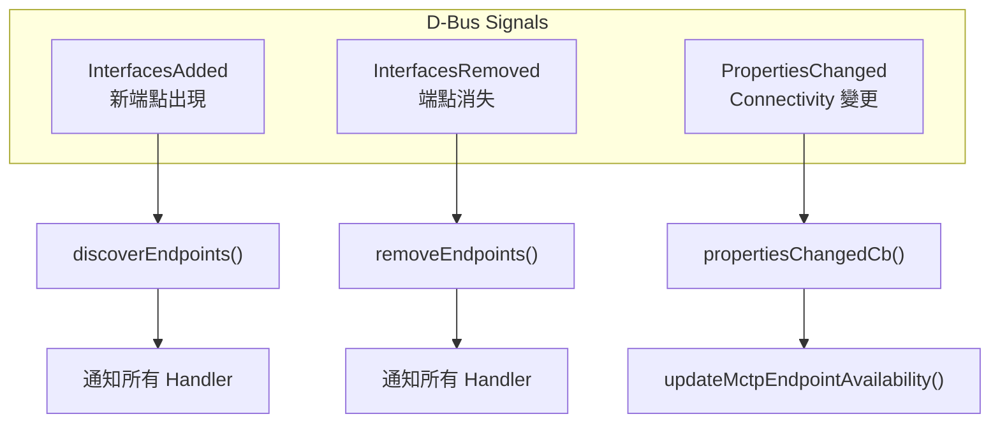

# Requester 模組

Requester 模組實作 BMC 作為 **PLDM Requester** 的功能——主動向遠端 PLDM Terminus 發送請求並處理回應。

---

## 概述

| 項目         | 說明                                                                                 |
| ------------ | ------------------------------------------------------------------------------------ |
| **位置**     | `requester/`                                                                         |
| **功能**     | 請求生命週期管理、重試邏輯、MCTP 端點探索                                            |
| **核心檔案** | `handler.hpp`（23KB）、`request.hpp`（6.5KB）、`mctp_endpoint_discovery.cpp`（18KB） |

---

## 架構



> **逐步說明：**
>
> 這張圖展示 Requester 模組的架構組成：
>
> - **應用層**（上方）：platform-mc、host-bmc 等模組透過 Handler 發送請求。
> - **requester 模組**（中間）：
>   - **Handler**：請求生命週期管理器，管理佇列、重試、超時。
>   - **Request**：單一請求的封裝，包含自動重試邏輯。
>   - **MctpDiscovery**：透過 D-Bus 監聽 MCTP 端點的新增/移除。
> - **外部依賴**（下方）：PldmTransport（MCTP 傳輸）、InstanceIdDb（ID 管理）、mctpd D-Bus。
>
> **白話總結**：應用層想發請求時，透過 Handler 排隊、發送、重試，最後透過 MCTP 傳送出去。

---

## 核心元件

### 1. RequestKey — 請求唯一識別

每個 PLDM 請求由 4 個欄位組合唯一識別：

```cpp
struct RequestKey {
    mctp_eid_t eid;     // MCTP 端點 ID
    uint8_t instanceId; // PLDM Instance ID
    uint8_t type;       // PLDM Type (0=Base, 2=Platform...)
    uint8_t command;    // PLDM Command code
};
```

Hash 函式將四個欄位打包為 32-bit 值：

```cpp
struct RequestKeyHasher {
    std::size_t operator()(const RequestKey& key) const {
        return (key.eid << 24 | key.instanceId << 16 |
                key.type << 8 | key.command);
    }
};
```

### 2. Handler — 請求生命週期管理器

`Handler<RequestInterface>` 是整個 Requester 的核心類別模板，管理請求的完整生命週期：



> **逐步說明：**
>
> 這張圖展示一個 PLDM 請求從註冊到完成的完整生命週期：
>
> 1. **註冊請求**：應用層呼叫 `registerRequest()`，請求被推入端點專屬的佇列。
> 2. **檢查端點狀態**：
>    - 如果端點空閒（沒有其他請求在等回應），立即處理：建立 Request 物件、啟動過期計時器、發送訊息。
>    - 如果端點忙碌，請求在佇列中等待。
> 3. **等待回應**：
>    - **收到回應**：停止計時器、呼叫原始 callback、釋放 Instance ID、處理佇列中的下一個請求。
>    - **超時無回應**：呼叫 callback 但傳入空回應（通知失敗），然後處理下一個請求。
>
> **關鍵設計**：每個端點一次只允許一個活躍請求，避免 Instance ID 衝突和压垂低資源端點。

#### 建構參數

```cpp
Handler(PldmTransport* pldmTransport,
        sdeventplus::Event& event,
        pldm::InstanceIdDb& instanceIdDb,
        bool verbose,
        std::chrono::seconds instanceIdExpiryInterval = 5s,  // INSTANCE_ID_EXPIRATION_INTERVAL
        uint8_t numRetries = 2,                               // NUMBER_OF_REQUEST_RETRIES
        std::chrono::milliseconds responseTimeOut = 2000ms);  // RESPONSE_TIME_OUT
```

| 參數                       | Meson 選項                        | 預設值  | 說明                                          |
| -------------------------- | --------------------------------- | ------- | --------------------------------------------- |
| `instanceIdExpiryInterval` | `instance-id-expiration-interval` | 5 秒    | Instance ID 過期時間（DSP0240 規定最大 6 秒） |
| `numRetries`               | `number-of-request-retries`       | 2 次    | 請求重試次數                                  |
| `responseTimeOut`          | `response-time-out`               | 2000 ms | 單次等待回應超時                              |

#### 端點訊息佇列（per-EID Queue）

Handler 為每個 MCTP 端點維護一個獨立的訊息佇列：

```cpp
struct EndpointMessageQueue {
    mctp_eid_t eid;
    std::deque<std::shared_ptr<RegisteredRequest>> requestQueue;
    bool activeRequest;  // 是否有正在等待回應的請求
};
```

**關鍵設計**：每個端點一次只允許一個活躍請求（`activeRequest` 標誌）。這避免了同一端點的 Instance ID 衝突，並確保低資源端點不會被大量請求淹沒。

#### 主要 API

| 方法                                                        | 說明                                   |
| ----------------------------------------------------------- | -------------------------------------- |
| `registerRequest(eid, instanceId, type, cmd, msg, handler)` | 註冊請求並排入佇列                     |
| `unregisterRequest(eid, instanceId, type, cmd)`             | 取消已註冊的請求                       |
| `handleResponse(eid, instanceId, type, cmd, resp, len)`     | 處理收到的回應                         |
| `sendRecvMsg(eid, request)`                                 | Coroutine API（C++20 sender/receiver） |

### 3. Request — 單一請求封裝

繼承 `RequestRetryTimer`，實作自動重試邏輯：



> **逐步說明（Request 狀態機）：**
>
> 這張圖描述 `Request` 物件（單一 PLDM 請求）的完整生命週期狀態。底層由 `RequestRetryTimer` 實作，超時由 `sdbusplus::Timer` 計時。
>
> | 狀態                | 說明                                                                                                                                                                                               | 觸發下一狀態                                                                                                            |
> | ------------------- | -------------------------------------------------------------------------------------------------------------------------------------------------------------------------------------------------- | ----------------------------------------------------------------------------------------------------------------------- |
> | **Idle**            | 初始狀態，`Request` 物件剛建立，尚未發送任何訊息。                                                                                                                                                 | 呼叫 `start()`                                                                                                          |
> | **Sending**         | 正在呼叫 `send()`，透過 `PldmTransport::sendMsg()` 將訊息寫入 AF_MCTP socket。此操作快速完成。                                                                                                     | `send()` 成功 → WaitingResponse；`send()` 失敗（如 socket 錯誤）→ Failed                                                |
> | **WaitingResponse** | 訊息已發出，等待遠端 Terminus 回應。同時啟動一個計時器（`responseTimeOut`，預設 2000ms）。                                                                                                         | 計時器到期且剩餘重試次數 > 0 → 重送（回 Sending）；計時器到期且重試耗盡 → Failed；收到 Instance ID 匹配的回應 → Success |
> | **Success**         | 終止狀態。`handleResponse()` 收到匹配的回應，`Request` 物件正常結束。                                                                                                                              | —                                                                                                                       |
> | **Failed**          | 終止狀態。有兩種進入情況：① `send()` 本身失敗（如網路錯誤）；② 超時後重試次數（`numRetries`，預設 2 次）耗盡。進入 Failed 後，Handler 會以空回應（`nullptr, 0`）呼叫原始 callback 通知呼叫者失敗。 | —                                                                                                                       |
>
> **重試機制說明**：每次超時後，`RequestRetryTimer::callback()` 被觸發，若 `numRetries-- > 0`，重新呼叫 `send()`（等同重試）；若 `numRetries` 降至 0，呼叫 `stop()` 停止計時器並標記 Failed。
>
> **白話總結**：就像打電話後等對方接——電話打通（Sending）→ 等待接聽（WaitingResponse）→ 對方接了（Success）；或者等了 2 秒沒人接，就重撥（重試），撥了 2 次還沒人接就放棄（Failed）。

```cpp
// 抽象基底類別：重試計時器
class RequestRetryTimer {
protected:
    virtual int send() const = 0;  // 子類別實作實際發送

    void callback() {              // 超時回調
        if (numRetries--)
            send();                // 重試
        else
            stop();                // 放棄
    }

    uint8_t numRetries;
    std::chrono::milliseconds timeout;
    sdbusplus::Timer timer;
};

// 具體實作：透過 MCTP Transport 發送
class Request final : public RequestRetryTimer {
    int send() const override {
        // 1. verbose 模式印出
        // 2. Flight Recorder 記錄
        // 3. 驗證是 Request 訊息
        // 4. pldmTransport->sendMsg(eid, data, size)
        return pldmTransport->sendMsg(
            static_cast<pldm_tid_t>(eid),
            requestMsg.data(), requestMsg.size());
    }
};
```

### 4. Coroutine API（C++20 Sender/Receiver）

> 📖 **背景概念：Coroutine 與 stdexec 是什麼？**
>
> #### Coroutine（協程）是什麼？
>
> Coroutine 是 C++20 引入的語言功能。它讓你可以把「**等待某件非同步事情完成**」的程式碼，寫得像一般的**同步、直線式**程式碼，不需要手動傳 callback。
>
> 核心關鍵字是 `co_await`。它的意思是：「**暫停這個函式，等待這個操作完成，完成後從這裡繼續**」。
>
> ```cpp
> // 舊式 callback （難讀）：你必須把「收到回應之後要做什麼」
> // 包成一個 lambda 傳進去，程式流程是分裂的
> handler.registerRequest(eid, instanceId, ..., [](auto eid, auto resp, auto len) {
>     // 這裡才是「收到回應之後」的邏輯
>     process(resp);
> });
>
> // 新式 coroutine（好讀）：整個流程是連續的，就像同步程式碼
> auto [rc, resp, len] = co_await handler.sendRecvMsg(eid, std::move(request));
> process(resp);  // 這行在「收到回應之後」自動繼續執行
> ```
>
> **關鍵認知**：`co_await` 並不會「卡住整個程式」。它只是讓**當前這個函式**暫停，讓事件迴圈繼續處理其他事件。等回應到了，才喚醒這個函式繼續跑。BMC 不會因此 hang 住。
>
> #### stdexec（Sender/Receiver）是什麼？
>
> stdexec 是一個 C++ 函式庫（正在走向 C++ 標準化），提供「**Sender/Receiver**」框架，是 coroutine 的底層實作機制之一。
>
> 你不需要深入理解它的內部——只需要知道以下對照：
>
> | 概念              | 白話意思                                                           |
> | ----------------- | ------------------------------------------------------------------ |
> | **Sender**        | 「一個承諾：我會在未來某個時間點完成，並給你結果」（類似 Promise） |
> | **Receiver**      | 「約定好當 Sender 完成時，要呼叫的後續動作」                       |
> | `co_await sender` | 語法糖：自動把後面的程式碼包成 Receiver，讓 Sender 完成時繼續執行  |
>
> 在 PLDM 程式碼裡，`handler.sendRecvMsg()` 回傳的就是一個 **Sender**——它代表「發出這個 PLDM request、等待回應」這整個非同步操作。
>
> #### 作個比喻
>
> 想像你在餐廳點餐後拿了號碼牌等待：
>
> - **舊式 callback**：你把電話號碼留給服務員，說「做好了打電話給我」，然後去做別的事。問題是你的「等餐邏輯」和「接到通知後的邏輯」分散在兩個地方，程式很難追。
> - **co_await**：你坐在位子上「等」，但等待期間椅子可以讓給別人坐（事件迴圈繼續跑），餐來了你自動回來繼續。程式是一條直線。

Handler 提供了基於 C++20 stdexec 的 coroutine API：

```cpp
// ① 定義回傳型別：一個裝三個值的「束包」
using SendRecvCoResp = std::tuple<int, const pldm_msg*, size_t>;
//                                ^^^   ^^^^^^^^^^^^^   ^^^^^^
//                                rc    resp 指標       len
```

`std::tuple` 是 C++ 標準的「固定欄位束包」。這裡裝了三個值：

| 位置    | 型別              | 變數名 | 意義                                                                 |
| ------- | ----------------- | ------ | -------------------------------------------------------------------- |
| 第 1 個 | `int`             | `rc`   | 回傳碼（Result Code）。`PLDM_SUCCESS=0` 代表成功，其他值代表錯誤     |
| 第 2 個 | `const pldm_msg*` | `resp` | 指向 PLDM 回應訊息的指標（失敗時是 `nullptr`——空指標，代表沒有回應） |
| 第 3 個 | `size_t`          | `len`  | 回應訊息的長度（bytes）。失敗時是 `0`                                |

三種可能結果：

| `rc`                   | `resp`    | `len` | 代表什麼                                      |
| ---------------------- | --------- | ----- | --------------------------------------------- |
| `PLDM_SUCCESS`         | 有效指標  | > 0   | ✅ 成功收到 PLDM 回應                         |
| `PLDM_ERROR`           | `nullptr` | 0     | ❌ `registerRequest()` 失敗（在發送前就出錯） |
| `PLDM_ERROR_NOT_READY` | `nullptr` | 0     | ⏰ 超時無回應（發出去了但 Terminus 沒回）     |

```cpp
// ② 實際呼叫方式（在 coroutine 函式中）
auto [rc, resp, len] = co_await handler.sendRecvMsg(eid, std::move(request));
```

逐一拆解這行：

| 語法片段                        | 說明                                                                                                                        |
| ------------------------------- | --------------------------------------------------------------------------------------------------------------------------- |
| `co_await`                      | **暫停在這裡**，等 `sendRecvMsg` 完成（發送 + 等回應），完成後繼續往下                                                      |
| `handler.sendRecvMsg(eid, ...)` | 呼叫 Handler 的「發送並等待回應」方法，回傳一個 **Sender**（代表整個非同步操作）                                            |
| `std::move(request)`            | 把 `request` 的所有權「移交」給函式，避免複製大型物件（C++11 move semantics）。移交後 `request` 不可再用                    |
| `auto [rc, resp, len] = ...`    | **C++17 結構化綁定（Structured Binding）**：自動把 tuple 的三個值拆開分別命名為 `rc`、`resp`、`len`，等同於分別宣告三個變數 |

**白話讀法**：「把這個 PLDM request 交給 Handler 去發（`sendRecvMsg`），在這裡等（`co_await`），等到回應了，把結果的三個值取出來，分別叫 rc（是否成功）、resp（回應內容）、len（長度）」。

完整使用範例（如何實際判斷結果）：

```cpp
// 在某個 coroutine 函式中：
auto [rc, resp, len] = co_await handler.sendRecvMsg(eid, std::move(request));

if (rc != PLDM_SUCCESS || resp == nullptr) {
    // 失敗處理：可能是超時或發送本身出錯
    return;
}

// 成功：resp 是指向回應資料的指標，len 是資料長度
// 接著解析 resp 即可
```

> **`SendRecvMsgSender` 和 `stop token` 是什麼（可跳過）**
>
> `SendRecvMsgSender` 是 `sendRecvMsg()` 在內部建立並回傳的 Sender 物件。用來把「發送 PLDM request + 等待回應」這整件事包裝成一個可以被 `co_await` 的東西（這是 stdexec 框架的寫法）。
>
> `stop token` 是「取消令牌」：如果整個任務需要提前取消（例如 BMC 要關機），可以透過 stop token 通知 Sender 中止等待，不用繼續等回應。一般讀 code 時不需要深究，知道「它支援中途取消操作」即可。

---

## MCTP 端點探索（`mctp_endpoint_discovery.cpp/hpp`）

`MctpDiscovery` 負責發現和追蹤 PLDM-capable 的 MCTP 端點。

### 與 mctpd 的整合

透過 D-Bus 監聽 CodeConstruct mctpd：

| D-Bus 常數     | 值                                        |
| -------------- | ----------------------------------------- |
| 服務名稱       | `au.com.codeconstruct.MCTP1`              |
| 路徑前綴       | `/au/com/codeconstruct/mctp1`             |
| 端點介面       | `au.com.codeconstruct.MCTP.Endpoint1`     |
| 篩選 PLDM 支援 | MCTP Message Type = `1`（`mctpTypePLDM`） |

### 內部實作細節：D-Bus Match 規則與信號監聽

`MctpDiscovery` 的建構函式註冊了三個 `sdbusplus::bus::match_t` 來監聽 D-Bus 信號：

```cpp
MctpDiscovery::MctpDiscovery(
    sdbusplus::bus_t& bus,
    std::initializer_list<MctpDiscoveryHandlerIntf*> list) :
    bus(bus),
    // 1. 監聽新端點加入 (InterfacesAdded)
    mctpEndpointAddedSignal(
        bus, interfacesAdded(MCTPPath), /* MCTPPath = "/au/com/codeconstruct/mctp1" */
        [this](sdbusplus::message_t& msg) { this->discoverEndpoints(msg); }),
    
    // 2. 監聽端點移除 (InterfacesRemoved)
    mctpEndpointRemovedSignal(
        bus, interfacesRemoved(MCTPPath),
        [this](sdbusplus::message_t& msg) { this->removeEndpoints(msg); }),
    
    // 3. 監聽端點屬性變更 (PropertiesChanged)，用於監控連線狀態 (Connectivity)
    mctpEndpointPropChangedSignal(
        bus, propertiesChangedNamespace(MCTPPath, MCTPInterfaceCC), 
        [this](sdbusplus::message_t& msg) { this->propertiesChangedCb(msg); }),
    
    handlers(list)
{
    // ... (初始化與現有端點輪詢) ...
}
```

> 💡 **補充觀念：D-Bus Service Name 與 Object Path 的差異**
> 
> 在上面的程式碼中，`interfacesAdded(MCTPPath)` 使用的是以 **斜線 `/` 分隔的 Object Path** (`/au/com/codeconstruct/mctp1`)，而不是以 **句號 `.` 分隔的 Service Name** (`au.com.codeconstruct.MCTP1`)。
>
> 這是因為 D-Bus 的事件訂閱機制如下：
> - **Service Name (服務名稱)**：像是「**公司招牌**」。`au.com.codeconstruct.MCTP1` 是 `mctpd` 這支程式在 D-Bus 網路上註冊的名稱，代表這家公司。
> - **Object Path (物件路徑)**：像是「**公司內部的檔案目錄**」。`/au/com/codeconstruct/mctp1` 是這家公司存放資料的目錄樹根節點。
> 
> 當 `mctpd` 發現新的端點時，它是在**自己的物件目錄樹底下**新增一個物件（例如 `/au/.../endpoints/8`）。因此，`sdbusplus` 底層的 `interfacesAdded()` API 監聽的是：「**在哪個目錄路徑下發生了新增事件？**」，所以我們必須提供 Object Path 給這個 Match Rule。這與「我們正在跟 `mctpd` 服務通訊」的整體概念是完全吻合沒有衝突的！



> **逐步說明：**
>
> 這張圖展示 MctpDiscovery 如何監聽 D-Bus 信號：
>
> - **InterfacesAdded**：新 MCTP 端點出現時，呼叫 `discoverEndpoints()` 通知所有註冊的 Handler（如 FW Manager、Platform Manager）。
> - **InterfacesRemoved**：端點消失時，呼叫 `removeEndpoints()` 通知 Handler 清理。
> - **PropertiesChanged**：端點屬性變更（如 Connectivity 狀態）時，更新可用性。
>
> **白話總結**：MctpDiscovery 像「哨兵」，監控誰來了、誰走了、誰的狀態變了，並即時通知相關模組。

### 內部實作細節：啟動時的輪詢邏輯 (GetSubTree)

如果在 `pldmd` 啟動前，`mctpd` 已經把端點建好了，就不會觸發 `InterfacesAdded`。因此 `MctpDiscovery` 在建構時會主動撈取現有端點：

```cpp
// 在 MctpDiscovery::getMctpInfos() 中：
pldm::utils::GetSubTreeResponse mapperResponse;
// 透過 ObjectMapper 尋找所有實作 MCTPEndpoint 介面的物件
mapperResponse = pldm::utils::DBusHandler().getSubtree(
    MCTPPath, 0, std::vector<std::string>({MCTPEndpoint::interface}));

for (const auto& [path, services] : mapperResponse) {
    for (const auto& serviceIter : services) {
        // ... (取得各項屬性) ...
        auto types = std::get<MCTPMsgTypes>(epProps);
        
        // 關鍵過濾：確認 SupportedMessageTypes 中包含 PLDM (Type 1)
        if (std::find(types.begin(), types.end(), mctpTypePLDM) != types.end()) {
            auto mctpInfo = MctpInfo(eid, uuid, "", networkId, std::nullopt);
            mctpInfoMap[std::move(mctpInfo)] = availability;
        }
    }
}
```

**白話總結**：`pldmd` 啟動時先做一次「戶口普查」，找出此時已經存在且支援 PLDM 的端點，並把目前為 `Available` 的端點登記下來。

### 內部實作細節：D-Bus 訊息解析與過濾

當有新的端點加入時，D-Bus 的 `InterfacesAdded` 信號會夾帶複雜的字典結構，`MctpDiscovery` 會將其解開並比對：

```cpp
void MctpDiscovery::getAddedMctpInfos(sdbusplus::message_t& msg, MctpInfos& mctpInfos)
{
    sdbusplus::message::object_path objPath;
    std::map<std::string, std::map<std::string, dbus::Value>> interfaces;

    // 解開 D-Bus 字典
    msg.read(objPath, interfaces);

    for (const auto& [intfName, properties] : interfaces) {
        // 只看 MCTP Endpoint 介面
        if (intfName == MCTPEndpoint::interface) {
            // 解析 NetworkId, EID 和 SupportedMessageTypes
            auto networkId = std::get<NetworkId>(properties.at("NetworkId"));
            auto eid = std::get<mctp_eid_t>(properties.at("EID"));
            auto types = std::get<std::vector<uint8_t>>(properties.at("SupportedMessageTypes"));

            // 關鍵過濾：不是所有 MCTP 端點 pldmd 都想理，只理 PLDM (Type 1) 的端點
            if (std::find(types.begin(), types.end(), mctpTypePLDM) != types.end()) {
                // 打包成 MctpInfo 準備通知各 Manager
                auto mctpInfo = MctpInfo(eid, uuid, "", networkId, std::nullopt);
                mctpInfos.emplace_back(std::move(mctpInfo));
            }
        }
    }
}
```

**白話總結**：`mctpd` 廣播「有新鄰居搬進來了」，`MctpDiscovery` 會去檢查他的基本資料表，如果這鄰居**會講 PLDM 語言**（`mctpTypePLDM`），才建檔並通報給 `fwManager` 與 `platformManager` 進行業務接洽。

### Handler 介面

`MctpDiscoveryHandlerIntf` 定義了接收 MCTP 端點事件的抽象介面：

```cpp
class MctpDiscoveryHandlerIntf {
public:
    virtual void handleMctpEndpoints(const MctpInfos& mctpInfos) = 0;
    virtual void handleRemovedMctpEndpoints(const MctpInfos& mctpInfos) = 0;
    virtual void updateMctpEndpointAvailability(
        const MctpInfo& mctpInfo, Availability availability) = 0;
    virtual std::optional<mctp_eid_t> getActiveEidByName(
        const std::string& terminusName) = 0;
    virtual void handleConfigurations(const Configurations&) {}
};
```

**註冊的 Handler**（`pldmd.cpp` L368-371）：

```cpp
std::unique_ptr<MctpDiscovery> mctpDiscoveryHandler =
    std::make_unique<MctpDiscovery>(
        bus, std::initializer_list<MctpDiscoveryHandlerIntf*>{
                 fwManager.get(), platformManager.get()});
```

> `std::initializer_list<...>{ A, B }` 是 C++ 的「**初始化清單**」語法——就是用 `{}` 大括號把多個值列出來，傳給函式當作一份清單。這裡的意思是「把這兩個 Manager 的指標，打包成一份清單傳入」。

**白話翻譯**：「建立一個 `MctpDiscovery` 哨兵，連接到 D-Bus，並登記說：一旦有 MCTP 端點變動（新增、移除、狀態改變），就去通知 **Firmware Update Manager** 和 **Platform MC Manager**。」

**為什麼通知這兩個？**

- **`fw_update::Manager`**：需要知道有哪些 MCTP 端點，才能對它們執行韌體更新
- **`platform_mc::Manager`**：需要知道有哪些 MCTP 端點，才能跟它們進行 sensor polling 等 Platform MC 操作

### 端點資訊

```cpp
// common/types.hpp 中定義
using MctpInfo = std::tuple<mctp_eid_t, emctpd::UUID, std::string, MctpMedium>;
```

| 欄位          | 說明                                           |
| ------------- | ---------------------------------------------- |
| `mctp_eid_t`  | MCTP 端點 ID                                   |
| UUID          | 端點 UUID（`xyz.openbmc_project.Common.UUID`） |
| `std::string` | 端點名稱                                       |
| `MctpMedium`  | MCTP 傳輸媒體（I2C/I3C 等）                    |

### 配置自動關聯

`MctpDiscovery` 也會搜尋 Entity Manager 的配置物件，支援以下介面：

```cpp
const std::vector<std::string> interfaceFilter = {
    "xyz.openbmc_project.Configuration.MCTPI2CTarget",
    "xyz.openbmc_project.Configuration.MCTPI3CTarget"
};
```

---

## 原始碼結構

| 檔案                                    | 大小  | 說明                                       |
| --------------------------------------- | ----- | ------------------------------------------ |
| `requester/handler.hpp`                 | 23KB  | `Handler` 模板類別，含完整請求生命週期管理 |
| `requester/request.hpp`                 | 6.5KB | `RequestRetryTimer` + `Request` 重試邏輯   |
| `requester/mctp_endpoint_discovery.cpp` | 18KB  | MCTP 端點探索實作                          |
| `requester/mctp_endpoint_discovery.hpp` | 8.6KB | MCTP 端點探索標頭                          |
| `requester/README.md`                   | 1.9KB | 模組說明文件                               |

---

## 相關文件

- [Pldmd](Pldmd.md) - pldmd 守護程式
- [Architecture](Architecture.md) - 系統架構
- [PlatformMC](PlatformMC.md) - Platform MC（使用 Requester 與 Terminus 通訊）

---

_返回 [Home](Home.md)_
