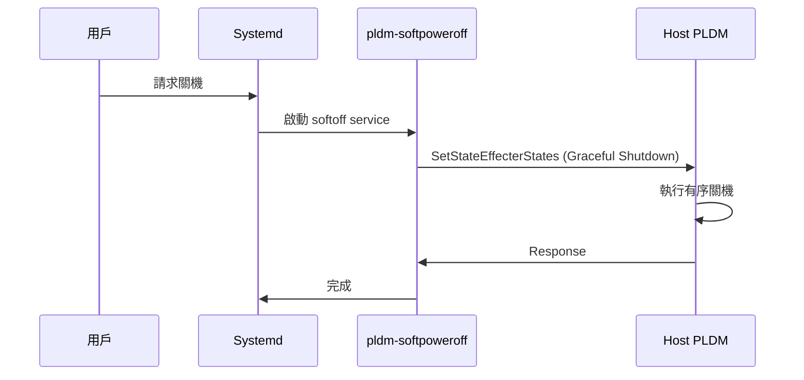

# 軟關機功能

softoff 模組實作透過 PLDM 的軟關機功能。

---

## 概述

| 項目 | 說明 |
|------|------|
| **位置** | `softoff/` |
| **執行檔** | `pldm-softpoweroff` |
| **功能** | 通知 Host 進行有序關機 |

---

## 運作流程



---

## Systemd 整合

```bash
# 服務檔案位置
softoff/services/pldm-softpoweroff.service
```

---

## 原始碼

| 檔案 | 說明 |
|------|------|
| `main.cpp` | 進入點 |
| `softoff.cpp/hpp` | 軟關機邏輯 |

---

*返回 [Home](Home.md)*
