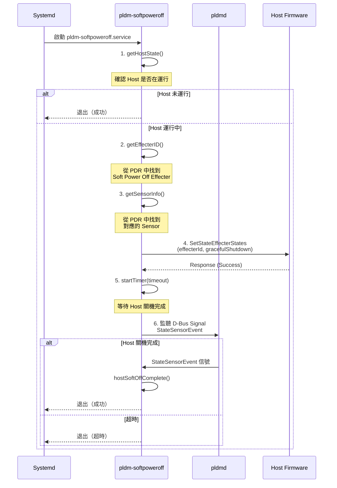

# SoftOff 模組

SoftOff 模組實作 PLDM 軟關機功能——透過 PLDM `SetStateEffecterStates` 命令要求 Host Firmware 執行優雅的關機（Graceful Shutdown）。

---

## 概述

| 項目 | 說明 |
|------|------|
| **執行檔** | `/usr/bin/pldm-softpoweroff` |
| **服務** | `pldm-softpoweroff.service` |
| **位置** | `softoff/` |
| **核心類別** | `SoftPowerOff` |
| **原始碼** | `softoff.cpp`（14KB）、`main.cpp`（2KB） |

---

## 軟關機完整流程



---

## SoftPowerOff 類別

```cpp
class SoftPowerOff {
public:
    SoftPowerOff(sdbusplus::bus_t& bus, sd_event* event,
                 InstanceIdDb& instanceIdDb);

    // 狀態查詢
    bool isError();           // 是否發生錯誤
    bool isTimerExpired();    // 計時器是否過期
    bool isCompleted();       // 軟關機是否完成
    bool isReceiveResponse(); // 是否收到回應

    // 執行軟關機
    int hostSoftOff(sdeventplus::Event& event);

private:
    // PDR 查詢
    bool getEffecterID(pldm::pdr::EntityType& entityType,
                       pldm::pdr::StateSetId& stateSetId);
    int getSensorInfo(pldm::pdr::EntityType& entityType,
                      pldm::pdr::StateSetId& stateSetId);

    // 事件處理
    void hostSoftOffComplete(sdbusplus::message_t& msg);
    int getHostState();
    Json parseConfig();

    // 狀態
    uint16_t effecterID;
    pldm::pdr::SensorID sensorID;
    pldm::pdr::SensorOffset sensorOffset;
    bool hasError = false;
    bool completed = false;
    bool responseReceived = false;
    sdbusplus::Timer timer;
    std::unique_ptr<sdbusplus::bus::match_t> pldmEventSignal;
};
```

---

## 關鍵步驟詳解

### 1. 取得 Host 狀態

```cpp
int getHostState() {
    // 查詢 D-Bus: xyz.openbmc_project.State.Host.CurrentHostState
    // 若為 "Running" → 繼續
    // 若不是 → 直接完成
}
```

### 2. 從 PDR 找到 Effecter ID

```cpp
bool getEffecterID(EntityType& entityType, StateSetId& stateSetId) {
    // 在 PDR Repo 中搜尋符合以下條件的 State Effecter PDR：
    // - Entity Type: SystemFirmware 或 VirtualMachineManager
    // - State Set ID: SoftPowerOff (PLDM_SW_TERM_GRACEFUL_SHUTDOWN_REQUESTED)
    // 取得對應的 effecterID
}
```

### 3. 從 PDR 找到 Sensor 資訊

```cpp
int getSensorInfo(EntityType& entityType, StateSetId& stateSetId) {
    // 搜尋對應的 State Sensor PDR
    // 用於後續監聽 Host 回報的關機狀態
}
```

### 4. 發送 SetStateEffecterStates

```cpp
// 構造 PLDM 請求：
//   - Type: Platform (0x02)
//   - Command: SetStateEffecterStates (0x39)
//   - effecterID: 從 PDR 中找到
//   - StateField: { setRequest = requestSet,
//                    effecter_state = gracefulShutdownRequestedState }
```

### 5. 等待完成信號

```cpp
// 監聽 D-Bus 信號：
//   路徑: /xyz/openbmc_project/pldm
//   介面: xyz.openbmc_project.PLDM.Event
//   信號: StateSensorEvent
// 當收到對應 sensorID 的 state 變更 → softoff 完成
```

---

## 配置

軟關機超時時間可透過 JSON 配置：

```json
// softoff 配置檔（路徑在 parseConfig() 中定義）
{
    "softoff_timeout_seconds": 30
}
```

---

## Systemd 整合

```ini
# pldm-softpoweroff.service
[Unit]
Description=PLDM Software Power Off
After=pldmd.service

[Service]
Type=oneshot
ExecStart=/usr/bin/pldm-softpoweroff
TimeoutSec=90
```

整合到 OpenBMC 關機流程中：


---

## 原始碼結構

| 檔案 | 大小 | 說明 |
|------|------|------|
| `softoff.cpp` | 14KB | SoftPowerOff 實作 |
| `softoff.hpp` | 4.4KB | SoftPowerOff 定義 |
| `main.cpp` | 2KB | 主程式入口 |
| `softoff.service` | — | Systemd 服務檔案 |

---

## 相關文件

- [Pldmd](Pldmd.md) - pldmd 守護程式
- [TypePlatform](TypePlatform.md) - SetStateEffecterStates 命令
- [HostBMC](HostBMC.md) - Host 狀態感測

---

*返回 [Home](Home.md)*
