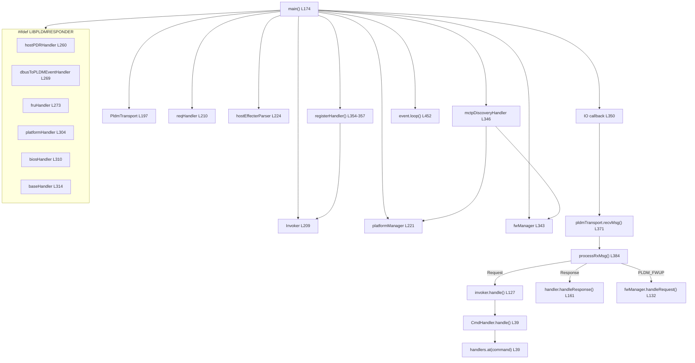
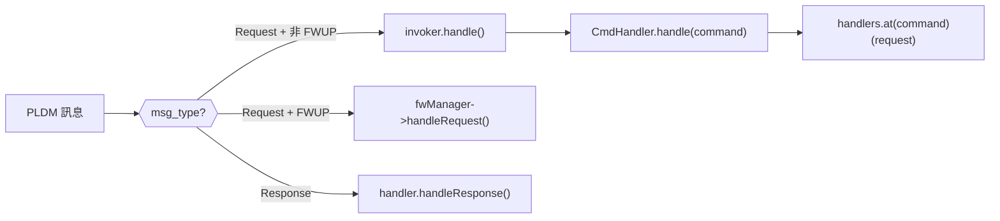
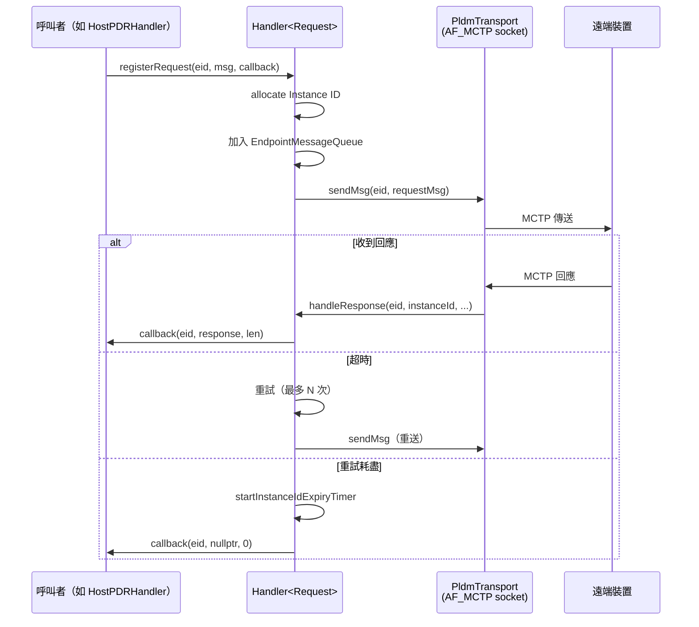
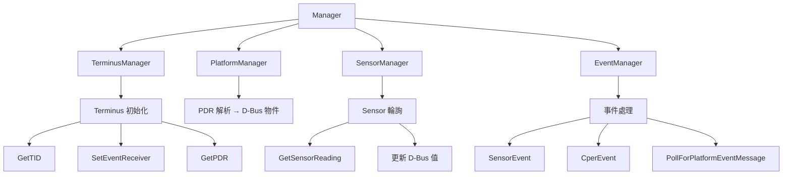
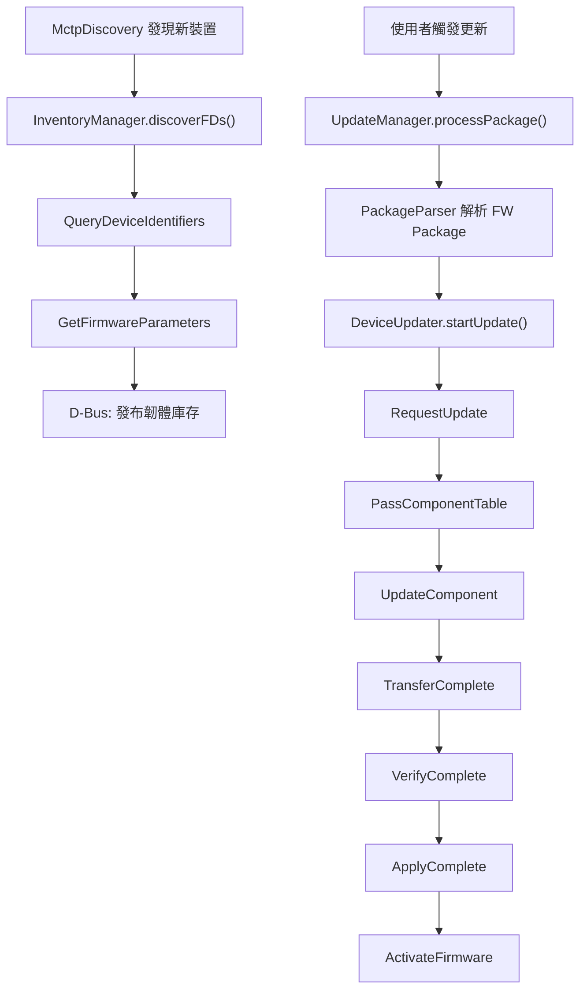

# pldmd Source Code 深度走讀

## 概述

本文件深入追蹤 pldmd（PLDM 守護程式）的主要程式碼流程，從 `main()` 到各子系統的完整呼叫鏈。pldmd 是 OpenBMC 中 PLDM 協定的核心服務，負責處理 PLDM 請求/回應、管理遠端 Terminus、監控 Sensor、更新韌體等。

> ⚠️ **簡化說明**：本文件聚焦於主要邏輯流程，省略了部分錯誤處理和條件編譯（`#ifdef OEM_IBM` 等）。行號基於 source code 目錄。完整實作請參閱 source code。

---

## 原始碼檔案總覽

### pldmd/（守護程式入口）

| 檔案                                                              | 行數 | 核心職責                                            |
| ----------------------------------------------------------------- | ---- | --------------------------------------------------- |
| [`pldmd.cpp`](../../src/pldm/pldmd/pldmd.cpp)                     | 460  | main()、IO callback、processRxMsg()                 |
| [`invoker.hpp`](../../src/pldm/pldmd/invoker.hpp)                 | 53   | Invoker：PLDM Type → CmdHandler 分派器              |
| [`handler.hpp`](../../src/pldm/pldmd/handler.hpp)                 | 68   | CmdHandler 抽象基底類別，Command → HandlerFunc 對映 |
| [`dbus_impl_pdr.cpp/hpp`](../../src/pldm/pldmd/dbus_impl_pdr.cpp) | ~100 | PDR Repository D-Bus 介面                           |

### requester/（請求端）

| 檔案                                                                                      | 行數 | 核心職責                                                        |
| ----------------------------------------------------------------------------------------- | ---- | --------------------------------------------------------------- |
| [`handler.hpp`](../../src/pldm/requester/handler.hpp)                                     | 664  | Handler\<Request\>：請求生命週期管理（重試、超時、Instance ID） |
| [`request.hpp`](../../src/pldm/requester/request.hpp)                                     | ~300 | Request 類別：單一 PLDM 請求封裝                                |
| [`mctp_endpoint_discovery.cpp/hpp`](../../src/pldm/requester/mctp_endpoint_discovery.cpp) | ~500 | MctpDiscovery：監聽 mctpd 的 D-Bus 信號，追蹤 MCTP 端點         |

### platform-mc/（Platform Monitoring & Control）

| 檔案                                                                          | 行數 | 核心職責                                           |
| ----------------------------------------------------------------------------- | ---- | -------------------------------------------------- |
| [`manager.hpp`](../../src/pldm/platform-mc/manager.hpp)                       | 290  | Manager：平台管理總入口                            |
| [`terminus_manager.cpp/hpp`](../../src/pldm/platform-mc/terminus_manager.cpp) | ~600 | TerminusManager：Terminus 初始化（GetTID、GetPDR） |
| [`terminus.cpp/hpp`](../../src/pldm/platform-mc/terminus.cpp)                 | ~400 | Terminus：單一遠端裝置的 PDR、Sensor、Effecter     |
| [`platform_manager.cpp/hpp`](../../src/pldm/platform-mc/platform_manager.cpp) | ~200 | PlatformManager：PDR 解析、D-Bus 物件建立          |
| [`sensor_manager.cpp/hpp`](../../src/pldm/platform-mc/sensor_manager.cpp)     | ~400 | SensorManager：Sensor 輪詢排程                     |
| [`numeric_sensor.cpp/hpp`](../../src/pldm/platform-mc/numeric_sensor.cpp)     | ~600 | NumericSensor：單一數值型 Sensor                   |
| [`event_manager.cpp/hpp`](../../src/pldm/platform-mc/event_manager.cpp)       | ~300 | EventManager：非同步事件處理                       |

### libpldmresponder/（回應端 Handler）

| 檔案                                                                     | 行數 | 核心職責                                                                 |
| ------------------------------------------------------------------------ | ---- | ------------------------------------------------------------------------ |
| [`base.cpp/hpp`](../../src/pldm/libpldmresponder/base.cpp)               | ~200 | BaseHandler：Type 0（GetPLDMTypes、GetPLDMVersion）                      |
| [`platform.cpp/hpp`](../../src/pldm/libpldmresponder/platform.cpp)       | ~800 | PlatformHandler：Type 2（GetPDR、SetStateEffecterStates、PlatformEvent） |
| [`bios.cpp/hpp`](../../src/pldm/libpldmresponder/bios.cpp)               | ~300 | BIOSHandler：Type 3（GetBIOSTable、SetBIOSAttribute）                    |
| [`bios_config.cpp/hpp`](../../src/pldm/libpldmresponder/bios_config.cpp) | ~800 | BIOSConfig：BIOS 表格管理                                                |
| [`fru.cpp/hpp`](../../src/pldm/libpldmresponder/fru.cpp)                 | ~500 | FRUHandler：Type 4（GetFRURecordTable）                                  |
| [`pdr.cpp/hpp`](../../src/pldm/libpldmresponder/pdr.cpp)                 | ~400 | PDR 生成與解析                                                           |

### host-bmc/（Host 互動）

| 檔案                                                                                 | 行數 | 核心職責                                          |
| ------------------------------------------------------------------------------------ | ---- | ------------------------------------------------- |
| [`host_pdr_handler.cpp/hpp`](../../src/pldm/host-bmc/host_pdr_handler.cpp)           | ~800 | HostPDRHandler：從 Host 取得 PDR、合併到本地 Repo |
| [`dbus_to_event_handler.cpp/hpp`](../../src/pldm/host-bmc/dbus_to_event_handler.cpp) | ~300 | DbusToPLDMEvent：D-Bus 屬性變化 → PLDM 事件       |

### fw-update/（韌體更新）

| 檔案                                                                          | 行數 | 核心職責                            |
| ----------------------------------------------------------------------------- | ---- | ----------------------------------- |
| [`manager.hpp`](../../src/pldm/fw-update/manager.hpp)                         | ~100 | fw_update::Manager：韌體更新入口    |
| [`update_manager.cpp/hpp`](../../src/pldm/fw-update/update_manager.cpp)       | ~400 | UpdateManager：更新流程控制         |
| [`device_updater.cpp/hpp`](../../src/pldm/fw-update/device_updater.cpp)       | ~500 | DeviceUpdater：單一裝置更新狀態機   |
| [`inventory_manager.cpp/hpp`](../../src/pldm/fw-update/inventory_manager.cpp) | ~300 | InventoryManager：裝置韌體清單探索  |
| [`package_parser.cpp/hpp`](../../src/pldm/fw-update/package_parser.cpp)       | ~400 | PackageParser：PLDM FW Package 解析 |

### softoff/（軟關機）

| 檔案                                                    | 行數 | 核心職責                                                      |
| ------------------------------------------------------- | ---- | ------------------------------------------------------------- |
| [`main.cpp`](../../src/pldm/softoff/main.cpp)           | ~50  | 獨立的 pldm-softpoweroff 程式入口                             |
| [`softoff.cpp/hpp`](../../src/pldm/softoff/softoff.cpp) | ~300 | SoftPowerOff：軟關機邏輯（PDR 查找 → SetStateEffecterStates） |

---

## 完整呼叫鏈總覽



> **逐步說明：**
>
> 1. **傳輸層**：`PldmTransport` 封裝 MCTP socket，負責收發 PLDM 訊息。
> 2. **分派器**：`Invoker` 是一個 PLDM Type → CmdHandler 的對映表。
> 3. **請求端**：`reqHandler`（Handler\<Request\>）管理主動發出的 PLDM 請求的生命週期。
> 4. **模組初始化**：依序建立 platformManager、hostPDRHandler、fruHandler、platformHandler、biosHandler、baseHandler。
> 5. **Handler 註冊**：將各 Handler 註冊到 Invoker（Type 0→Base、Type 2→Platform、Type 3→BIOS、Type 4→FRU）。
> 6. **MCTP 探索**：`mctpDiscoveryHandler` 監聽 mctpd 的 D-Bus 信號，發現新端點時通知 fwManager 和 platformManager。
> 7. **IO Callback**：當 MCTP socket 可讀時，呼叫 `recvMsg()` → `processRxMsg()`，根據訊息類型分派到 Invoker 或 reqHandler。
> 8. **事件循環**：`event.loop()` 永久運行，統一管理 I/O、D-Bus、定時器事件。
>
> **白話總結**：pldmd 就像一個「客服中心」——開門營業（初始化）→ 設置各專線（註冊 Handler）→ 派遣探員監視新客戶（MctpDiscovery）→ 接電話分派到對應部門（Invoker）→ 永遠不下班（event loop）。

---

## 階段一：啟動與初始化

### main() — 入口點

📍 [`pldmd.cpp`](../../src/pldm/pldmd/pldmd.cpp) L174-460

```c++
int main(int argc, char** argv)
{
    // === 1. 基礎設施 ===
    auto hostEID = pldm::utils::readHostEID();  // ← 從檔案讀取 Host EID
    pldm_tid_t TID = hostEID;  // ← 暫時 TID = Host EID
    PldmTransport pldmTransport{};  // ← MCTP transport 層
    auto event = Event::get_default();
    auto& bus = pldm::utils::DBusHandler::getBus();

    InstanceIdDb instanceIdDb;    // ← Instance ID 資料庫
    Invoker invoker{};            // ← PLDM Type 分派器
    requester::Handler<requester::Request> reqHandler(  // ← 請求端
        &pldmTransport, event, instanceIdDb, verbose);

    // === 2. PDR Repository ===
    auto pdrRepo = pldm_pdr_init();  // ← 初始化 PDR 儲存庫

    // === 3. Platform-MC Manager ===
    auto platformManager = std::make_unique<platform_mc::Manager>(
        event, reqHandler, instanceIdDb);  // ← 遠端 Terminus 管理

    // === 4. libpldmresponder Handler（條件編譯）===
    auto hostPDRHandler = std::make_shared<HostPDRHandler>(...);  // ← Host PDR
    auto fruHandler = std::make_unique<fru::Handler>(...);        // ← FRU
    auto platformHandler = std::make_unique<platform::Handler>(...);  // ← Platform
    auto biosHandler = std::make_unique<bios::Handler>(...);      // ← BIOS
    auto baseHandler = std::make_unique<base::Handler>(event);    // ← Base

    // === 5. 註冊 Handler 到 Invoker ===
    invoker.registerHandler(PLDM_BIOS, std::move(biosHandler));       // Type 3
    invoker.registerHandler(PLDM_PLATFORM, std::move(platformHandler)); // Type 2
    invoker.registerHandler(PLDM_FRU, std::move(fruHandler));         // Type 4
    invoker.registerHandler(PLDM_BASE, std::move(baseHandler));       // Type 0

    // === 6. FW Update 與 MCTP Discovery ===
    auto fwManager = std::make_unique<fw_update::Manager>(...);
    auto mctpDiscoveryHandler = std::make_unique<MctpDiscovery>(
        bus, {fwManager.get(), platformManager.get()});

    // === 7. IO Callback + 事件循環 ===
    IO io(event, pldmTransport.getEventSource(), EPOLLIN, callback);
    event.loop();  // ← 永久運行
}
```

**關鍵設計決策**：

| 決策                               | 原因                                            |
| ---------------------------------- | ----------------------------------------------- |
| Handler 在 main() 中建立並注入依賴 | 避免全域狀態，方便測試                          |
| MctpDiscovery 接收 handler list    | 新端點出現時，同時通知 FW Update 和 Platform-MC |
| IO callback 而非 thread            | 與 sd_event 統一，避免多執行緒                  |

---

## 階段二：訊息分派

### processRxMsg() — 收到 PLDM 訊息後的路由

📍 [`pldmd.cpp`](../../src/pldm/pldmd/pldmd.cpp) L102-165

```c++
std::optional<Response> processRxMsg(
    const std::vector<uint8_t>& requestMsg, Invoker& invoker,
    requester::Handler<requester::Request>& handler,
    fw_update::Manager* fwManager, pldm_tid_t tid)
{
    auto hdr = reinterpret_cast<const pldm_msg_hdr*>(requestMsg.data());
    unpack_pldm_header(hdr, &hdrFields);

    if (hdrFields.msg_type != PLDM_RESPONSE) {
        // === 收到 Request：BMC 是 Responder ===
        if (hdrFields.pldm_type != PLDM_FWUP) {
            response = invoker.handle(tid, hdrFields.pldm_type,
                                      hdrFields.command, request, requestLen);
        } else {
            response = fwManager->handleRequest(eid, hdrFields.command, ...);
        }
        return response;  // ← 回傳 Response
    } else {
        // === 收到 Response：BMC 是 Requester ===
        handler.handleResponse(eid, hdrFields.instance,
                               hdrFields.pldm_type, hdrFields.command,
                               response, responseLen);
        return std::nullopt;  // ← 不需回傳
    }
}
```

**關鍵三條路徑**：



> **白話總結**：就像郵局分信——看信封上的類型（Request/Response）和部門（Type），分給對應的櫃檯處理。

---

## 階段三：Invoker 與 CmdHandler

### Invoker — 二級分派

📍 [`invoker.hpp`](../../src/pldm/pldmd/invoker.hpp) L18-49

```c++
class Invoker {
    std::map<Type, std::unique_ptr<CmdHandler>> handlers;

    void registerHandler(Type pldmType, std::unique_ptr<CmdHandler> handler) {
        handlers.emplace(pldmType, std::move(handler));
    }

    Response handle(pldm_tid_t tid, Type pldmType, Command pldmCommand,
                    const pldm_msg* request, size_t reqMsgLen) {
        return handlers.at(pldmType)->handle(tid, pldmCommand, request, reqMsgLen);
    }
};
```

### CmdHandler — 命令級分派

📍 [`handler.hpp`](../../src/pldm/pldmd/handler.hpp) L23-64

```c++
class CmdHandler {
  protected:
    std::map<Command, HandlerFunc> handlers;  // ← 由子類別填充

  public:
    Response handle(pldm_tid_t tid, Command pldmCommand,
                    const pldm_msg* request, size_t reqMsgLen) {
        return handlers.at(pldmCommand)(tid, request, reqMsgLen);
    }
};
```

**兩級分派模式**：

```
pldm_type (例如 PLDM_PLATFORM=2)
  → Invoker 查找 → PlatformHandler

command (例如 PLDM_GET_PDR=0x51)
  → CmdHandler 查找 → getPDR() handler func
```

> **白話總結**：Invoker 是「部門總機」（按 Type 分部門），CmdHandler 是「部門內部分機」（按 Command 分到具體員工）。

---

## 階段四：Requester — 請求端生命週期

### Handler\<Request\> — 請求管理器

📍 [`requester/handler.hpp`](../../src/pldm/requester/handler.hpp) L120-459

BMC 作為 Requester（主動發請求）時的核心管理器：



**關鍵資料結構**：

| 結構                   | 用途                                                    |
| ---------------------- | ------------------------------------------------------- |
| `RequestKey`           | {eid, instanceId, type, command} — 唯一識別一個請求     |
| `EndpointMessageQueue` | 每個端點一個佇列 — **一次只送一個請求**，避免端點被淹沒 |
| `RegisteredRequest`    | 請求 key + 訊息 + 回呼函式                              |

**設計意義**：

- **每端點序列化**：EndpointMessageQueue 確保同一端點的請求不會重疊
- **Instance ID 管理**：每個請求都會分配唯一的 Instance ID，用於匹配 Response
- **超時重試**：可配置超時時間和重試次數，符合 DSP0240 規範

---

## 階段五：Platform-MC — 遠端 Terminus 管理

### 整體架構

📍 [`platform-mc/manager.hpp`](../../src/pldm/platform-mc/manager.hpp) L28-287



> **逐步說明：**
>
> 1. **Manager**：總入口，實作 `MctpDiscoveryHandlerIntf`，當 MctpDiscovery 發現新端點時被通知
> 2. **TerminusManager**：初始化新的 Terminus：
>    - `GetTID`：詢問端點的 Terminus ID
>    - `SetEventReceiver`：告訴端點「把事件送到 BMC」
>    - `GetPDR`：讀取端點的所有 PDR
> 3. **PlatformManager**：解析 PDR，為每個 Sensor/Effecter 建立 D-Bus 物件
> 4. **SensorManager**：啟動定期輪詢（coroutine），讀取各 Sensor 的值
> 5. **EventManager**：處理端點主動送來的非同步事件

### MctpDiscovery → Manager 的觸發鏈

```
mctpd 發布新端點 D-Bus 信號
  → MctpDiscovery 收到 InterfacesAdded
    → Manager.handleMctpEndpoints(mctpInfos)
      → TerminusManager.discoverMctpTerminus(mctpInfo)
        → GetTID → SetEventReceiver → GetPDR
          → PlatformManager.initTerminus(terminus)
            → SensorManager.startPolling(tid)
```

**白話總結**：Platform-MC 就像一個「設備巡檢隊」——發現新設備（MctpDiscovery）→ 登記身分（GetTID）→ 收集規格書（GetPDR）→ 建立監控面板（D-Bus）→ 開始定期巡檢（Sensor Polling）。

---

## 階段六：libpldmresponder — BMC 側回應

### PlatformHandler — Type 2 回應

📍 [`libpldmresponder/platform.cpp`](../../src/pldm/libpldmresponder/platform.cpp)

在建構函式中註冊所有支援的 Platform 命令：

```c++
// PlatformHandler 建構函式中：
handlers.emplace(PLDM_GET_PDR,                /*→*/ getPDR);
handlers.emplace(PLDM_SET_STATE_EFFECTER_STATES, /*→*/ setStateEffecterStates);
handlers.emplace(PLDM_PLATFORM_EVENT_MESSAGE, /*→*/ platformEventMessage);
handlers.emplace(PLDM_SET_NUMERIC_EFFECTER_VALUE, /*→*/ setNumericEffecterValue);
handlers.emplace(PLDM_GET_STATE_SENSOR_READINGS,  /*→*/ getStateSensorReadings);
// ...
```

**PlatformHandler 的核心功能**：

| 命令                     | 方向       | 說明                                      |
| ------------------------ | ---------- | ----------------------------------------- |
| `GetPDR`                 | Host → BMC | Host 讀取 BMC 的 PDR Repository           |
| `SetStateEffecterStates` | Host → BMC | Host 透過 Effecter 控制 BMC（如重啟服務） |
| `PlatformEventMessage`   | Host → BMC | Host 送事件給 BMC（如 Sensor 異常）       |

### HostPDRHandler — Host PDR 合併

📍 [`host-bmc/host_pdr_handler.cpp`](../../src/pldm/host-bmc/host_pdr_handler.cpp)

```
BMC 啟動時，如果 Host 正在運行：
  1. HostPDRHandler.fetchPDR() → 向 Host 發送 GetPDR
  2. 收到 PDR → mergePDR() 合併到本地 Repository
  3. 解析 Entity Association → 建立 D-Bus Sensor/Effecter 物件
  4. 設定 DbusToPLDMEvent → 監控 D-Bus 屬性變化，轉發為 PLDM 事件
```

---

## 階段七：fw-update — 韌體更新

### 更新流程

📍 [`fw-update/`](../../src/pldm/fw-update/)



> **逐步說明：**
>
> 1. **探索**：新裝置出現 → InventoryManager 查詢韌體資訊 → 發布到 D-Bus 供管理介面顯示
> 2. **更新**：使用者上傳 FW Package → PackageParser 解析 → DeviceUpdater 依狀態機逐步更新
> 3. **狀態機**：遵循 DSP0267 定義的 UA（Update Agent）狀態機

---

## 階段八：softoff — 軟關機

### 獨立程式

📍 [`softoff/`](../../src/pldm/softoff/)

```
systemd 啟動 pldm-softpoweroff.service
  → main() 建立 SoftPowerOff 物件
    → 從 PDR Repository 查找「Host 軟關機」對應的 Effecter ID 和 Sensor ID
      → 發送 SetStateEffecterStates（Graceful Shutdown Requested）
        → 啟動計時器，監聽 StateSensorEvent（Host 回報關機完成）
          → 成功 → 退出（systemd 繼續關機流程）
          → 超時 → 退出（允許 systemd 強制關機）
```

---

## 重要設計模式

### 1. 二級分派（Two-Level Dispatch）

```
收到 PLDM 訊息 → Invoker（按 pldm_type 分派）→ CmdHandler（按 command 分派）
每個 Handler 在建構函式中用 handlers.emplace() 註冊自己支援的命令。
新增命令只需在 Handler 中加一行 emplace，不需修改分派邏輯。
```

### 2. 端點佇列序列化（Per-Endpoint Serialization）

```
requester::Handler 為每個端點維護一個 EndpointMessageQueue。
每次只允許一個「活躍請求」，其餘排隊等候。
避免「淹沒」資源受限的嵌入式端點。
```

### 3. Instance ID 生命週期

```
分配：registerRequest() 時從 InstanceIdDb 取得
釋放：收到 Response 後釋放，或超時後等 Instance ID 過期再釋放
過期時間：5 秒（DSP0240 規定最大 6 秒）
```

### 4. MctpDiscovery 觀察者模式

```
MctpDiscovery 接收 handler list（std::initializer_list<MctpDiscoveryHandlerIntf*>）。
新端點出現時，遍歷所有 handler 呼叫 handleMctpEndpoints()。
各 Manager 各自決定「這個端點跟我有沒有關」。
```

### 5. 條件編譯隔離 OEM

```
#ifdef OEM_IBM   → OemIBM 擴充（ibm-specific handler）
#ifdef OEM_AMPERE → OemAMPERE 擴充（ampere-specific handler）
#ifdef OEM_META  → OemMETA 擴充（meta-specific handler）
#ifdef OEM_NVIDIA → OemNVIDIA 擴充（nvidia-specific handler）
#ifdef LIBPLDMRESPONDER → 啟用 BMC 側回應（Host-facing handler）

OEM 擴充透過在建構函式中向 Invoker 註冊額外 Handler 來實現。
```

---

## 下一步

- 了解 [PLDM 概述](PLDMOverview.md) 理解 PLDM 基本概念
- 查看 [DMTF 規格](DMTFSpecifications.md) 了解各 Type 的詳細規範
- 閱讀 [架構總覽](Architecture.md) 了解模組間關係
- 參考 [程式碼結構](CodeOrganization.md) 了解目錄與檔案組織

---

> 📖 **Source Code**：[openbmc/pldm](https://github.com/openbmc/pldm)

---

_返回 [Home](Home.md)_
