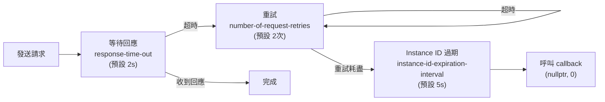

# Troubleshooting 故障排除

本文件提供 PLDM 常見問題的診斷方法、工具使用指引、以及解決方案。

---

## 診斷工具

### 1. pldmtool — PLDM 命令測試

```bash
# 確認 pldmd 是否正常運行
$ pldmtool base GetTID
{ "TID": 1 }

# 確認支援的 PLDM Types
$ pldmtool base GetPLDMTypes

# 遍歷 PDR Repository
$ pldmtool platform GetPDR -d 0

# 指定遠端端點
$ pldmtool base GetTID -m 8

# 發送原始 PLDM 命令
$ pldmtool raw -d 0x80 0x00 0x02
```

### 2. Flight Recorder — PLDM 訊息記錄

```bash
# 確認是否啟用（編譯時設定）
# meson.options: flightrecorder-max-entries > 0

# 傾印紀錄到 /tmp/pldm_flight_recorder
$ kill -SIGUSR1 $(pidof pldmd)

# 檢視紀錄
$ cat /tmp/pldm_flight_recorder
# 格式：<timestamp> : Tx/Rx : <hex bytes>
```

### 3. Journal 日誌

```bash
# 查看 pldmd 日誌
$ journalctl -u pldmd -f

# 啟用詳細模式
$ systemctl stop pldmd
$ pldmd --verbose
# 或設定 service 環境變數
```

### 4. D-Bus 診斷

```bash
# 確認 pldmd 是否在 D-Bus 上
$ busctl list | grep pldm

# 查看 PDR 介面
$ busctl introspect xyz.openbmc_project.PLDM /xyz/openbmc_project/pldm

# 查詢 State Effecter PDR
$ busctl call xyz.openbmc_project.PLDM \
    /xyz/openbmc_project/pldm \
    xyz.openbmc_project.PLDM.PDR \
    FindStateEffecterPDR yqq <tid> <entityId> <stateSetId>
```

---

## 常見問題

### 問題 1：pldmd 啟動失敗

**症狀**：`systemctl status pldmd` 顯示 failed

**診斷**：

```bash
$ journalctl -u pldmd --no-pager -n 50
```

**常見原因**：

| 原因                 | 解決方案                                                             |
| -------------------- | -------------------------------------------------------------------- |
| Transport 初始化失敗 | 確認 `af-mctp` kernel module 已載入，或 `mctp-demux` daemon 正在運行 |
| D-Bus 連線失敗       | 確認 `dbus-daemon` 正常運行                                          |
| Instance ID DB 錯誤  | 刪除 `/var/lib/pldm/` 下的 instance ID 資料庫                        |

### 問題 2：Host 端點不回應

**症狀**：`pldmtool base GetTID -m <eid>` 超時

**診斷步驟**：

1. **確認 MCTP 連通性**

   ```bash
   $ mctp link
   $ mctp address
   $ mctp route
   ```

2. **確認端點已被發現**

   ```bash
   $ busctl tree au.com.codeconstruct.MCTP1
   ```

3. **確認 PLDM 支援**

   ```bash
   # 端點的 MCTP Message Types 是否包含 1（PLDM）
   $ busctl get-property au.com.codeconstruct.MCTP1 \
       /au/com/codeconstruct/mctp1/networks/1/endpoints/<eid> \
       xyz.openbmc_project.MCTP.Endpoint MessageTypes
   ```

4. **檢查 Timing**
   - `response-time-out`（預設 2000ms）是否足夠？
   - 端點是否在 Instance ID 過期前（6 秒）回應？

### 問題 3：PDR 資料不正確

**症狀**：Sensor/Effecter 數值異常或缺失

**診斷**：

```bash
# 遍歷所有 PDR 確認資料
$ pldmtool platform GetPDR -d 0
# 比對 Handle 0 → nextHandle → ... → 0xFFFF

# 確認 PDR JSON 配置
$ ls /usr/share/pldm/pdr/
```

### 問題 4：Firmware Update 失敗

**症狀**：FW Update 卡在某個狀態

**診斷**：

```bash
# 查看 FW Update 日誌
$ journalctl -u pldmd | grep -i "fw\|firmware\|update"

# 確認 FD 探索是否成功
$ journalctl -u pldmd | grep "QueryDeviceIdentifiers\|GetFirmwareParameters"

# 確認 D-Bus 上的 Software 物件
$ busctl tree xyz.openbmc_project.PLDM | grep software
```

### 問題 5：SoftOff 超時

**症狀**：`pldm-softpoweroff` 超時未完成

**診斷**：

```bash
$ journalctl -u pldm-softpoweroff --no-pager

# 確認 Host 狀態
$ busctl get-property xyz.openbmc_project.State.Host \
    /xyz/openbmc_project/state/host0 \
    xyz.openbmc_project.State.Host CurrentHostState
```

**常見原因**：

- Host 未回報 `GracefulShutdownRequested` Sensor 狀態變更
- Effecter ID 在 PDR 中找不到
- `softoff-timeout-seconds`（預設 7200 秒）太短

### 問題 6：Instance ID 耗盡

**症狀**：`No free instance ids` 錯誤

**原因**：同時有太多未完成的 PLDM 請求

**解決方案**：

```bash
# 重啟 pldmd 釋放所有 Instance ID
$ systemctl restart pldmd

# 長期：調整 instance-id-expiration-interval
# 或減少並發請求數
```

### 問題 7：Sensor 數值不更新（stuck at initial value）

**症狀**：D-Bus 上 `/xyz/openbmc_project/sensors/...` 的 Sensor 數值一直不變，或 BMC 上看不到預期的 Sensor 物件。

**診斷步驟**：

**Step 1：確認 Terminus 是否被發現**

```bash
# 確認 platform-mc 發現的 Terminus 列表
$ busctl tree xyz.openbmc_project.PLDM | grep terminus
# 或確認 pldmd 日誌是否有 "initMctpTerminus" 或 "addTerminus"
$ journalctl -u pldmd | grep -i "terminus\|initMctp"
```

**Step 2：確認 PDR 是否成功拉取**

```bash
# 確認是否有 NumericSensor 相關日誌
$ journalctl -u pldmd | grep -i "getPDR\|parseTerminus\|NumericSensor"
# 確認 D-Bus 上是否已有 Sensor 物件
$ busctl tree xyz.openbmc_project.PLDM | grep sensors
```

**Step 3：確認 SensorManager 是否啟動輪詢**

```bash
# 查看是否有 doSensorPolling 相關的 verbose 輸出
$ pldmd --verbose 2>&1 | grep -i "polling\|GetSensor"
```

**Step 4：確認 Sensor 輪詢間隔設定**

```bash
# 確認 meson 選項（編譯時設定）
# sensor-polling-time: Terminus sensor 輪詢 timer（預設 249ms）
# default-sensor-update-interval: 預設 Sensor 輪詢間隔（預設 999ms）
```

**常見原因**：

| 原因                                              | 解決方案                                                      |
| ------------------------------------------------- | ------------------------------------------------------------- |
| Terminus 未完成 TID 分配（initMctpTerminus 失敗） | 確認 MCTP 連通性、`GetTID`/`SetTID` 是否有回應                |
| PDR 拉取失敗（GetPDR 超時）                       | 增大 `response-time-out`，確認裝置 PLDM Platform 能力已啟用   |
| Terminus 被標記為 NOT_READY                       | 查看 pldmd 日誌中是否有 Availability 相關錯誤                 |
| Sensor 尚未被加入輪詢清單                         | 確認 PDR 中該 Sensor 的 `sensorOperationalState` == `enabled` |
| `updateTime` 節流：尚未到讀取時機                 | 這是正常 round-robin 優化——等下一個輪詢週期即可，無需修改     |

---

## Timing 參數調校



> **逐步說明：**
>
> 這張圖展示 PLDM 請求的超時與重試機制：
>
> 1. **發送請求**：發送 PLDM 請求後開始等待。
> 2. **等待回應**：預設 2 秒（`response-time-out`）。如果收到回應→完成。
> 3. **超時重試**：如果超時，重試（預設 2 次）。
> 4. **重試耗盡**：等待 Instance ID 過期（預設 5 秒），然後呼叫 callback 通知失敗。
>
> **關鍵**：總等待時間 = 回應超時 × (重試次數+1) ≤ Instance ID 過期時間 ≤ 6 秒（DSP0240 規定）。

**調校建議**：

- 總等待時間 = `response-time-out` × (`number-of-request-retries` + 1)
- 總等待時間 **必須** ≤ `instance-id-expiration-interval`
- DSP0240 規定 Instance ID 最大有效期為 6 秒

---

## 相關文件

- [Pldmtool](Pldmtool.md) - 命令列工具
- [Pldmd](Pldmd.md) - Flight Recorder 詳細說明
- [Configuration](Configuration.md) - Timing 參數列表

---

_返回 [Home](Home.md)_
