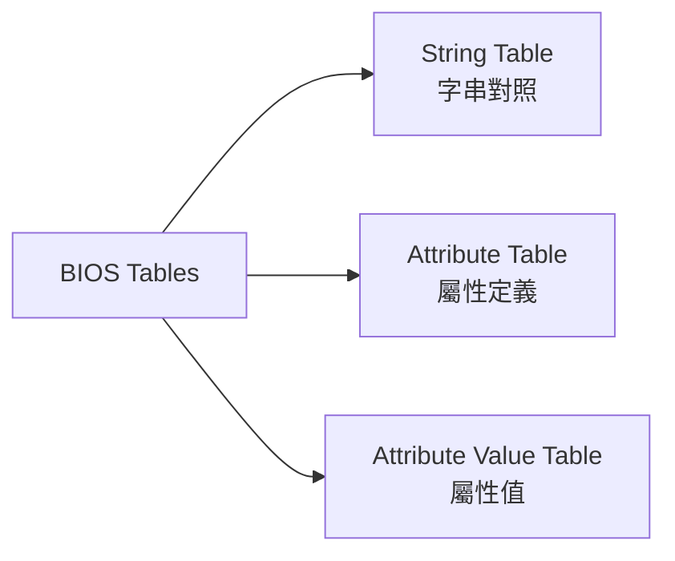
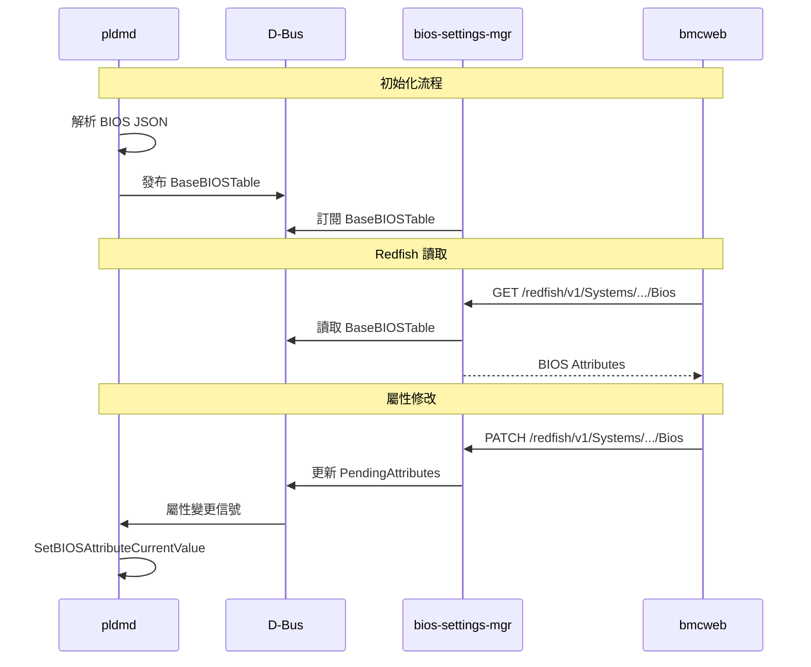
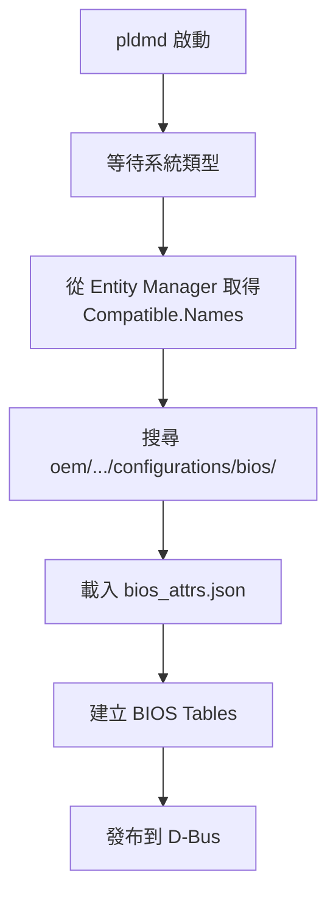

# PLDM Type 3: BIOS Control and Configuration

BIOS Type 提供 BMC 與 BIOS 之間的配置資料交換功能。

---

## 概述

| 欄位 | 值 |
|------|-----|
| **Type Code** | 0x03 |
| **規範** | DSP0247 |
| **功能** | BIOS 屬性讀取與設定 |

---

## 核心概念

### BIOS 表格

PLDM BIOS 定義三種表格：



| 表格 | 說明 |
|------|------|
| **String Table** | 字串 ID 到字串值的對照表 |
| **Attribute Table** | 定義所有 BIOS 屬性的元資料 |
| **Attribute Value Table** | 儲存屬性的當前值 |

### 屬性類型

| 類型 | 說明 | 範例 |
|------|------|------|
| Enumeration | 多選一選項 | Boot Mode: Legacy/UEFI |
| Integer | 整數值 | Memory Size: 0-65535 |
| String | 字串值 | Asset Tag: "Server01" |
| Password | 密碼 (不可讀) | Admin Password |

---

## 命令列表

| Command | Code | 說明 |
|---------|------|------|
| GetBIOSTable | 0x01 | 取得 BIOS 表格 |
| SetBIOSTable | 0x02 | 設定 BIOS 表格 |
| GetBIOSAttributeCurrentValueByHandle | 0x07 | 依 Handle 取得屬性值 |
| SetBIOSAttributeCurrentValue | 0x08 | 設定屬性值 |
| GetDateTime | 0x0C | 取得日期時間 |
| SetDateTime | 0x0D | 設定日期時間 |

---

## GetBIOSTable

### 請求格式

| 欄位 | 大小 | 說明 |
|------|------|------|
| Data Transfer Handle | 4 bytes | 傳輸控制代碼 |
| Transfer Op Flag | 1 byte | 傳輸操作旗標 |
| Table Type | 1 byte | 表格類型 (0=String, 1=Attr, 2=Value) |

### pldmtool 使用

```bash
# 取得 String Table
$ pldmtool bios GetBIOSTable -t 0

# 取得 Attribute Table
$ pldmtool bios GetBIOSTable -t 1

# 取得 Attribute Value Table
$ pldmtool bios GetBIOSTable -t 2
{
    "Table Type": "Attribute Value Table",
    "Entries": [
        {
            "Attribute Handle": 1,
            "Attribute Name": "BootMode",
            "Current Value": "UEFI"
        },
        ...
    ]
}
```

---

## BIOS 屬性 JSON 配置

OpenBMC PLDM 使用 JSON 檔案定義 BIOS 屬性。

### 目錄結構

```
oem/<vendor>/configurations/bios/
├── bios_attrs.json         # 主要屬性定義
└── <system_type>/          # 系統特定配置
    └── bios_attrs.json
```

### Enumeration 屬性

```json
{
    "entries": [
        {
            "attribute_type": "enum",
            "attribute_name": "BootMode",
            "possible_values": ["Legacy", "UEFI"],
            "default_values": ["UEFI"],
            "help_text": "Specifies the boot mode",
            "display_name": "Boot Mode",
            "read_only": false
        }
    ]
}
```

### Integer 屬性

```json
{
    "entries": [
        {
            "attribute_type": "integer",
            "attribute_name": "MemorySize",
            "lower_bound": 0,
            "upper_bound": 65535,
            "scalar_increment": 1,
            "default_value": 4096,
            "help_text": "Memory size in MB",
            "display_name": "Memory Size (MB)",
            "read_only": true
        }
    ]
}
```

### String 屬性

```json
{
    "entries": [
        {
            "attribute_type": "string",
            "attribute_name": "AssetTag",
            "string_type": "ASCII",
            "minimum_string_length": 0,
            "maximum_string_length": 64,
            "default_string": "",
            "help_text": "Asset tag for the system",
            "display_name": "Asset Tag",
            "read_only": false
        }
    ]
}
```

---

## 與 BIOS Config Manager 整合



### D-Bus 介面

| 介面 | 路徑 | 屬性 |
|------|------|------|
| `xyz.openbmc_project.BIOSConfig.Manager` | `/xyz/openbmc_project/bios_config/manager` | `BaseBIOSTable` |
| | | `PendingAttributes` |
| | | `ResetBIOSSettings` |

---

## 系統特定配置

透過 meson 選項啟用系統特定 BIOS 配置：

```bash
meson setup build -Dsystem-specific-bios-json=enabled
```

啟用後，PLDM 會：
1. 監聽 Entity Manager 的 Compatible 介面
2. 根據系統類型載入對應的 BIOS JSON
3. 動態建立 BIOS 表格



---

## pldmtool BIOS 命令

### 取得所有屬性

```bash
$ pldmtool bios GetBIOSAttributeCurrentValueByHandle -a
{
    "CurrentBIOSSettings": [
        {
            "AttributeName": "BootMode",
            "AttributeType": "Enumeration",
            "CurrentValue": "UEFI"
        },
        {
            "AttributeName": "MemorySize",
            "AttributeType": "Integer",
            "CurrentValue": 4096
        }
    ]
}
```

### 設定屬性

```bash
$ pldmtool bios SetBIOSAttributeCurrentValue \
    -a BootMode -d Enum -v Legacy
{
    "Response": "SUCCESS"
}
```

---

## 原始碼位置

| 檔案 | 說明 |
|------|------|
| `libpldmresponder/bios.cpp` | BIOS Handler |
| `libpldmresponder/bios_config.cpp` | BIOS 配置管理 |
| `libpldmresponder/bios_attribute.cpp` | 屬性基類 |
| `libpldmresponder/bios_enum_attribute.cpp` | Enum 屬性 |
| `libpldmresponder/bios_integer_attribute.cpp` | Integer 屬性 |
| `libpldmresponder/bios_string_attribute.cpp` | String 屬性 |
| `libpldmresponder/bios_table.cpp` | 表格處理 |

---

## 相關文件

- [BIOSConfig](BIOSConfig.md) - BIOS 配置詳解
- [DMTFSpecifications](DMTFSpecifications.md) - DSP0247 規範

---

*返回 [Home](Home.md)*
