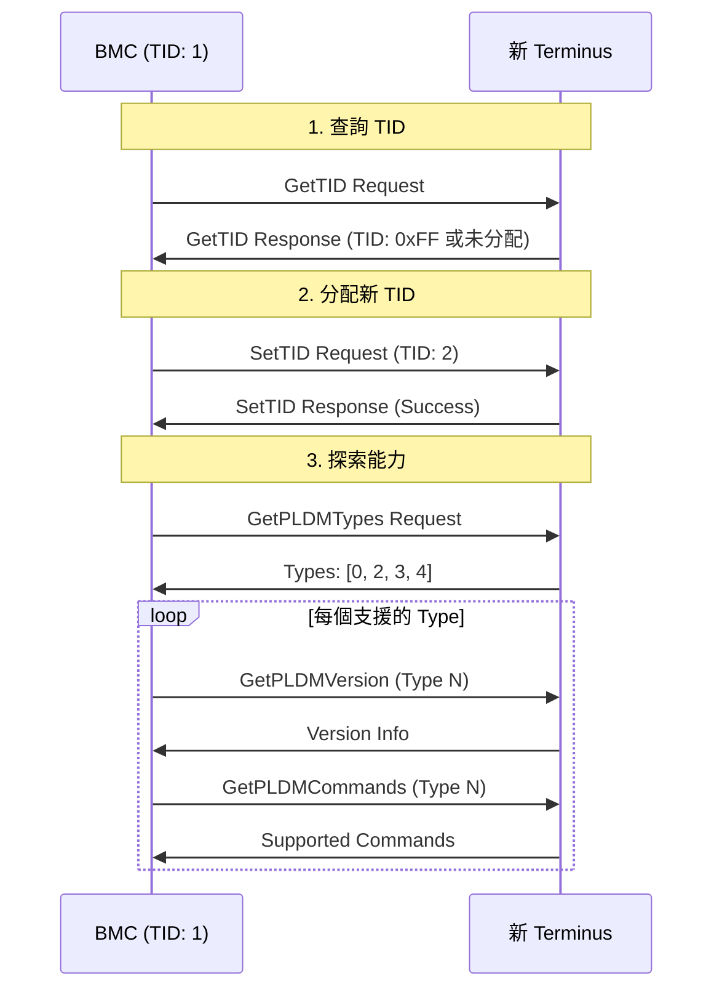

# PLDM Type 0: Base

Base Type 是所有 PLDM Terminus 必須支援的基礎類型，提供探索與版本查詢功能。

---

## 概述

| 欄位          | 值                       |
| ------------- | ------------------------ |
| **Type Code** | 0x00                     |
| **規範**      | DSP0240 v1.1.0           |
| **必要性**    | 必須支援                 |
| **功能**      | 探索、版本查詢、TID 管理 |

---

## 支援的命令

| Command                     | Code | 方向                  | 說明             | 狀態                   |
| --------------------------- | ---- | --------------------- | ---------------- | ---------------------- |
| SetTID                      | 0x01 | Requester → Responder | 設定 Terminus ID | ⚠️ 未由 Responder 處理 |
| GetTID                      | 0x02 | Requester → Responder | 查詢 Terminus ID | ✅ 已實作              |
| GetPLDMVersion              | 0x03 | Requester → Responder | 查詢 PLDM 版本   | ✅ 已實作              |
| GetPLDMTypes                | 0x04 | Requester → Responder | 查詢支援的 Types | ✅ 已實作              |
| GetPLDMCommands             | 0x05 | Requester → Responder | 查詢支援的命令   | ✅ 已實作              |
| SelectPLDMVersion           | 0x06 | Requester → Responder | 選擇使用的版本   | ⚠️ 未實作              |
| NegotiateTransferParameters | 0x07 | 雙向                  | 協商傳輸參數     | ⚠️ 未實作              |
| MultipartSend               | 0x08 | -                     | 多段傳送         | libpldm 有 API         |
| MultipartReceive            | 0x09 | -                     | 多段接收         | libpldm 有 API         |
| GetMultipartTransferSupport | 0x0A | -                     | 查詢多段傳輸支援 | libpldm 有定義         |

> **注意**：OpenBMC `libpldmresponder/base.hpp` 中的 `base::Handler` 僅註冊 GetTID (0x02)、GetPLDMVersion (0x03)、GetPLDMTypes (0x04)、GetPLDMCommands (0x05) 四個 handler。SetTID (0x01) 由 `platform-mc/terminus_manager.cpp` 作為 Requester 使用。

---

## 命令詳解

### GetTID (0x02)

查詢 Terminus 的 TID (Terminus ID)。

**請求格式：**
無 payload

**回應格式：**

| 欄位            | 大小   | 說明        |
| --------------- | ------ | ----------- |
| Completion Code | 1 byte | 0x00 = 成功 |
| TID             | 1 byte | 0x00-0xFF   |

**pldmtool 使用：**

```bash
$ pldmtool base GetTID
{
    "Response": "SUCCESS",
    "TID": 1
}
```

---

### GetPLDMTypes (0x04)

查詢 Terminus 支援的 PLDM Types。

**請求格式：**
無 payload

**回應格式：**

| 欄位            | 大小    | 說明                     |
| --------------- | ------- | ------------------------ |
| Completion Code | 1 byte  | 0x00 = 成功              |
| Types           | 8 bytes | 位元陣列，bit N = Type N |

**pldmtool 使用：**

```bash
$ pldmtool base GetPLDMTypes
[
    { "PLDM Type": "base", "PLDM Type Code": 0 },
    { "PLDM Type": "platform", "PLDM Type Code": 2 },
    { "PLDM Type": "bios", "PLDM Type Code": 3 },
    { "PLDM Type": "fru", "PLDM Type Code": 4 },
    { "PLDM Type": "oem-ibm", "PLDM Type Code": 63 }
]
```

---

### GetPLDMVersion (0x03)

查詢特定 PLDM Type 的支援版本。

**請求格式：**

| 欄位                 | 大小    | 說明          |
| -------------------- | ------- | ------------- |
| Data Transfer Handle | 4 bytes | 傳輸控制代碼  |
| Transfer Op Flag     | 1 byte  | 傳輸操作旗標  |
| PLDM Type            | 1 byte  | 要查詢的 Type |

**回應格式：**

| 欄位                      | 大小    | 說明                    |
| ------------------------- | ------- | ----------------------- |
| Completion Code           | 1 byte  | 0x00 = 成功             |
| Next Data Transfer Handle | 4 bytes | 下次傳輸控制代碼        |
| Transfer Flag             | 1 byte  | 傳輸旗標                |
| Version Data              | 可變    | 版本資訊 (BCDPLUS 格式) |

**pldmtool 使用：**

```bash
$ pldmtool base GetPLDMVersion -t base
{
    "Response": "SUCCESS",
    "Versions": ["1.0.0"]
}
```

---

### GetPLDMCommands (0x05)

查詢特定 PLDM Type 支援的命令。

**請求格式：**

| 欄位      | 大小    | 說明          |
| --------- | ------- | ------------- |
| PLDM Type | 1 byte  | 要查詢的 Type |
| Version   | 4 bytes | PLDM 版本     |

**回應格式：**

| 欄位            | 大小     | 說明                        |
| --------------- | -------- | --------------------------- |
| Completion Code | 1 byte   | 0x00 = 成功                 |
| Commands        | 32 bytes | 位元陣列，bit N = command N |

**pldmtool 使用：**

```bash
$ pldmtool base GetPLDMCommands -t base
{
    "Response": "SUCCESS",
    "Commands": [
        { "Command": "SetTID", "Code": 1 },
        { "Command": "GetTID", "Code": 2 },
        { "Command": "GetPLDMVersion", "Code": 3 },
        { "Command": "GetPLDMTypes", "Code": 4 },
        { "Command": "GetPLDMCommands", "Code": 5 }
    ]
}
```

---

### SetTID (0x01)

設定 Terminus 的 TID。

**請求格式：**

| 欄位 | 大小   | 說明         |
| ---- | ------ | ------------ |
| TID  | 1 byte | 要設定的 TID |

**回應格式：**

| 欄位            | 大小   | 說明        |
| --------------- | ------ | ----------- |
| Completion Code | 1 byte | 0x00 = 成功 |

---

## 探索流程

新 PLDM Terminus 的探索流程：



> **逐步說明：**
>
> 這張圖展示 BMC 發現新 PLDM Terminus 時的完整探索流程：
>
> 1. **查詢 TID**：BMC 先問新裝置：「你的 Terminus ID 是什麼？」如果回傳 0xFF（未分配），表示需要 BMC 幫它分配。
> 2. **分配新 TID**：BMC 分配一個 TID（例如 2）給新裝置。TID 就像 PLDM 層級的「員工編號」，和 MCTP 的 EID（通訊地址）是不同層的概念。
> 3. **探索能力**：BMC 問裝置：「你支援哪些 PLDM Type？」回傳 [0, 2, 3, 4] 表示支援 Base、Platform、BIOS、FRU。
> 4. **迴圈查詢每個 Type 的詳情**：對每個支援的 Type，BMC 進一步查詢：
>    - `GetPLDMVersion`：「你用的是哪個版本的規範？」
>    - `GetPLDMCommands`：「你支援哪些命令？」
>
> **白話總結**：就像面試新員工——先問名字（TID）、再問會什麼技能（Types）、然後問每個技能的程度（Version/Commands）。

---

## libpldm API

### 編碼 API

```cpp
// encode_get_types_req - 編碼 GetPLDMTypes 請求
int encode_get_types_req(uint8_t instance_id, struct pldm_msg *msg);

// encode_get_version_req - 編碼 GetPLDMVersion 請求
int encode_get_version_req(
    uint8_t instance_id,
    uint32_t transfer_handle,
    uint8_t transfer_opflag,
    uint8_t type,
    struct pldm_msg *msg
);

// encode_get_commands_req - 編碼 GetPLDMCommands 請求
int encode_get_commands_req(
    uint8_t instance_id,
    uint8_t type,
    ver32_t version,
    struct pldm_msg *msg
);
```

### 解碼 API

```cpp
// decode_get_types_resp - 解碼 GetPLDMTypes 回應
int decode_get_types_resp(
    const struct pldm_msg *msg,
    size_t payload_length,
    uint8_t *completion_code,
    bitfield8_t *types
);

// decode_get_version_resp - 解碼 GetPLDMVersion 回應
int decode_get_version_resp(
    const struct pldm_msg *msg,
    size_t payload_length,
    uint8_t *completion_code,
    uint32_t *next_transfer_handle,
    uint8_t *transfer_flag,
    ver32_t *version
);
```

---

## OpenBMC 實作

Base Type Handler 位於 `libpldmresponder/base.cpp`：

```cpp
// 主要處理函式
Response Handler::getPLDMTypes(const pldm_msg* request, size_t payloadLength);
Response Handler::getPLDMVersion(const pldm_msg* request, size_t payloadLength);
Response Handler::getPLDMCommands(const pldm_msg* request, size_t payloadLength);
Response Handler::getTID(const pldm_msg* request, size_t payloadLength);
```

---

## 相關文件

- [PLDMOverview](PLDMOverview.md) - PLDM 協議概述
- [TypePlatform](TypePlatform.md) - Platform Type
- [Pldmtool](Pldmtool.md) - pldmtool 使用

---

_返回 [Home](Home.md)_
