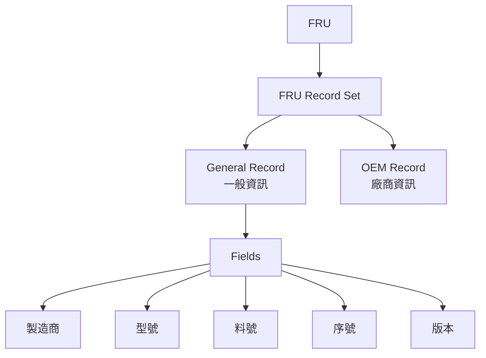
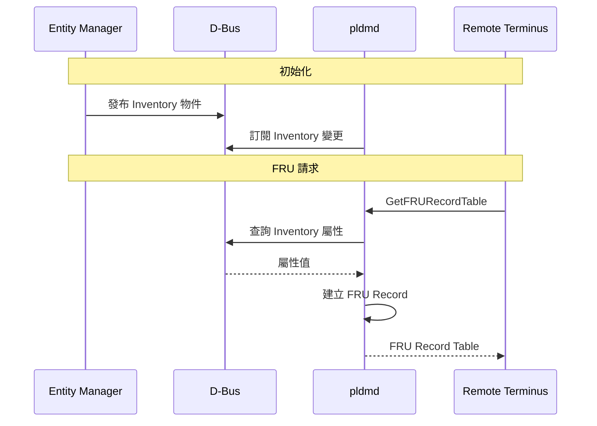

# PLDM Type 4: FRU Data

FRU Type 提供 FRU (Field Replaceable Unit) 資料的標準化存取。

---

## 概述

| 欄位 | 值 |
|------|-----|
| **Type Code** | 0x04 |
| **規範** | DSP0257 |
| **功能** | FRU 資料讀取 |

---

## 核心概念

### FRU Record Set

每個 FRU 由一組 Record 組成：



### Record Types

| Type | 名稱 | 說明 |
|------|------|------|
| 1 | General FRU Record | 標準 FRU 欄位 |
| 254 | OEM FRU Record | 廠商自訂欄位 |

### Encoding Types

| Encoding | 說明 |
|----------|------|
| 0 | Unspecified |
| 1 | ASCII |
| 2 | UTF-8 |
| 3 | UTF-16 |
| 4 | UTF-16LE |
| 5 | UTF-16BE |

---

## 命令列表

| Command | Code | 說明 |
|---------|------|------|
| GetFRURecordTableMetadata | 0x01 | 取得 FRU 表格元資料 |
| GetFRURecordTable | 0x02 | 取得 FRU 記錄表格 |
| SetFRURecordTable | 0x03 | 設定 FRU 記錄表格 |
| GetFRURecordByOption | 0x04 | 依選項取得 FRU 記錄 |

---

## GetFRURecordTableMetadata

查詢 FRU 表格的元資料。

### 回應格式

| 欄位 | 大小 | 說明 |
|------|------|------|
| Completion Code | 1 byte | |
| FRU Data Major Version | 1 byte | 主版本號 |
| FRU Data Minor Version | 1 byte | 次版本號 |
| FRU Table Maximum Size | 4 bytes | 表格最大大小 |
| FRU Table Length | 4 bytes | 表格目前大小 |
| Total Record Set Identifiers | 2 bytes | Record Set 數量 |
| Total Table Records | 2 bytes | 總記錄數 |
| Checksum | 4 bytes | CRC32 校驗碼 |

### pldmtool 使用

```bash
$ pldmtool fru GetFRURecordTableMetadata
{
    "FRU Data Major Version": 1,
    "FRU Data Minor Version": 0,
    "FRU Table Maximum Size": 65536,
    "FRU Table Length": 2048,
    "Total Record Set Identifiers": 5,
    "Total Table Records": 10,
    "Checksum": "0x12345678"
}
```

---

## GetFRURecordTable

取得完整 FRU 記錄表格。

### 請求格式

| 欄位 | 大小 | 說明 |
|------|------|------|
| Data Transfer Handle | 4 bytes | 傳輸控制代碼 |
| Transfer Op Flag | 1 byte | 傳輸操作旗標 |

### pldmtool 使用

```bash
$ pldmtool fru GetFRURecordTable
{
    "FRU Record Table": [
        {
            "FRU Record Set Identifier": 1,
            "FRU Record Type": "General",
            "Fields": [
                {
                    "Type": "Manufacturer",
                    "Value": "OpenBMC"
                },
                {
                    "Type": "Model",
                    "Value": "Server X"
                },
                {
                    "Type": "Part Number",
                    "Value": "PN123456"
                },
                {
                    "Type": "Serial Number",
                    "Value": "SN987654"
                }
            ]
        },
        ...
    ]
}
```

---

## FRU JSON 配置

OpenBMC 使用 JSON 配置 D-Bus 屬性與 PLDM FRU 欄位的映射。

### 配置檔位置

```
pldm/configurations/fru/
└── fru_config.json
```

### 配置格式

```json
{
    "service": "xyz.openbmc_project.Inventory.Manager",
    "records": [
        {
            "entity_type": 45,
            "fru_fields": [
                {
                    "dbus": {
                        "interface": "xyz.openbmc_project.Inventory.Decorator.Asset",
                        "property_name": "Manufacturer",
                        "property_type": "string"
                    },
                    "fru_field_type": 1
                },
                {
                    "dbus": {
                        "interface": "xyz.openbmc_project.Inventory.Decorator.Asset",
                        "property_name": "Model",
                        "property_type": "string"
                    },
                    "fru_field_type": 7
                },
                {
                    "dbus": {
                        "interface": "xyz.openbmc_project.Inventory.Decorator.Asset",
                        "property_name": "PartNumber",
                        "property_type": "string"
                    },
                    "fru_field_type": 2
                },
                {
                    "dbus": {
                        "interface": "xyz.openbmc_project.Inventory.Decorator.Asset",
                        "property_name": "SerialNumber",
                        "property_type": "string"
                    },
                    "fru_field_type": 3
                }
            ]
        }
    ]
}
```

### FRU Field Types

| Type | 名稱 |
|------|------|
| 1 | Manufacturer |
| 2 | Part Number |
| 3 | Serial Number |
| 4 | Manufacturing Date |
| 5 | Vendor |
| 6 | Name |
| 7 | Model |
| 8 | Version |
| 9 | SKU |
| 10 | Description |
| 11 | Asset Tag |
| 12 | Engineering Change Level |

---

## 與 Entity Manager 整合



---

## FRU 記錄格式

### General FRU Record Header

```
┌─────────────────────────────────────────────────────────────────┐
│ Record Set ID │ Record Type │ Num Fields │ Encoding │ Fields...│
│   (2 bytes)   │  (1 byte)   │  (1 byte)  │ (1 byte) │          │
└─────────────────────────────────────────────────────────────────┘
```

### FRU Field

```
┌─────────────────────────────────────────────┐
│ Field Type │ Field Length │   Field Value  │
│  (1 byte)  │   (1 byte)   │   (variable)   │
└─────────────────────────────────────────────┘
```

---

## 原始碼位置

| 檔案 | 說明 |
|------|------|
| `libpldmresponder/fru.cpp` | FRU Handler |
| `libpldmresponder/fru.hpp` | FRU 定義 |
| `libpldmresponder/fru_parser.cpp` | FRU JSON 解析 |
| `pldmtool/pldm_fru_cmd.cpp` | pldmtool FRU 命令 |

---

## 相關文件

- [TypePlatform](TypePlatform.md) - FRU Record Set PDR
- [Architecture](Architecture.md) - Entity Manager 整合

---

*返回 [Home](Home.md)*
