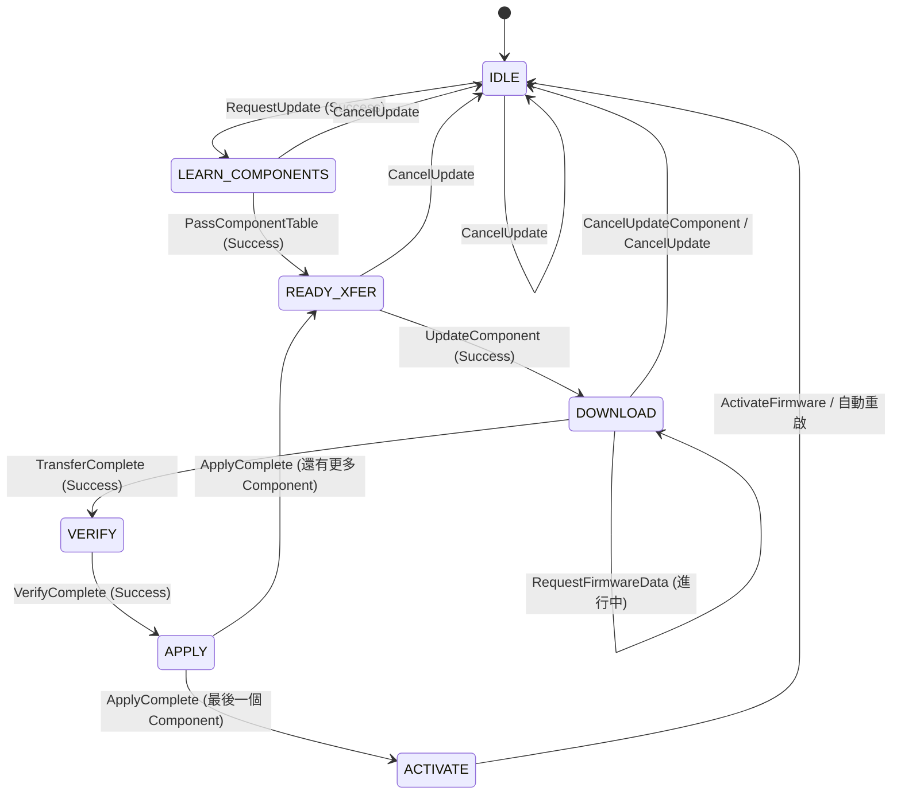
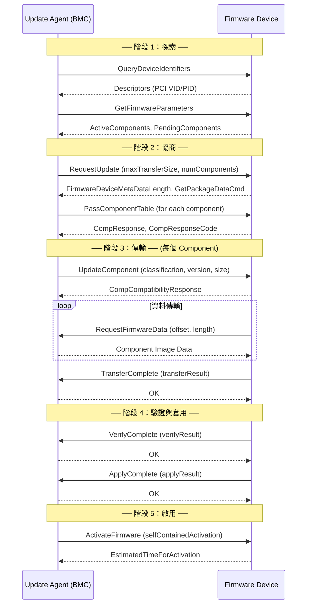

# PLDM Type 5: Firmware Update

Firmware Update Type 提供標準化的韌體更新流程，定義於 DSP0267。

---

## 概述

| 欄位          | 值                                 |
| ------------- | ---------------------------------- |
| **Type Code** | 0x05                               |
| **規範**      | DSP0267 — PLDM for Firmware Update |
| **功能**      | 韌體查詢、傳輸、驗證、套用、啟用   |

---

## 角色與術語

| 角色                     | 說明                                           |
| ------------------------ | ---------------------------------------------- |
| **Update Agent (UA)**    | 發起更新的一方（BMC 扮演此角色）               |
| **Firmware Device (FD)** | 被更新的裝置（GPU、NIC、FPGA 等）              |
| **FDP**                  | Firmware Device Package — 標準化的韌體打包格式 |
| **Component**            | FD 中的一個可獨立更新的韌體元件                |
| **Descriptor**           | 用於識別 FD 的唯一描述符（如 PCI VID/PID）     |

---

## 完整命令列表

### 探索與查詢

| Command                    | Code | 方向  | 說明                                 |
| -------------------------- | ---- | ----- | ------------------------------------ |
| QueryDeviceIdentifiers     | 0x01 | UA→FD | 查詢裝置描述符（Vendor/Device ID）   |
| GetFirmwareParameters      | 0x02 | UA→FD | 取得韌體參數（元件表、capabilities） |
| QueryDownstreamDevices     | 0x03 | UA→FD | 查詢下游裝置                         |
| QueryDownstreamIdentifiers | 0x04 | UA→FD | 查詢下游裝置描述符                   |

### 更新流程

| Command                 | Code     | 方向      | 說明                      |
| ----------------------- | -------- | --------- | ------------------------- |
| RequestUpdate           | 0x10     | UA→FD     | 請求進入更新模式          |
| PassComponentTable      | 0x13     | UA→FD     | 傳遞要更新的元件列表      |
| UpdateComponent         | 0x14     | UA→FD     | 開始更新特定元件          |
| **RequestFirmwareData** | **0x15** | **FD→UA** | FD 主動向 UA 請求韌體資料 |
| **TransferComplete**    | **0x16** | **FD→UA** | FD 通知傳輸完成           |
| **VerifyComplete**      | **0x17** | **FD→UA** | FD 通知驗證完成           |
| **ApplyComplete**       | **0x18** | **FD→UA** | FD 通知套用完成           |
| ActivateFirmware        | 0x1A     | UA→FD     | 啟用新韌體                |
| GetStatus               | 0x1B     | UA→FD     | 查詢更新狀態              |
| CancelUpdateComponent   | 0x1C     | UA→FD     | 取消當前元件更新          |
| CancelUpdate            | 0x1D     | UA→FD     | 取消整個更新              |

> **面試重點**：注意 `RequestFirmwareData`、`TransferComplete`、`VerifyComplete`、`ApplyComplete` 是 **FD 主動發給 UA** 的命令（FD 作為 Requester）。這是 PLDM FW Update 的獨特設計——FD 控制資料傳輸節奏。

---

## FD 狀態機（DSP0267 Figure 3）



> **逐步說明（FD 狀態機）：**
>
> 這張圖描述的是**韌體裝置（FD）本身的內部狀態**。FD 必須依此狀態機回應來自 UA（BMC）的命令，並主動發出部分命令（如 `RequestFirmwareData`）。
>
> | 狀態                 | 觸發事件                    | FD 在此狀態做什麼                                                                                                                                                                                                    |
> | -------------------- | --------------------------- | -------------------------------------------------------------------------------------------------------------------------------------------------------------------------------------------------------------------- |
> | **IDLE**             | —                           | 初始/待機狀態。FD 接受 `QueryDeviceIdentifiers`、`GetFirmwareParameters` 等查詢命令，但**不接受** `UpdateComponent` 等更新命令。                                                                                     |
> | **LEARN_COMPONENTS** | `RequestUpdate` 成功        | FD 知道 UA 打算更新哪些元件（數量由 `numComponents` 指定），開始準備。UA 後續會用 `PassComponentTable` 傳遞元件詳細列表。                                                                                            |
> | **READY_XFER**       | `PassComponentTable` 成功   | FD 已確認元件列表，等待 UA 呼叫 `UpdateComponent` 指定要更新的元件。此狀態可重複進入（每個元件完成後回來）。                                                                                                         |
> | **DOWNLOAD**         | `UpdateComponent` 成功      | **核心傳輸階段**。FD 主動呼叫 `RequestFirmwareData(offset, length)` 向 UA 索取韌體區塊，UA 回傳對應的二進位資料。這個過程**由 FD 控制節奏**（Pull 模式），FD 決定每次請求的 `offset` 與 `length`，直到整個映像傳完。 |
> | **VERIFY**           | `TransferComplete` 成功     | FD 內部驗證剛收到的韌體映像完整性，例如 CRC-32 校驗、簽章驗證。UA **不需要** 做任何事，只需等待。                                                                                                                    |
> | **APPLY**            | `VerifyComplete` 成功       | FD 將已驗證的韌體映像寫入 Flash（或其他持久儲存）。這是**不可逆的寫入操作**。完成後：若還有其他元件待更新，發 `ApplyComplete` 並回到 **READY_XFER**；若這是最後一個元件，則進入 **ACTIVATE**。                       |
> | **ACTIVATE**         | `ApplyComplete`（最後元件） | FD 準備啟用新韌體。UA 呼叫 `ActivateFirmware` 後，FD 可能執行自我重啟（self-contained activation）或等待外部重啟。                                                                                                   |
>
> **取消路徑說明**：
>
> - `CancelUpdate`（0x1D）：在 IDLE、LEARN_COMPONENTS、READY_XFER 任一狀態下均可呼叫，立即中止整個更新流程並回到 IDLE。
> - `CancelUpdateComponent`（0x1C）：只能在 DOWNLOAD 狀態下使用，僅取消**當前元件**的下載，FD 回到 READY_XFER，可繼續更新其他元件。
>
> **白話總結**：就像手機系統更新——確認清單（LEARN/READY）→ 下載韌體（DOWNLOAD，手機自己控制下載進度）→ 驗證完整性（VERIFY）→ 寫入儲存（APPLY）→ 重新啟動（ACTIVATE）。

---

## Firmware Device Package 格式

```
+─────────────────────────────────────+
│ Package Header Information          │
│   ├── PackageHeaderIdentifier (UUID)│
│   ├── PackageHeaderFormatRevision   │
│   ├── PackageHeaderSize             │
│   ├── ComponentBitmapBitLength      │
│   ├── PackageVersionString          │
│   └── PackageReleaseDateTime        │
+─────────────────────────────────────+
│ Firmware Device Identification Area │
│   ├── DeviceIDRecordCount           │
│   └── DeviceIDRecord[]              │
│       ├── RecordLength              │
│       ├── DescriptorCount           │
│       ├── ComponentBitmap           │
│       └── Descriptors[]             │
│           ├── Type (IANA/PCI/UUID)  │
│           └── Data                  │
+─────────────────────────────────────+
│ Component Image Information Area    │
│   ├── ComponentImageCount           │
│   └── ComponentImageInfo[]          │
│       ├── Classification            │
│       ├── Identifier                │
│       ├── ComparisonStamp           │
│       ├── ComponentOptions          │
│       ├── ImageSize                 │
│       └── VersionString             │
+─────────────────────────────────────+
│ Component Image Data                │
│   └── Binary firmware images...     │
+─────────────────────────────────────+
│ Package Header Checksum (CRC-32)    │
+─────────────────────────────────────+
```

---

## 完整更新序列



> **逐步說明（完整更新序列）：**
>
> 這張圖展示 UA（BMC）與 FD（待更新裝置）之間的完整命令交換流程，實線箭頭（`->>`)為 **Request**，虛線箭頭（`-->>`)為 **Response**。
>
> ---
>
> **階段 1：探索（Discovery）**
>
> | 步驟 | 命令                       | 說明                                                                                                                                                                                                                    |
> | ---- | -------------------------- | ----------------------------------------------------------------------------------------------------------------------------------------------------------------------------------------------------------------------- |
> | 1    | `QueryDeviceIdentifiers` → | UA 詢問 FD「你是什麼裝置？」FD 回傳一組 **Descriptors**（如 PCI Vendor ID `0x0000`、PCI Device ID `0x0100`）。UA 用這些 Descriptor 與 FW Package 中的 DeviceIDRecord 做**精確比對**，確認此 FW Package 適用於這台裝置。 |
> | 2    | `GetFirmwareParameters` →  | UA 詢問 FD「你現在裝了哪些韌體？」FD 回傳 **ActiveComponents**（目前運行的版本）和 **PendingComponents**（已下載但等待啟用的版本）。UA 藉此判斷是否需要更新（版本比較）。                                               |
>
> ---
>
> **階段 2：協商（Negotiation）**
>
> | 步驟 | 命令                                                                                        | 說明                                                                                                                                                                                                                                                                        |
> | ---- | ------------------------------------------------------------------------------------------- | --------------------------------------------------------------------------------------------------------------------------------------------------------------------------------------------------------------------------------------------------------------------------- |
> | 3    | `RequestUpdate(maxTransferSize, numComponents, ...)` →                                      | UA 正式通知 FD「我要開始更新了」，並傳遞關鍵參數：`maxTransferSize`（UA 每次能回應的最大資料量，限制 FD 單次 `RequestFirmwareData` 的請求大小）、`numComponents`（此次要更新的元件數量）。FD 回應 `FirmwareDeviceMetaDataLength`（FD 是否有自己的 metadata 要 UA 先讀取）。 |
> | 4    | `PassComponentTable(componentClassification, componentIdentifier, componentVersion, ...)` → | UA 逐一傳入每個待更新元件的資訊。FD 對每個元件回應 `CompResponse`（`updateComp` 或 `compCanBeUpdated`）以及 `CompResponseCode`，表示它是否願意/能夠接受更新。**若 FD 拒絕某個元件，UA 可選擇跳過或中止整個流程。**                                                          |
>
> ---
>
> **階段 3：傳輸（Transfer）**（每個元件重複執行）
>
> | 步驟 | 命令                                                                               | 說明                                                                                                                                                                                                                                       |
> | ---- | ---------------------------------------------------------------------------------- | ------------------------------------------------------------------------------------------------------------------------------------------------------------------------------------------------------------------------------------------ |
> | 5    | `UpdateComponent(componentClassification, componentVersion, componentSize, ...)` → | UA 告訴 FD「現在開始更新這個特定元件」，並告知 `componentSize`（映像總大小），FD 以此規劃後續的 `RequestFirmwareData` 次數。FD 回應 `CompCompatibilityResponse`，確認接受。                                                                |
> | 6    | ← `RequestFirmwareData(offset, length)`                                            | **⚠️ 方向反轉**：此命令是由 **FD 發給 UA** 的。FD 主動用 `offset` 和 `length` 向 UA 索取韌體映像的特定區段。UA 只是被動地從 FW Package 中讀取對應位置的資料並回傳。這是 **Pull 模式**，FD 掌控下載節奏，可以按自己的 buffer 大小分批請求。 |
> | 7    | ← `TransferComplete(transferResult)`                                               | FD 完成所有區段的請求後，發送此命令通知 UA 傳輸結果。`transferResult = 0` 表示成功；若失敗（如 timeout 或資料錯誤），FD 仍需發此命令並帶上錯誤碼，UA 可決定是否重試或中止。                                                                |
>
> ---
>
> **階段 4：驗證與套用（Verify & Apply）**
>
> | 步驟 | 命令                             | 說明                                                                                                                                                           |
> | ---- | -------------------------------- | -------------------------------------------------------------------------------------------------------------------------------------------------------------- |
> | 8    | ← `VerifyComplete(verifyResult)` | FD 對收到的韌體映像進行完整性檢查（例如 CRC-32、數位簽章驗證）後，主動通知 UA 結果。UA 在此期間**無需任何動作**，只需等待（可視狀況用 `GetStatus` 查詢進度）。 |
> | 9    | ← `ApplyComplete(applyResult)`   | FD 完成韌體寫入 Flash 後，主動通知 UA。若還有更多元件，FD 內部狀態回到 READY_XFER，UA 繼續從步驟 5 重複。                                                      |
>
> ---
>
> **階段 5：啟用（Activation）**
>
> | 步驟 | 命令                                          | 說明                                                                                                                                                                                        |
> | ---- | --------------------------------------------- | ------------------------------------------------------------------------------------------------------------------------------------------------------------------------------------------- |
> | 10   | `ActivateFirmware(selfContainedActivation)` → | UA 下令啟用新韌體。`selfContainedActivation = true` 表示 FD 可以自行重啟（不需要外部電源循環）。FD 回傳 `EstimatedTimeForActivation`（預計啟用所需秒數），UA 應等待此時間後再進行後續操作。 |
>
> ---
>
> **白話總結**：就像汽車軟體 OTA 更新——掃描行車電腦版本（探索）→ 確認更新清單（協商）→ 電腦自己從伺服器下拉韌體（傳輸，Pull 模式）→ 自我檢查（驗證）→ 寫入（套用）→ 下次發動重啟生效（啟用）。

---

## Descriptor 類型

| Type                    | Code   | 說明                |
| ----------------------- | ------ | ------------------- |
| PCI Vendor ID           | 0x0000 | PCI 供應商 ID       |
| IANA Enterprise ID      | 0x0001 | IANA 企業 ID        |
| UUID                    | 0x0002 | 通用唯一識別符      |
| PnP Vendor ID           | 0x0003 | PnP 供應商 ID       |
| ACPI Vendor ID          | 0x0004 | ACPI 供應商 ID      |
| PCI Device ID           | 0x0100 | PCI 設備 ID         |
| PCI Subsystem Vendor ID | 0x0101 | PCI 子系統供應商 ID |
| PCI Subsystem ID        | 0x0102 | PCI 子系統 ID       |
| PCI Revision ID         | 0x0103 | PCI 修訂 ID         |
| Vendor Defined          | 0xFFFF | 廠商自訂            |

---

## pldmtool 使用

```bash
# 查詢裝置識別
$ pldmtool fw_update QueryDeviceIdentifiers -m 20

# 查詢韌體參數
$ pldmtool fw_update GetFirmwareParameters -m 20
```

---

## 相關文件

- [FirmwareUpdate](FirmwareUpdate.md) - OpenBMC 實作詳解
- [Requester](Requester.md) - 請求管理

---

_返回 [Home](Home.md)_
