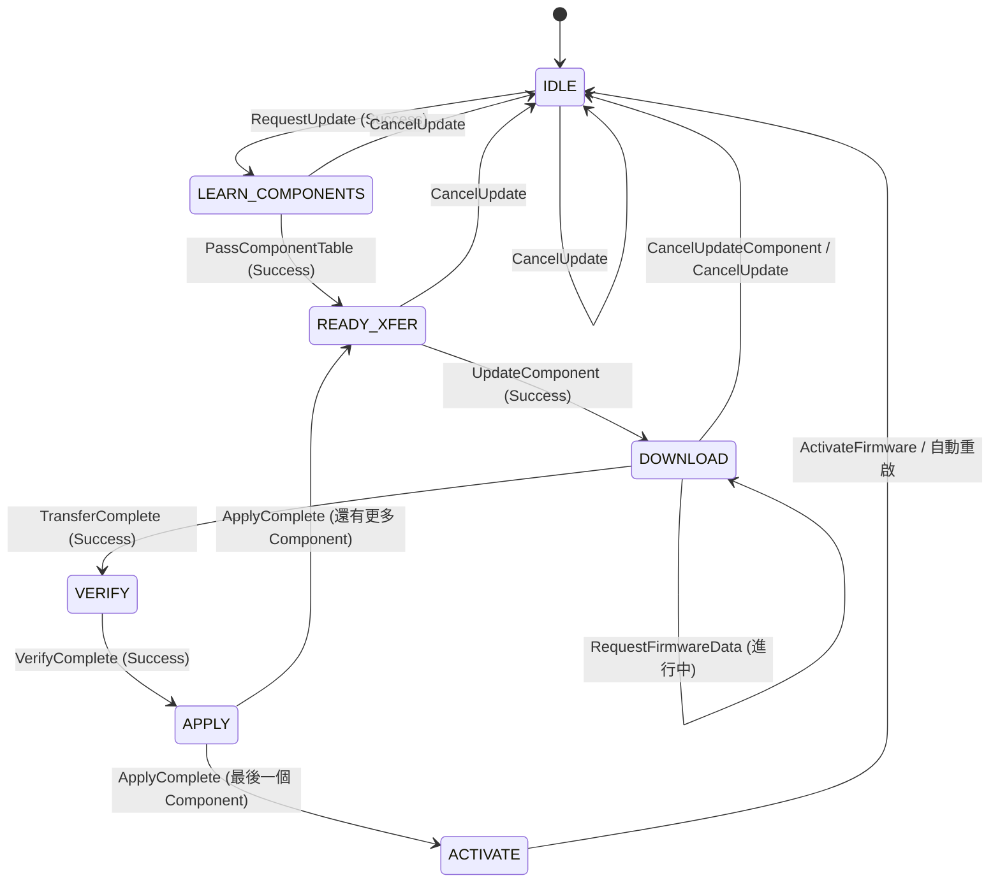
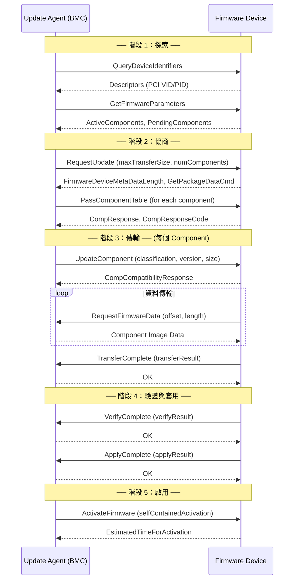

# PLDM Type 5: Firmware Update

Firmware Update Type 提供標準化的韌體更新流程，定義於 DSP0267。

---

## 概述

| 欄位 | 值 |
|------|-----|
| **Type Code** | 0x05 |
| **規範** | DSP0267 — PLDM for Firmware Update |
| **功能** | 韌體查詢、傳輸、驗證、套用、啟用 |

---

## 角色與術語

| 角色 | 說明 |
|------|------|
| **Update Agent (UA)** | 發起更新的一方（BMC 扮演此角色） |
| **Firmware Device (FD)** | 被更新的裝置（GPU、NIC、FPGA 等） |
| **FDP** | Firmware Device Package — 標準化的韌體打包格式 |
| **Component** | FD 中的一個可獨立更新的韌體元件 |
| **Descriptor** | 用於識別 FD 的唯一描述符（如 PCI VID/PID） |

---

## 完整命令列表

### 探索與查詢

| Command | Code | 方向 | 說明 |
|---------|------|------|------|
| QueryDeviceIdentifiers | 0x01 | UA→FD | 查詢裝置描述符（Vendor/Device ID） |
| GetFirmwareParameters | 0x02 | UA→FD | 取得韌體參數（元件表、capabilities） |
| QueryDownstreamDevices | 0x03 | UA→FD | 查詢下游裝置 |
| QueryDownstreamIdentifiers | 0x04 | UA→FD | 查詢下游裝置描述符 |

### 更新流程

| Command | Code | 方向 | 說明 |
|---------|------|------|------|
| RequestUpdate | 0x10 | UA→FD | 請求進入更新模式 |
| PassComponentTable | 0x13 | UA→FD | 傳遞要更新的元件列表 |
| UpdateComponent | 0x14 | UA→FD | 開始更新特定元件 |
| **RequestFirmwareData** | **0x15** | **FD→UA** | FD 主動向 UA 請求韌體資料 |
| **TransferComplete** | **0x16** | **FD→UA** | FD 通知傳輸完成 |
| **VerifyComplete** | **0x17** | **FD→UA** | FD 通知驗證完成 |
| **ApplyComplete** | **0x18** | **FD→UA** | FD 通知套用完成 |
| ActivateFirmware | 0x1A | UA→FD | 啟用新韌體 |
| GetStatus | 0x1B | UA→FD | 查詢更新狀態 |
| CancelUpdateComponent | 0x1C | UA→FD | 取消當前元件更新 |
| CancelUpdate | 0x1D | UA→FD | 取消整個更新 |

> **面試重點**：注意 `RequestFirmwareData`、`TransferComplete`、`VerifyComplete`、`ApplyComplete` 是 **FD 主動發給 UA** 的命令（FD 作為 Requester）。這是 PLDM FW Update 的獨特設計——FD 控制資料傳輸節奏。

---

## FD 狀態機（DSP0267 Figure 3）



---

## Firmware Device Package 格式

```
+─────────────────────────────────────+
│ Package Header Information          │
│   ├── PackageHeaderIdentifier (UUID)│
│   ├── PackageHeaderFormatRevision   │
│   ├── PackageHeaderSize             │
│   ├── ComponentBitmapBitLength      │
│   ├── PackageVersionString          │
│   └── PackageReleaseDateTime        │
+─────────────────────────────────────+
│ Firmware Device Identification Area │
│   ├── DeviceIDRecordCount           │
│   └── DeviceIDRecord[]              │
│       ├── RecordLength              │
│       ├── DescriptorCount           │
│       ├── ComponentBitmap           │
│       └── Descriptors[]             │
│           ├── Type (IANA/PCI/UUID)  │
│           └── Data                  │
+─────────────────────────────────────+
│ Component Image Information Area    │
│   ├── ComponentImageCount           │
│   └── ComponentImageInfo[]          │
│       ├── Classification            │
│       ├── Identifier                │
│       ├── ComparisonStamp           │
│       ├── ComponentOptions          │
│       ├── ImageSize                 │
│       └── VersionString             │
+─────────────────────────────────────+
│ Component Image Data                │
│   └── Binary firmware images...     │
+─────────────────────────────────────+
│ Package Header Checksum (CRC-32)    │
+─────────────────────────────────────+
```

---

## 完整更新序列



---

## Descriptor 類型

| Type | Code | 說明 |
|------|------|------|
| PCI Vendor ID | 0x0000 | PCI 供應商 ID |
| IANA Enterprise ID | 0x0001 | IANA 企業 ID |
| UUID | 0x0002 | 通用唯一識別符 |
| PnP Vendor ID | 0x0003 | PnP 供應商 ID |
| ACPI Vendor ID | 0x0004 | ACPI 供應商 ID |
| PCI Device ID | 0x0100 | PCI 設備 ID |
| PCI Subsystem Vendor ID | 0x0101 | PCI 子系統供應商 ID |
| PCI Subsystem ID | 0x0102 | PCI 子系統 ID |
| PCI Revision ID | 0x0103 | PCI 修訂 ID |
| Vendor Defined | 0xFFFF | 廠商自訂 |

---

## pldmtool 使用

```bash
# 查詢裝置識別
$ pldmtool fw_update QueryDeviceIdentifiers -m 20

# 查詢韌體參數
$ pldmtool fw_update GetFirmwareParameters -m 20
```

---

## 相關文件

- [FirmwareUpdate](FirmwareUpdate.md) - OpenBMC 實作詳解
- [Requester](Requester.md) - 請求管理

---

*返回 [Home](Home.md)*
