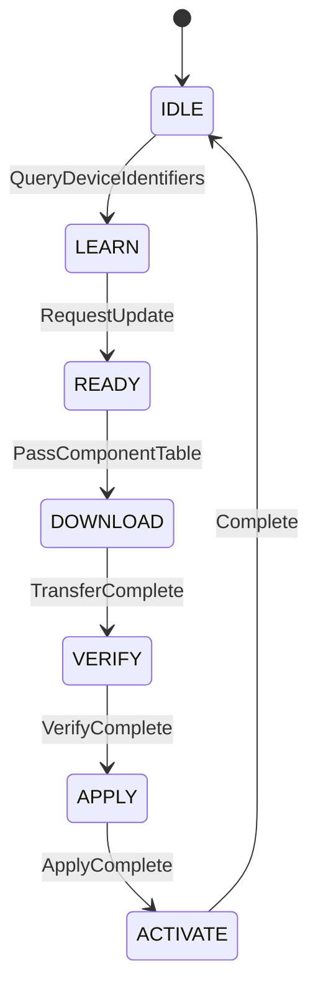

# PLDM Type 5: Firmware Update

Firmware Update Type 提供標準化的韌體更新流程。

---

## 概述

| 欄位 | 值 |
|------|-----|
| **Type Code** | 0x05 |
| **規範** | DSP0267 |
| **功能** | 韌體查詢與更新 |

---

## 更新角色

| 角色 | 說明 |
|------|------|
| **Update Agent (UA)** | 發起更新的一方 (通常是 BMC) |
| **Firmware Device (FD)** | 接受更新的裝置 |

---

## 主要命令

| Command | Code | 說明 |
|---------|------|------|
| QueryDeviceIdentifiers | 0x01 | 查詢裝置識別 |
| GetFirmwareParameters | 0x02 | 取得韌體參數 |
| RequestUpdate | 0x10 | 請求更新 |
| PassComponentTable | 0x13 | 傳遞元件表 |
| UpdateComponent | 0x14 | 更新元件 |
| RequestFirmwareData | 0x15 | 請求韌體資料 |
| TransferComplete | 0x16 | 傳輸完成 |
| VerifyComplete | 0x17 | 驗證完成 |
| ApplyComplete | 0x18 | 套用完成 |
| ActivateFirmware | 0x1A | 啟動韌體 |
| CancelUpdate | 0x1D | 取消更新 |

---

## 更新流程



---

## pldmtool 使用

```bash
# 查詢裝置識別
$ pldmtool fw_update QueryDeviceIdentifiers -m 20

# 查詢韌體參數
$ pldmtool fw_update GetFirmwareParameters -m 20
```

---

## OpenBMC 實作

| 檔案 | 說明 |
|------|------|
| `fw-update/update_manager.cpp` | 更新流程管理 |
| `fw-update/device_updater.cpp` | 裝置更新器 |
| `fw-update/package_parser.cpp` | 封包解析 |

### 觸發方式

1. **D-Bus API**: StartUpdate 介面
2. **Inotify**: 監控 `/tmp/images/` 目錄

---

## 相關文件

- [FirmwareUpdate](FirmwareUpdate.md) - 韌體更新模組詳解

---

*返回 [Home](Home.md)*
