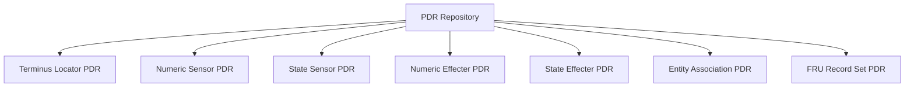
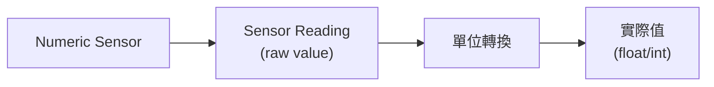
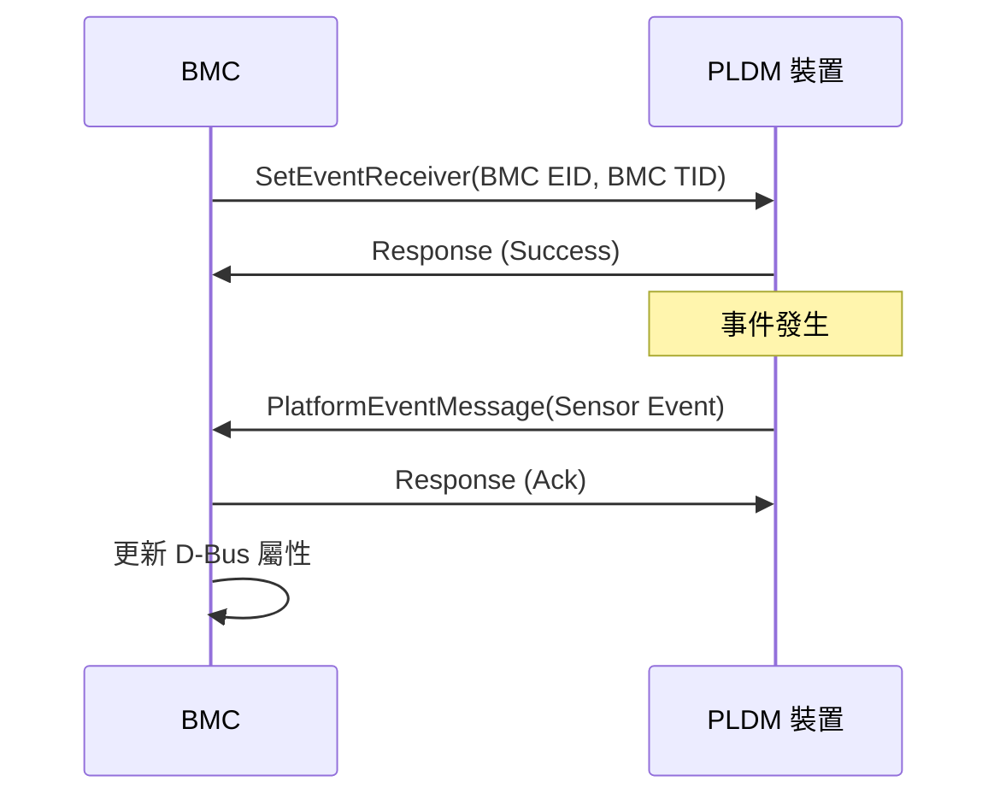

# PLDM Type 2: Platform Monitoring and Control

Platform M&C Type 提供平台監控與控制功能，包括 Sensor、Effecter、PDR 和事件管理。

---

## 概述

| 欄位          | 值                          |
| ------------- | --------------------------- |
| **Type Code** | 0x02                        |
| **規範**      | DSP0248 v1.3.0              |
| **功能**      | Sensor、Effecter、PDR、事件 |

---

## 核心概念

### Platform Descriptor Records (PDR)

PDR 是描述平台資源的標準化記錄格式：



> **逐步說明：**
>
> 這張圖展示 PDR Repository 中各種 PDR 類型的組成：
>
> - **Terminus Locator PDR**：描述「誰在系統中」——每個 PLDM Terminus 的位置訊息
> - **Numeric Sensor PDR**：描述數值型 Sensor（如溫度=45°C）
> - **State Sensor PDR**：描述狀態型 Sensor（如電源=開/關）
> - **Numeric Effecter PDR**：描述數值型控制器（如設定風扇轉速=5000 RPM）
> - **State Effecter PDR**：描述狀態型控制器（如設定 LED=開/關）
> - **Entity Association PDR**：描述實體之間的關聯（如「CPU 0 屬於主機板」）
> - **FRU Record Set PDR**：描述硬體資訊集
>
> **白話總結**：PDR Repository 就像一本「硬體型錄」，記錄了系統中所有的 Sensor、控制器、硬體組件及它們的關係。

### PDR 類型

| Type | 名稱                   | 說明                                  |
| ---- | ---------------------- | ------------------------------------- |
| 1    | Terminus Locator       | 描述 Terminus                         |
| 2    | Numeric Sensor         | 數值型 Sensor 定義                    |
| 4    | Numeric Sensor Init    | Sensor 初始化配置                     |
| 9    | Numeric Effecter       | 數值型 Effecter 定義                  |
| 11   | State Sensor           | 狀態型 Sensor 定義                    |
| 14   | State Effecter         | 狀態型 Effecter 定義                  |
| 15   | Entity Association     | 實體關聯                              |
| 20   | FRU Record Set         | FRU 記錄集                            |
| 22   | Compact Numeric Sensor | 精簡版數值型 Sensor（含內嵌名稱）     |
| 26   | Sensor Auxiliary Names | Sensor 輔助名稱（多語言）             |
| 27   | Entity Auxiliary Names | Entity 輔助名稱（用於 Terminus 命名） |

---

## 主要命令

### PDR 相關

| Command              | Code | 說明                |
| -------------------- | ---- | ------------------- |
| GetPDR               | 0x51 | 取得 PDR 記錄       |
| GetPDRRepositoryInfo | 0x50 | 取得 PDR 儲存庫資訊 |

### Sensor 相關

| Command                | Code | 說明                     |
| ---------------------- | ---- | ------------------------ |
| GetSensorReading       | 0x11 | 讀取 Numeric Sensor      |
| GetStateSensorReadings | 0x21 | 讀取 State Sensor        |
| SetNumericSensorEnable | 0x10 | 啟用/停用 Numeric Sensor |

### Effecter 相關

| Command                 | Code | 說明                  |
| ----------------------- | ---- | --------------------- |
| SetNumericEffecterValue | 0x31 | 設定 Numeric Effecter |
| GetNumericEffecterValue | 0x32 | 讀取 Numeric Effecter |
| SetStateEffecterStates  | 0x39 | 設定 State Effecter   |
| GetStateEffecterStates  | 0x3A | 讀取 State Effecter   |

### 事件相關

| Command                     | Code | 說明           |
| --------------------------- | ---- | -------------- |
| SetEventReceiver            | 0x04 | 設定事件接收者 |
| GetEventReceiver            | 0x05 | 取得事件接收者 |
| PlatformEventMessage        | 0x0A | 平台事件訊息   |
| PollForPlatformEventMessage | 0x0B | 輪詢事件       |

---

## GetPDR 命令

### 請求格式

| 欄位                 | 大小    | 說明                          |
| -------------------- | ------- | ----------------------------- |
| Record Handle        | 4 bytes | PDR 記錄控制代碼 (0 = 第一筆) |
| Data Transfer Handle | 4 bytes | 傳輸控制代碼                  |
| Transfer Op Flag     | 1 byte  | 傳輸操作旗標                  |
| Request Count        | 2 bytes | 請求的位元組數                |
| Record Change Number | 2 bytes | 記錄變更編號                  |

### 回應格式

| 欄位                      | 大小    | 說明               |
| ------------------------- | ------- | ------------------ |
| Completion Code           | 1 byte  |                    |
| Next Record Handle        | 4 bytes | 下一筆記錄控制代碼 |
| Next Data Transfer Handle | 4 bytes |                    |
| Transfer Flag             | 1 byte  |                    |
| Response Count            | 2 bytes | 回傳的位元組數     |
| Record Data               | 可變    | PDR 記錄資料       |
| Transfer CRC              | 1 byte  | CRC (選用)         |

### pldmtool 使用

```bash
# 取得第一筆 PDR
$ pldmtool platform GetPDR -d 0
{
    "Record Handle": 1,
    "PDR Type": "State Effecter PDR",
    "PDR Data": { ... }
}

# 取得所有 PDR
$ pldmtool platform GetPDR -a
[
    { "Record Handle": 1, "PDR Type": "Terminus Locator PDR", ... },
    { "Record Handle": 2, "PDR Type": "State Sensor PDR", ... },
    ...
]
```

---

## Sensor 類型

### Numeric Sensor

讀取連續數值（如溫度、電壓）：



> **逐步說明：**
>
> 這張圖展示從 Numeric Sensor 讀取值的過程：
>
> 1. **Sensor Reading**：從硬體讀取原始值（raw value），例如溫度 Sensor 回傳 `180`。
> 2. **單位轉換**：根據 PDR 中定義的公式（y = (m × x + b) × 10^r）將原始值轉換為實際值。
> 3. **實際值**：得到有意義的數值，例如 `45.0°C`。
>
> **為什麼需要轉換**：硬體回傳的是「機器值」，人類看不懂。PDR 中的公式幫助把機器值轉成人類可讀的唏位值。

**pldmtool 範例：**

```bash
$ pldmtool platform GetSensorReading -i 1
{
    "Sensor ID": 1,
    "Sensor Data Size": "uint8",
    "Operational State": "enabled",
    "Present Reading": 45
}
```

### State Sensor

讀取離散狀態：

| State Set | 說明               | 可能值                    |
| --------- | ------------------ | ------------------------- |
| 1         | Health State       | Normal, Critical, Warning |
| 3         | Availability       | Available, Unavailable    |
| 11        | Link State         | Up, Down                  |
| 196       | Operational Status | Enabled, Disabled         |

**pldmtool 範例：**

```bash
$ pldmtool platform GetStateSensorReadings -i 1
{
    "Sensor ID": 1,
    "Composite Sensor Count": 1,
    "State Readings": [
        {
            "Sensor Operational State": "Enabled",
            "Present State": "Normal",
            "Previous State": "Normal"
        }
    ]
}
```

---

## Effecter 類型

### Numeric Effecter

設定連續數值（如風扇轉速）：

```bash
$ pldmtool platform SetNumericEffecterValue -i 1 -d 5000
{
    "Response": "SUCCESS"
}
```

### State Effecter

設定離散狀態：

```bash
# 設定 Host 狀態同步
$ pldmtool platform SetStateEffecterStates -i 1 -c 1 -s 2
{
    "Response": "SUCCESS"
}
```

---

## 事件機制

### 事件訂閱流程



> **逐步說明：**
>
> 1. **註冊事件接收者**：BMC 發送 `SetEventReceiver` 告訴裝置：「有事件請發給我（EID 和 TID）」。
> 2. **事件發生**：當裝置有狀況（例如溫度超過閾值），它透過 `PlatformEventMessage` 主動通知 BMC。
> 3. **BMC 確認並更新**：BMC 回傳確認，並將事件資訊寫入 D-Bus，讓其他 OpenBMC 服務可以讀取。
>
> **白話總結**：就像設定「緊急聯絡人」——告訴裝置「有問題打給我」，裝置就會在異常時主動通知 BMC。

### 事件類型

| Event Class                   | Code      | 說明                              |
| ----------------------------- | --------- | --------------------------------- |
| Sensor Event                  | 0x00      | Sensor 狀態變更事件               |
| Effecter Event                | 0x01      | Effecter 狀態變更事件             |
| Redfish Task Executed Event   | 0x02      | Redfish Task 執行事件             |
| Redfish Message Event         | 0x03      | Redfish 訊息事件                  |
| PDR Repository Change Event   | 0x04      | PDR 儲存庫變更事件                |
| Message Poll Event            | 0x05      | PLDM 訊息輪詢事件                 |
| Heartbeat Timer Elapsed Event | 0x06      | 心跳計時器過期事件                |
| CPER Event                    | 0x07      | Common Platform Error Record 事件 |
| OEM Events                    | 0xFA-0xFE | OEM 廠商自定事件                  |

> **注意**：以上 event class 值已根據 upstream libpldm `include/libpldm/platform.h` L333-340 驗證。

---

## PDR JSON 配置

在 OpenBMC 中，PDR 可透過 JSON 檔案定義：

### State Sensor PDR 範例

```json
{
  "entries": [
    {
      "type": 11,
      "instance": 0,
      "container_id": 1,
      "entity_type": 45,
      "entity_instance": 0,
      "sensor_composite_count": 1,
      "possible_states": [
        {
          "set_id": 196,
          "state_ids": [1, 2, 3]
        }
      ],
      "dbus": {
        "path": "/xyz/openbmc_project/state/host0",
        "interface": "xyz.openbmc_project.State.Host",
        "property_name": "CurrentHostState",
        "property_type": "string",
        "property_values": {
          "1": "xyz.openbmc_project.State.Host.HostState.Off",
          "2": "xyz.openbmc_project.State.Host.HostState.Running",
          "3": "xyz.openbmc_project.State.Host.HostState.Quiesced"
        }
      }
    }
  ]
}
```

### State Effecter PDR 範例

```json
{
  "entries": [
    {
      "type": 14,
      "instance": 0,
      "container_id": 1,
      "entity_type": 45,
      "entity_instance": 0,
      "effecter_composite_count": 1,
      "possible_states": [
        {
          "set_id": 196,
          "state_ids": [1, 2]
        }
      ],
      "dbus": {
        "path": "/xyz/openbmc_project/state/host0",
        "interface": "xyz.openbmc_project.State.Host",
        "property_name": "RequestedHostTransition",
        "property_type": "string"
      }
    }
  ]
}
```

---

## OpenBMC 實作

### 原始碼位置

**libpldmresponder (Responder 端)：**

| 檔案                                             | 說明                                            |
| ------------------------------------------------ | ----------------------------------------------- |
| `libpldmresponder/platform.cpp/hpp`              | Platform Handler (GetPDR/SetEffecter/GetSensor) |
| `libpldmresponder/pdr_state_sensor.hpp`          | State Sensor PDR 生成                           |
| `libpldmresponder/pdr_state_effecter.hpp`        | State Effecter PDR 生成                         |
| `libpldmresponder/pdr_numeric_effecter.hpp`      | Numeric Effecter PDR 生成                       |
| `libpldmresponder/platform_state_sensor.hpp`     | State Sensor 讀取處理                           |
| `libpldmresponder/platform_state_effecter.hpp`   | State Effecter 設定處理                         |
| `libpldmresponder/platform_numeric_effecter.hpp` | Numeric Effecter 設定處理                       |
| `libpldmresponder/event_parser.cpp/hpp`          | 事件定義解析                                    |

**platform-mc (Requester 端 / MC)：**

| 檔案                                   | 說明                               |
| -------------------------------------- | ---------------------------------- |
| `platform-mc/terminus.cpp/hpp`         | Terminus PDR 解析、Sensor 物件建立 |
| `platform-mc/platform_manager.cpp/hpp` | PDR/FRU 拉取、Event Receiver 配置  |
| `platform-mc/sensor_manager.cpp/hpp`   | Per-TID Sensor 輪詢                |
| `platform-mc/event_manager.cpp/hpp`    | 事件處理（Sensor/CPER/Poll）       |
| `platform-mc/numeric_sensor.cpp/hpp`   | 數值型 Sensor D-Bus 物件           |

---

## 相關文件

- [PDRImplementation](PDRImplementation.md) - PDR 實作細節
- [PlatformMC](PlatformMC.md) - Platform MC 模組
- [DMTFSpecifications](DMTFSpecifications.md) - DSP0248 規範

---

_返回 [Home](Home.md)_
